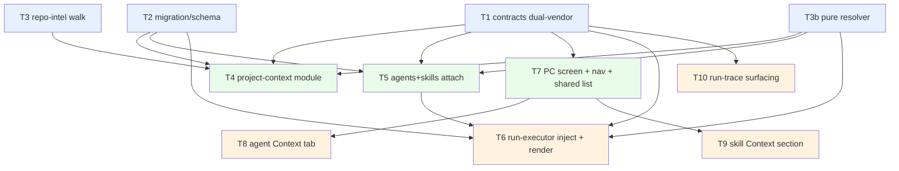

# Implementation Plan — SPEC-02 Project Context

- **Spec (WHAT):** [`specs/cross/SPEC-02-2026-07-01-project-context.md`](../specs/cross/SPEC-02-2026-07-01-project-context.md) — Status: approved
- **Plan (HOW):** this file. Reuses the spec's `AC-1 … AC-21` ids verbatim.
- **Date planned:** 2026-07-02
- **Execution mode:** MULTI-AGENT (parallel `implementer-backend` / `implementer-ui`, worktree-isolated, ≤4 workers per group).

## Resolved decisions (planner clarifications, answered by user 2026-07-02)
- **NC-1 — AC-5/AC-7 two-sub-block rendering → "Keep engine frozen" (Option B).**
  `reviewer-core` is **NOT touched**. The `specs` slot stays a flat `string[]` (engine-pre-wired).
  The server groups own/inherited docs into **≤2 fenced `wrapUntrusted` blocks with the sub-block
  labels living INSIDE the fence**, and folds that render into **T6**. Task **T-ENG is dropped**;
  AC-5/AC-7's render assertions become **T6 server units**.
  ```
  ## Project context
  <untrusted id=spec-0>
  // Agent-attached documents
  …own doc…
  </untrusted>
  <untrusted id=spec-1>
  // Inherited from skills
  …skill doc…
  </untrusted>
  ```
- **NC-2 — attachable-doc source repo → "Active/selected repo".**
  The Context tab / Project Context screen browse list is seeded from the **active/selected repo**
  (the same active-repo context the sidebar uses, `nav.ts` `:repoId`). Only the repo-relative
  **path** is stored; it is resolved against **each reviewed PR's own clone** at run time (AC-19).
- **Execution mode → MULTI-AGENT.**

No `[RESEARCH NEEDED]` gaps. Every dependency (js-tiktoken, simple-git, Drizzle, next-intl,
TanStack, `node:fs`) is in-repo and understood.

---

## Requirements review (restated from the spec — NOT newly authored)
1. Discover every `.md` under folders named `specs`/`docs`/`insights` at any depth in a repo's
   clone; list with a `specs|docs|insights` badge on a read+attach-only **Project Context** screen
   (AC-1, AC-2, AC-3).
2. Manually attach/detach + **order** documents on an Agent **Context** tab and a Skill **Context**
   section, persisting only ordered **paths**, never text (AC-4, AC-6, AC-8).
3. An agent's **effective** context = own docs + docs inherited from its **enabled** skills, deduped
   (agent-own wins; else first position), rendered as two sub-blocks under one `## Project context`
   header (AC-5, AC-7).
4. At run time, read attached files **fresh** from the PR's own clone and inject them as an
   **untrusted** block; skip missing; make it auditable via `specs_read`, a token-size stat, and the
   expandable `assembly.specs` (AC-9, AC-10, AC-11, AC-13, AC-14, AC-15, AC-16, AC-19, AC-20).
5. Deterministic per-doc + total **token estimate** at attach time and a per-doc **"Used by N
   agents" + coverage %** — **zero** LLM/embedding calls anywhere (AC-12, AC-17, AC-21).
6. A live acceptance demo: an attached invariant catches + cites a violating PR (AC-18).

### Assumptions (grounded)
- The `specs` prompt slot is **pre-wired** in the engine: `PromptParts.specs?: string[]`
  (`reviewer-core/src/prompt.ts:47`), rendered as `## Project context` with per-doc
  `wrapUntrusted('spec-i', …)` after `## Repo skeleton` (`prompt.ts:114-117,154`), recorded as
  `assembly.specs` (`prompt.ts:172`), `INJECTION_GUARD` appended on system (`prompt.ts:106`).
  Server INSIGHTS 2026-06-20 confirms `specs` is a **server-only** slot for a **flat list** — under
  the NC-1·B decision, the own/inherited grouping is done server-side into ≤2 fenced blocks.
- Run-time reads use the existing `container.git.readFile(repoRef, path)` port
  (`server/src/adapters/git/simple-git.ts:129`); the repo row (`{owner,name}`) is already in
  `runOneAgent` (`run-executor.ts:157,243`). Token counting reuses `container.tokenizer`
  (`TiktokenTokenizer`, cl100k_base + `ceil(chars/4)` fallback — `server/src/adapters/tokenizer/index.ts`),
  **no new dependency**.
- Discovery default is **repo-wide** (whole-clone walk); "overridable via config" (AC-1) is realized
  as an optional roots parameter/constant, **not** a user-facing setting in v1.
- Attach storage adds **no `repo_id`** to agents/skills (`schema/agents.ts`, spec Assumptions).
  Paths are repo-relative, resolved against the PR's clone at run time (AC-19).
- The client run-trace **already renders** `prompt_assembly.specs` (expandable, `TraceBody.tsx:85-87`)
  and `specs_read` (`TraceBody.tsx:39-51`) — both empty today because `run-executor.ts:315-316`
  hardcodes `specs_read: []` and passes no `specs`. AC-14/AC-16 are largely a **populate-the-data** job.

### Recommendations folded into this plan
- **Storage = two join tables** `agent_context_docs` / `skill_context_docs`, each `(owner_id, path,
  order)` mirroring `agent_skills`. Preferred over a jsonb array because AC-21's used_by/coverage is
  a cross-agent aggregation better done in SQL; ordering via `order`, **no `enabled` column** (AC-4
  forbids per-doc enable in v1).
- **Discovery walk hosted in the repo-intel facade** (`discoverContextDocs(repoId)` + a new
  `pipeline/docs-walk.ts`) — repo-intel already owns clone-FS + path normalization (`walk.ts`).
- **Proposed-improvements verdict:** FOLD #2 (per-slot token attribution) as `RunStats.specs_tokens`
  (AC-15 needs a token field anyway). Adopt #4 **partially** (use `order`, drop `enabled`). DEFER #1
  (context in `AgentVersionConfig`) and #3 (pre-run missing-path warning) — no AC requires them.

---

## Acceptance criteria (verbatim ids — traceability anchors)

- **AC-1** — discover `**/{specs,docs,insights}/**/*.md`, exclude non-`.md`/binary, default repo-wide
  + config override. Verify: unit (glob matcher over a fixture tree; default repo-wide + config
  override) + *.it.test.ts (reader route). → **T3, T4**
- **AC-2** — list each doc with repo-relative path + badge from nearest matching ancestor. Verify:
  *.it.test.ts (list route) + client unit (badge/path render). → **T4, T7**
- **AC-3** — no match → empty state, not error/blank. Verify: client unit (empty state). → **T7**
- **AC-4** — Agent **Context** tab (checkbox=attach/detach; Filter = display-only), persist ordered
  paths, no text. Verify: *.it.test.ts (agent stores ordered paths, no text) + client unit (checkbox
  attach/detach + filter narrows). → **T5, T8**
- **AC-5** — single `## Project context` header, two sub-blocks (own then inherited), order
  preserved. Verify: unit (two sub-blocks, own-before-inherited, ordering preserved) + client unit
  (drag reorder persists order). → **T6 (server render, NC-1·B), T8**
- **AC-6** — Skill "Project context to use" section, persist paths, "SERIALIZES AS" uses
  `## Project context`. Verify: *.it.test.ts (skill stores paths) + client unit (skill Context
  section; preview header == `## Project context`). → **T5, T9**
- **AC-7** — effective = own + inherited, deduped (own wins; else first). Verify: unit (effective-set
  resolution + dedupe) + *.it.test.ts (agent+skill inheritance). → **T3b, T5**
- **AC-8** — read fresh; never bake text into config/metadata. Verify: unit (stored config contains
  no doc text) + *.it.test.ts (edit-doc-then-run reflects new text). → **T5, T6**
- **AC-9** — run-executor resolves effective paths, reads clone, injects into `PromptParts.specs`.
  Verify: *.it.test.ts (specs slot populated) + unit (run-executor passes `specs`). → **T6**
- **AC-10** — wrap untrusted via `wrapUntrusted` + `INJECTION_GUARD`; `</untrusted>` escaped. Verify:
  unit (wrapUntrusted applied; `</untrusted>` escaped) — grounded in `reviewer-core/prompt.ts`. → **T6**
- **AC-11** — no docs → omit `## Project context`, byte-identical to pre-feature. Verify: unit
  (omit-when-empty, prompt unchanged). → **T6**
- **AC-12** — zero extra LLM calls. Verify: unit (mock LLM count unchanged vs baseline) + *.it.test.ts.
  → **T4, T6**
- **AC-13** — missing/unreadable path → skip, continue, record skip, no crash. Verify: unit (missing
  file skipped) + *.it.test.ts. → **T6**
- **AC-14** — `specs_read` = ordered injected paths (skipped excluded). Verify: *.it.test.ts
  (`specs_read` populated) + unit. → **T6**
- **AC-15** — Stats reports injected block token size via existing tokenizer (cl100k_base). Verify:
  *.it.test.ts (stats size present) + unit (count == cl100k_base of injected text). → **T1, T6**
- **AC-16** — Prompt-assembly exposes "Project context — attached specs" expandable to exact full
  text. Verify: client unit (expand renders `assembly.specs`) + *.it.test.ts (`assembly.specs`
  persisted). → **T6, T10**
- **AC-17** — per-doc + total token estimate at attach time, deterministic, no LLM, existing
  tokenizer, no new dep. Verify: client unit (per-doc + total shown) + unit (cl100k_base tokenizer,
  no LLM). → **T4, T8**
- **AC-18** — attached invariant catches + cites a violating PR. Verify: e2e / manual
  (model-dependent, guarded demo). → **T6 (DoD demo)**
- **AC-19** — scope by `workspace_id` + each PR's own clone; never another workspace/repo. Verify:
  *.it.test.ts (cross-workspace / cross-repo isolation). → **T5, T6**
- **AC-20** — large set → editor warning, but run injects the **full** set (no cap/truncation/drop).
  Verify: client unit (warning past threshold) + unit (run injects full set). → **T8, T6**
- **AC-21** — per-doc "Used by N agents" + coverage %, no LLM/embedding. Verify: unit (count +
  coverage over agent attachments, no LLM) + client unit (indicator renders). → **T4, T7**

---

## Non-functional requirements (carried from the spec; assigned to units)
- **Security / untrusted input**: attached docs are untrusted → delimiter-fenced (`wrapUntrusted`) +
  `INJECTION_GUARD` (**T6**); stored/attached paths validated inside-clone, no `..`/absolute/drive
  (path-traversal guard reused from `intent-service.ts:161` `isSafeRepoPath` + a resolved-prefix
  check) at **attach time (T5)** and **read time (T6)**; discovery reads only `.md` on disk
  (**T3/T4**). Apply the `security` rubric (A01 IDOR/ownership, A05 path traversal).
- **Determinism / zero-new-LLM (AC-12)**: no `container.llm` in any new path; only
  `container.tokenizer` + file reads (**T4, T6**).
- **Tenancy (AC-19)**: workspace-scope every query (**T4, T5**); resolve paths against the run's own
  repo clone (**T6**).
- **i18n**: all new strings via `next-intl`; new `messages/en/projectContext.json` +
  `agents.json`/`skills.json`/`runs.json` keys (missing key throws — client INSIGHTS 2026-06-20)
  (**T7, T8, T9, T10**).
- **a11y**: keyboard-navigable rows, keyboard-accessible drag alternative, roles/labels, labeled
  disclosure for the prompt-assembly block (**T7, T8, T10**).
- **Observability**: `specs_read` paths + `specs_tokens` stat + expandable `assembly.specs`
  (**T6, T10**).
- **Perf**: bounded FS walk (no analysis); run-time = reads + concat + count. Discovery reads +
  tokenizes each doc — bounded, but flag the read-all cost; a content-hash token cache is a deferred
  optimization (**T3, T4, T6**).
- **Privacy**: no secrets injected or logged; only user-attached repo markdown is read (**T6**).

---

## Scope
- **Modules touched**: server `modules/repo-intel`, new `modules/project-context`, `modules/agents`,
  `modules/skills`, `modules/reviews`, `modules/_shared`, `db/schema`; client `app/project-context`,
  `app/agents/[id]/…`, `app/skills/…SkillDetail/ConfigTab`, `app/…/RunTraceDrawer`, `lib/hooks`,
  `vendor/ui/nav.ts`, `messages`; **both** `vendor/shared` copies.
- **Modules deliberately NOT touched**: **`reviewer-core`** (engine frozen — NC-1·B);
  `code_chunks`/embeddings path (Non-goal: no chunking/indexing/RAG); `polling`, `pulls`, `repos`,
  `settings`, `workspace`, `blast`, `conventions`; `AgentVersionConfig` snapshot (Proposed #1 deferred).
- **Contracts changed** (`@devdigest/shared`, **BOTH** vendor copies): `contracts/knowledge.ts` (add
  `ContextBadge`, `ProjectContextDoc`, `ContextAttachment`); `contracts/trace.ts` (add
  `RunStats.specs_tokens`). Dual-vendor is the #1 sequencing anchor + INSIGHTS pitfall.

---

## Task units

### [T1] Contracts (dual-vendored) + trace stat · track: backend · parallel-group: A
- **Files**:
  - `server/src/vendor/shared/contracts/knowledge.ts` — add `ContextBadge = z.enum(['specs','docs','insights'])`, `ProjectContextDoc = { path, badge, tokens, used_by, coverage }`, `ContextAttachment = { path, order }`.
  - `client/src/vendor/shared/contracts/knowledge.ts` — **identical** copy.
  - `server/src/vendor/shared/contracts/trace.ts` — add `specs_tokens: z.number().int().nullish()` to `RunStats` (per-slot attribution, alongside the `repo_map` comment at `trace.ts:46-48`).
  - `client/src/vendor/shared/contracts/trace.ts` — **identical** copy.
  - Check `vendor/shared/contracts/index.ts` (both copies) exports the new symbols.
- **Skills**: `zod`, `typescript-expert`, `onion-architecture`.
- **Known pitfalls**: `@devdigest/shared` is vendored INDEPENDENTLY into server/… and client/… (NO sync script) — a contract change must be applied to BOTH copies or the apps drift (server + client INSIGHTS 2026-06-16). Enables per-slot token attribution without a bespoke field (Proposed #2).
- **Definition of done**: both copies byte-identical; `cd server && pnpm typecheck` and `cd client && pnpm typecheck` clean.
- **Depends on**: none.

### [T2] Migration + attach-storage schema · track: backend · parallel-group: A
- **Files**:
  - `server/src/db/schema/agents.ts` — add `agentContextDocs` pgTable `(agentId FK cascade, path text, order int, pk(agentId,path))` + `index('agent_context_docs_agent_idx').on(agentId)`.
  - `server/src/db/schema/skills.ts` — add `skillContextDocs` pgTable `(skillId FK cascade, path text, order int, pk(skillId,path))` + `index(...).on(skillId)`.
  - `server/src/db/rows.ts` — export new row types if the module pattern requires (mirror `AgentRow`).
  - `server/src/db/migrations/00NN_*.sql` + `meta/_journal.json` + `meta/NNNN_snapshot.json` — **GENERATED via `pnpm db:generate`**, never hand-written.
- **Skills**: `drizzle-orm-patterns`, `postgresql-table-design`, `onion-architecture`.
- **Known pitfalls**: Postgres does NOT auto-index a FK's referencing column — add an explicit index (server INSIGHTS 2026-06-17). Never hand-edit an applied migration — edit schema, `pnpm db:generate` (`server/README.md`). `pnpm db:migrate` Windows no-op was fixed in PR #4 (`pathToFileURL`); still verify the table exists after migrate (server INSIGHTS 2026-06-16). No `enabled` column (AC-4).
- **Definition of done**: `pnpm db:generate` emits exactly one new migration + snapshot + journal entry; `pnpm db:migrate` applies it; `pnpm typecheck` clean.
- **Depends on**: none (files disjoint from T1).

### [T3] repo-intel discovery walk (glob) · track: backend · parallel-group: A
- **Files**:
  - `server/src/modules/repo-intel/pipeline/docs-walk.ts` (**new**) — recursive walk for `**/{specs,docs,insights}/**/*.md`; derive badge from nearest matching ancestor; exclude `EXCLUDED_DIRS` + non-`.md`; accept optional `roots` (default whole clone). Model on `walk.ts`.
  - `server/src/modules/repo-intel/service.ts` — add facade `discoverContextDocs(repoId, roots?)` resolving the clone path then walking.
  - `server/src/modules/repo-intel/types.ts` — small `DiscoveredDoc = { path, badge }` type.
  - `server/src/modules/repo-intel/constants.ts` — `DOC_ROOT_DIRS = ['specs','docs','insights']`.
- **Skills**: `onion-architecture`, `typescript-expert`, `security`.
- **Known pitfalls**: POSIX-only path/URL assumptions keep breaking on Windows — use `node:path` `dirname`/`join`, normalize with `.split(sep).join('/')` (server INSIGHTS 2026-06-16; `walk.ts:119`). Skip symlinks + unreadable dirs (`walk.ts:80-89`). Repo-intel README: build on the facade, don't touch the pipeline internals.
- **Definition of done**: unit test over a fixture tree — matches `.md` under specs/docs/insights at any depth; excludes non-`.md`/binary and `node_modules`; correct nearest-ancestor badge; **default repo-wide + `roots` override** both covered (AC-1).
- **Depends on**: none.

### [T3b] Pure effective-context resolver · track: backend · parallel-group: A
- **Files**: `server/src/modules/_shared/project-context.ts` (**new**) — pure `resolveEffectiveContextPaths(own: string[], inherited: string[]): { own: string[]; inherited: string[] }` implementing AC-7 dedupe (agent-own wins; else keep first position among skills), order preserved.
- **Skills**: `typescript-expert`.
- **Known pitfalls**: keep it pure (no I/O) so it unit-tests without a DB and is importable by both `project-context` and `agents` without a cross-module reach (onion: share via `_shared`, not a sibling import).
- **Definition of done**: unit — agent-own doc also attached via a skill stays in own (omitted from inherited); doc via two skills kept at first position; ordering preserved (AC-7).
- **Depends on**: none.

> **Note (NC-1·B):** the former **T-ENG** (reviewer-core two-sub-block render) is **dropped**. The
> engine stays frozen; the own/inherited grouping into ≤2 fenced `wrapUntrusted` blocks (labels
> inside the fence) is implemented server-side in **T6**, and AC-5/AC-7's render assertions become
> T6 server units.

### [T4] project-context module (discovery route + tokens + used_by/coverage) · track: backend · parallel-group: B
- **Files**:
  - `server/src/modules/project-context/routes.ts` (**new**) — `GET /repos/:id/project-context/docs` → `ProjectContextDoc[]`; schema-first (`IdParams`), `getContext()` workspace scope.
  - `server/src/modules/project-context/service.ts` (**new**) — `discoverContextDocs` facade → read each via `container.git.readFile` + count via `container.tokenizer` → attach `used_by`/`coverage` from the repository.
  - `server/src/modules/project-context/repository.ts` (**new**) — workspace-scoped aggregation over `agent_context_docs` + `skill_context_docs` + `agent_skills` (+ enabled guards) computing, per path, how many agents' **effective** context includes it, using `_shared/project-context.ts`.
  - `server/src/modules/project-context/helpers.ts` (**new**) — row→`ProjectContextDoc` mapping.
  - `server/src/modules/index.ts` — register the new module (one import + one entry).
- **Skills**: `onion-architecture`, `fastify-best-practices`, `drizzle-orm-patterns`, `zod`, `security`, `typescript-expert`.
- **Known pitfalls**: aggregate in SQL, not fetch-all-then-JS-dedup (server INSIGHTS 2026-06-16 DISTINCT ON); FK index (2026-06-17); scope every query by `workspace_id` (`server/CLAUDE.md`); reuse `container.tokenizer` (no new dep, AC-17). Perf: reading + tokenizing every discovered doc is bounded but note the cost. Discovery is seeded from the **active/selected repo** (NC-2).
- **Definition of done**: *.it.test.ts — list route returns path+badge+tokens+used_by+coverage; **cross-workspace isolation** (AC-19); no LLM call (AC-12) — plus unit for used_by/coverage counting + tokenizer (AC-1, AC-2, AC-17, AC-21).
- **Depends on**: T1, T2, T3, T3b.

### [T5] agents + skills attach persistence + effective paths · track: backend · parallel-group: B
- **Files**:
  - `server/src/modules/agents/repository.ts` — `contextDocsForAgent`, `setContextDocs`, and `effectiveContextPaths(agentId)` (own from `agent_context_docs`; inherited from `skill_context_docs` joined via `agent_skills` WHERE binding+skill enabled + same workspace — mirror `enabledSkillBodies` at `repository.ts:221`; dedupe via `_shared/project-context.ts`).
  - `server/src/modules/agents/service.ts` — context get/set + workspace guard (mirror `assertSkillsInWorkspace` at `service.ts:193`).
  - `server/src/modules/agents/routes.ts` — `GET/POST /agents/:id/context` (body = ordered `ContextAttachment[]` or `string[]`; zod refine rejects `..`/absolute/non-`.md`).
  - `server/src/modules/skills/repository.ts` — `contextDocsForSkill`, `setContextDocs`.
  - `server/src/modules/skills/service.ts` — context get/set.
  - `server/src/modules/skills/routes.ts` — `GET/POST /skills/:id/context`.
- **Skills**: `onion-architecture`, `fastify-best-practices`, `drizzle-orm-patterns`, `zod`, `security`, `typescript-expert`.
- **Known pitfalls**: mirror the `agent_skills` set/reorder path (`setSkills` at `repository.ts:270`); same-workspace guard on the join prevents cross-tenant leakage (`enabledSkillBodies` guard, `repository.ts:236`); persist **paths only, no text** (AC-8); a disabled binding/skill contributes no inherited docs (spec edge case, mirrors enabled-only skill bodies). Attach-time path-safety = defense-in-depth (security A05).
- **Definition of done**: *.it.test.ts — agent+skill store ordered paths (no text); agent+skill **inheritance** resolves effective set; cross-workspace attach rejected (AC-4, AC-6, AC-19) — plus unit for `effectiveContextPaths` dedupe via T3b (AC-7, AC-8).
- **Depends on**: T1, T2, T3b.

### [T6] run-executor injection + own/inherited render (ProjectContextService) · track: backend · parallel-group: C
- **Files**:
  - `server/src/modules/reviews/project-context.ts` (**new**) — `ProjectContextService`: given `repoRef` + effective `{own, inherited}` paths, apply path-traversal guard, `container.git.readFile` each (skip missing → record), **group into ≤2 fenced blocks with the sub-block labels inside the fence (own first, then inherited; NC-1·B)**, count injected tokens via `container.tokenizer`, return `{ specs, specsRead, specsTokens }` where `specs` is the flat `string[]` the engine expects. Constructed + injected like `IntentService`.
  - `server/src/modules/reviews/run-executor.ts` — call `this.agents.effectiveContextPaths(agent.id)` → `ProjectContextService` → pass `specs` into `reviewPullRequest` (`run-executor.ts:219`, omit-when-empty like the other slots); set trace `specs_read` (replace `[]` at line 316), `stats.specs_tokens`.
  - `server/src/modules/reviews/service.ts` — construct + inject `ProjectContextService` into the executor (mirror the `IntentService` wiring at `run-executor.ts:44-50`).
  - `server/src/modules/reviews/helpers.ts` — extract/share the `isSafeRepoPath` guard (currently private in `intent-service.ts:161`).
- **Skills**: `onion-architecture`, `security`, `typescript-expert`, `drizzle-orm-patterns` (read path only).
- **Known pitfalls**: the `specs` slot is engine-pre-wired for a **flat list** (server INSIGHTS 2026-06-20) — under NC-1·B the own/inherited two-block grouping lives **here**, labels inside the fence; the engine is untouched. `wrapUntrusted` escapes `</untrusted>` (AC-10, `prompt.ts:32`); `specs_read` excludes skipped (AC-14); empty effective set → pass nothing → engine omits `## Project context` (AC-11, `prompt.ts:114-117`); **inject the full set, never truncate/drop** (AC-20); tokenizer reuse (AC-15); never log secrets/paths beyond `specs_read` (Privacy). Windows-safe `join` on read.
- **Definition of done**:
  - unit — two sub-blocks own-before-inherited, order preserved within each, per-doc `wrapUntrusted`, `</untrusted>` escaped (AC-5, AC-7, AC-10); missing file skipped + run proceeds (AC-13); count == cl100k_base of injected text (AC-15); omit-when-empty prompt unchanged (AC-11); full set injected, nothing dropped (AC-20); no new LLM call (AC-12).
  - *.it.test.ts — a run populates the specs slot + `specs_read` + `specs_tokens` + `assembly.specs`; **edit-doc-then-run reflects new text** (AC-8); **cross-repo isolation** (AC-19).
  - Manual demo — seeded agent + attached invariant spec + a violating PR surfaces a citing finding (AC-18).
- **Depends on**: T5, T3b, T1, T2.

### [T7] Project Context screen + nav + discovery hook + shared row list · track: ui · parallel-group: B
- **Files**:
  - `client/src/app/project-context/page.tsx` (**new**, thin `"use client"`).
  - `client/src/app/project-context/_components/ProjectContextView/` (**new**) — list rows (badge, path, used_by, coverage) + **empty state** (AC-3); `ProjectContextView.test.tsx`.
  - `client/src/components/ContextDocList/` (**new shared component**) — the reusable row list (drag handle, checkbox, name, badge, per-doc token, filter box, total + large-set warning) consumed by T8 & T9.
  - `client/src/lib/hooks/projectContext.ts` (**new**) — `useProjectContextDocs(repoId)` over `GET /repos/:id/project-context/docs` (repoId from the active-repo context, NC-2).
  - `client/src/vendor/ui/nav.ts` — add `{ key:'project-context', … }` NAV item + `SHORTCUTS` entry.
  - `client/src/components/app-shell/helpers.ts` — `activeKeyFor` for the new route if not already mapped.
  - `client/src/messages/en/projectContext.json` (**new**) + `messages/en/shell.json` nav label if needed.
- **Skills**: `frontend-ui-architecture`, `next-best-practices`, `react-best-practices`, `react-testing-library`, `zod`, `security`, `typescript-expert`.
- **Known pitfalls**: NAV is a HARDCODED list — surfacing a new top-level route needs a NAV item (+ SHORTCUTS) (client INSIGHTS 2026-06-20); i18n auto-globs new json but next-intl throws on any missing key (2026-06-20); style with **CSS design tokens**, not Tailwind (`client/CLAUDE.md`); `@testing-library/user-event` is NOT installed — use `fireEvent` (client INSIGHTS 2026-06-24); render untrusted paths as text (React escapes — no `dangerouslySetInnerHTML`).
- **Definition of done**: client unit — badge/path render (AC-2), empty state (AC-3), used_by/coverage indicator (AC-21); `pnpm typecheck` clean.
- **Depends on**: T1 (types). Live data/e2e depends on T4.

### [T8] Agent editor Context tab · track: ui · parallel-group: C
- **Files**:
  - `client/src/app/agents/[id]/_components/AgentEditor/AgentEditor.tsx` — render a `"context"` tab (mirror the `"skills"` branch at line 24).
  - `client/src/app/agents/[id]/_components/AgentEditor/constants.ts` — add the Context tab to `TABS`.
  - `client/src/app/agents/[id]/_components/AgentEditor/_components/ContextTab/` (**new**) — consumes `ContextDocList` (T7); wires attach/detach + reorder + per-doc/total tokens (AC-17) + large-set warning (AC-20); `ContextTab.test.tsx`.
  - `client/src/lib/hooks/agentContext.ts` (**new**) — `useAgentContext`/`useSetAgentContext` (mirror `agentSkills.ts`).
  - `client/src/messages/en/agents.json` — `context.*` keys.
- **Skills**: `frontend-ui-architecture`, `react-best-practices`, `next-best-practices`, `react-testing-library`, `zod`, `security`, `typescript-expert`.
- **Known pitfalls**: mirror `SkillsTab.tsx` exactly (drag+checkbox+filter, `mergeBindings`/`move` helpers); **checkbox = attach/detach only**, filter = display-only (AC-4, no per-doc enable); keyboard-accessible drag alternative + row roles/labels (a11y); CSS tokens; missing i18n key throws.
- **Definition of done**: client unit — checkbox attaches/detaches; filter narrows the visible list (AC-4); drag reorder persists order (AC-5); per-doc + total tokens shown (AC-17); warning past threshold (AC-20).
- **Depends on**: T7 (shared list + discovery hook), T1.

### [T9] Skill editor Context section · track: ui · parallel-group: C
- **Files**:
  - `client/src/app/skills/_components/SkillsListView/_components/SkillDetail/_components/ConfigTab/ConfigTab.tsx` — add "Project context to use" section (note: "Any agent using this skill inherits these documents") consuming `ContextDocList` (T7); "SERIALIZES AS" preview renders the canonical `## Project context` header (AC-6, not `## Project specifications`).
  - `client/src/lib/hooks/skillContext.ts` (**new**) — `useSkillContext`/`useSetSkillContext`.
  - `client/src/messages/en/skills.json` — `context.*` keys.
  - `ConfigTab.test.tsx` (colocated).
- **Skills**: `frontend-ui-architecture`, `react-best-practices`, `react-testing-library`, `zod`, `typescript-expert`.
- **Known pitfalls**: same shared component + i18n/token gotchas as T8; the preview header string is `## Project context` verbatim (AC-6).
- **Definition of done**: client unit — skill Context section attaches paths; "SERIALIZES AS" preview header == `## Project context` (AC-6).
- **Depends on**: T7, T1.

### [T10] Run-trace project-context surfacing (label + stat) · track: ui · parallel-group: C · XS
- **Files**:
  - `client/src/app/repos/[repoId]/pulls/[number]/_components/RunTraceDrawer/_components/TraceBody/TraceBody.tsx` — relabel the specs `PromptBlock` (line 86) to "Project context — attached specs"; optionally add a `specs_tokens` Stat tile (AC-15 client surface).
  - `client/src/messages/en/runs.json` — `trace.prompt.specs` label + optional stat label.
  - `client/src/app/…/RunTraceDrawer/RunTraceDrawer.test.tsx` — assert expanding renders `assembly.specs`.
- **Skills**: `react-testing-library`, `next-best-practices`, `typescript-expert`.
- **Known pitfalls**: the specs block + `specs_read` already render (`TraceBody.tsx:39-51,85-87`) — this is a label/test/stat touch only; missing i18n key throws.
- **Definition of done**: client unit — expanding the Prompt-assembly section renders `assembly.specs` full text (AC-16).
- **Depends on**: T1. (Same track as T7 — an agent may take T7+T10 together; files are disjoint.)

---

## Parallelization graph
Disjoint file sets share a group; contract/schema/`_shared` are the anchors.

- **Group A (anchors, parallel):** T1, T2, T3, T3b
- **Group B (after A):** T4, T5, T7
- **Group C (after B):** T6, T8, T9, T10


Recommended concurrency: ≤4 workers/group. Group A units (T1/T2/T3/T3b) are fully independent; T4
and T5 both wait on the shared anchors but not on each other.

---

## Test plan
- **Existing must still pass**: `cd server && pnpm exec vitest run --exclude '**/*.it.test.ts'` (unit)
  and `pnpm exec vitest run .it.test` (integration, Docker-gated, self-skips); `cd reviewer-core &&
  npm test`; `cd client && pnpm test` + `pnpm typecheck`. Note: `test/indexer-pipeline.test.ts` is
  **pre-existing Windows baseline noise** — run targeted suites to validate (server INSIGHTS
  2026-06-16); the long `reviews.it.test.ts` can flake under Docker contention (2026-06-24).
- **New tests by unit** (`.it.test.ts` = DB-backed testcontainers split):
  - Unit: T3 (glob/badge), T3b (dedupe), T4 (used_by/coverage + tokenizer), T6 (two-block render +
    skip/omit/token-count/full-set/no-LLM), client T7/T8/T9/T10.
  - `*.it.test.ts`: T4 (list route + cross-workspace), T5 (store paths/no text + inheritance +
    cross-workspace), T6 (specs populated + `specs_read` + `specs_tokens` + `assembly.specs` +
    edit-then-run + cross-repo).
  - Manual/e2e: AC-18 (seeded invariant catches + cites a violating PR).

---

## Risks & review gates
- **Dual-vendor drift (T1)** — the highest-frequency defect class here; verify both `vendor/shared`
  copies are byte-identical before any dependent unit starts.
- **Migration correctness (T2)** — `pnpm db:generate` only (never hand-edit); confirm the table
  applies on Windows post-`db:migrate`.
- **Path-traversal guard (T5 attach + T6 read)** — human security check: reject `..`/absolute/drive
  at both boundaries and verify a resolved path stays inside the clone.
- **Highest fan-in touch point** — wiring the currently-hardcoded `specs`/`specs_read` in
  `run-executor.ts`; regression-guard the pre-feature prompt (AC-11 byte-identical).
- **Two-block render lives in T6 (NC-1·B)** — the labels must sit **inside** each `wrapUntrusted`
  fence so untrusted doc text can never forge a sub-block label; assert `</untrusted>` escaping.
- **AC-18 is model-dependent** — a guarded acceptance demo, not a deterministic gate.

---

## Handoff
Execute with **`/implement plans/PLAN-SPEC-02-project-context.md`** (multi-agent). `plan-verifier`
traces the code against this file's `AC-N` ids; each task unit's Definition-of-done is the
per-unit acceptance gate.
