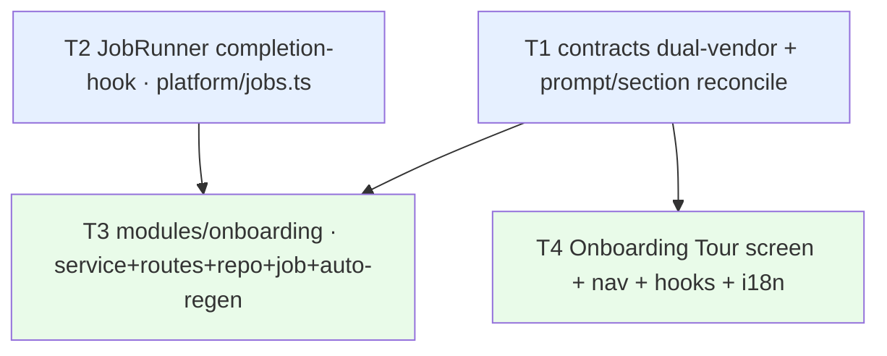

# Implementation Plan — SPEC-03 Onboarding Generator (Onboarding Tour)

- **Spec (WHAT):** [`specs/cross/SPEC-03-2026-07-02-onboarding-generator.md`](../specs/cross/SPEC-03-2026-07-02-onboarding-generator.md) — Status: approved. Reuses `AC-1 … AC-24` verbatim.
- **Plan (HOW):** this file.
- **Date planned:** 2026-07-02

## Execution mode
**MULTI-AGENT (Recommended).** The work splits into two disjoint-file tracks — a backend `modules/onboarding` module + a small platform hook, and a UI screen + nav/hooks/i18n — that share only the dual-vendored contract (an anchor). ≥2 independently-buildable units exist per wave, so parallel `implementer-backend` / `implementer-ui` in worktrees is the right shape (mirrors the SPEC-02 run). Recommended concurrency ≤2 workers per group.

---

## Resolved decisions

**From the spec (user-confirmed 2026-07-02 — restated for traceability, NOT re-authored):**
- **NC-1 → AC-15** — First tasks are **LLM-generated** inside the same single composite `completeStructured` call; no new GitHub fetch / data path.
- **NC-2 → AC-21** — Share link **copies the current authenticated in-app URL only**; no public/shared/unauthenticated artifact. Public/workspace sharing is a Non-goal.
- **NC-3 → AC-9/22/23/24** — Generation is an **async background job** on `container.jobs`: POST enqueues + returns a status handle; the client polls a GET status route (`queued`/`running`/`done`/`failed`); a re-index that advances the index past the tour's `generated_at` **auto-enqueues** exactly one regeneration.

**Planner decision (the one HOW the spec delegated — "exact hook mechanism is a HOW for the plan"):**
- **Auto-regen hook = a JobRunner completion-hook (Option A, chosen).** Add a minimal, `register`-symmetric `onCompleted(kind, hook)` capability to `JobRunner` (`server/src/platform/jobs.ts`) that fires **after** a job of that kind reaches `done`, passing `(payload, ctx:{ jobId, workspaceId, kind })`, fail-soft (a throwing hook is caught+logged, never fails the job). The onboarding module registers hooks for `INDEX_JOB_KIND`/`REFRESH_JOB_KIND`/`RESYNC_JOB_KIND` (imported from `repo-intel/constants.ts` — the same cross-module job-kind import `repos/service.ts:12-14` already uses, so **no** sibling-internal reach and **no** repo-intel edit). The hook body calls the onboarding service's `maybeEnqueueRegen(workspaceId, repoId)`.
  - **Rejected — Option B (repo-intel emits a Container event after each index method):** would edit `repo-intel/service.ts` (spec Non-goal: "changing repo-intel") and couple more tightly. Option A touches repo-intel not at all and keeps the coupling to a shared job-kind constant.
  - This is the **primary review gate** (see Risks). It is also what makes AC-24 unit- and it-testable without a live indexer (a stub index handler + `jobs.onIdle()`).

**Proposed-improvements verdict (spec marked all three "plan decides"):**
- **#1 Extend `OnboardingLink` with `rationale` + `used_by` → ADOPT.** AC-12 mandates a per-file rationale + a **deterministic** "used by N routes" count; the cleanest way to keep the count out of LLM prose and assert it derives from `getBlastRadius` is a structured (nullish) field the server fills post-generation. Dual-vendored contract change (both copies) — the #1 sequencing anchor + INSIGHTS pitfall.
- **#2 Deterministic import-graph diagram fallback → DEFER.** No AC requires it; AC-11's "drop the invalid diagram, render the rest" is already satisfied by the existing `MermaidDiagram` (validates + renders nothing on invalid). Building a `file_edges`→mermaid renderer is out of v1 scope.
- **#3 Snapshot feature-model + input-fact digest → DEFER.** No AC requires it, and it would need either a new column (Non-goal: no migration) or polluting the `Onboarding` contract's `json`.

No `[RESEARCH NEEDED]` gaps — every dependency (`JobRunner`/`p-queue`, `mermaid@^11`, `react-markdown`, Drizzle, repo-intel facade, `wrapUntrusted`) is in-repo and understood.

---

## Requirements review (restated from the spec — NOT newly authored)

1. A top-level **Onboarding Tour** nav item (its own icon, `:repoId`-templated href) in the sidebar **WORKSPACE** section, scoped to the active repo; a repo-scoped screen with breadcrumb `<owner>/<repo> > Onboarding Tour` and header `Onboarding for <repo-name>` (AC-1, AC-2).
2. **Exactly five** collapsible section cards in canonical order — Architecture overview (markdown + Mermaid), Critical paths (rationale + "used by N" + Open), How to run locally (numbered copyable shell steps), Guided reading path (numbered files + "why"), First tasks — with a left "ON THIS PAGE" anchor TOC (AC-3, AC-10–AC-15).
3. Generate the whole tour via **one** `completeStructured` call over the shared `Onboarding` schema, using the `onboarding` feature-model, grounded on deterministic repo-intel facts + capped key-file excerpts; treat all repo-derived input as **untrusted** (AC-6, AC-7, AC-8, AC-16); deterministic skeleton fallback on no-key/failure without overwriting a good tour (AC-18).
4. Persist per-repo in the existing `onboarding` table; subtitle `Generated from index of {N} files · last refreshed {relative}` (AC-4).
5. **Async background job**: POST enqueues + returns a handle; GET status poll; "updating…"/"stale" indicators; **auto-enqueue** a regeneration on a re-index that advances the index past `generated_at` (only when a tour already exists); Regenerate behind a confirm; Share link copies the current URL (AC-9, AC-21, AC-22, AC-23, AC-24).
6. Degrade gracefully: empty "Generate" state (AC-5), "index this repo first" state (AC-19), tenancy by resolving the repo inside the caller's `workspace_id` (AC-17), i18n + a11y (AC-20).

### Assumptions (grounded)
- **Heavily pre-scaffolded → mostly WIRING.** Confirmed on disk: the `onboarding` table (`server/src/db/schema/context.ts:120-126` — `repo_id` PK, `json` jsonb, `generated_at` timestamptz default now; **no** status column → **no new migration**); the `Onboarding`/`OnboardingSection`/`OnboardingLink` contracts (`server/src/vendor/shared/contracts/knowledge.ts:28-47`); the `onboarding` feature-model (`contracts/platform.ts:43-50`, default `openrouter`/`deepseek/deepseek-v4-flash`) + `FeatureModelId` includes `onboarding`; the system prompt (`server/src/prompts/onboarding.system.md`); the `onboarding` i18n namespace (`client/messages/en/onboarding.json`); and `activeKeyFor` already mapping `/onboarding` → `onboarding-tour` (`client/src/components/app-shell/helpers.ts:29`).
- **The nav item is genuinely missing** — `client/src/vendor/ui/nav.ts` NAV array has no onboarding entry (only `pulls` in WORKSPACE); it must be added (+ `SHORTCUTS`), because NAV is a hardcoded list (client INSIGHTS 2026-06-20).
- **The generative pattern is established** — `modules/conventions/service.ts` (`getFeatureModelOverride`/`resolveFeatureModel` → `container.llm(provider).completeStructured` with a zod schema + grounded, drop-ungrounded), `modules/blast/summary.ts` (exactly-one call + deterministic fallback on throw/missing-key/empty), and reviews' fire-and-forget (`reviews/service.ts:147`) + boot reaper (`:106`). The onboarding module mirrors all three; `reviewer-core` is untouched.
- **The repo-intel facade already exposes every needed read** — `getRepoMap` (cached, token-budgeted, `:400`), `getTopFilesByRank`/`getFileRank` (`:654`/`:420`), `getCriticalPaths` (the "onboarding reading-path", `:678`, returns `string[][]`), `getBlastRadius` (`:222`), `getIndexState` (`:191`, returns `filesIndexed`/`lastIndexedSha`/`updatedAt`). No repo-intel change.
- **The job runner + jobs table are ready** — `JobRunner.enqueue(workspaceId, kind, payload)` returns `{ id, done }`, `register(kind, handler)` (`platform/jobs.ts`); the `jobs` table (`db/schema/ops.ts:6`) is `workspace_id NOT NULL`, `status` enum `queued|running|done|failed`. The one-shot boot registration pattern is `repo-intel/routes.ts:29-30` / `repos/routes.ts:24`.
- **Two strong client reuse points:** `client/src/components/mermaid-diagram/MermaidDiagram.tsx` already validates with `mermaid.parse({suppressErrors})` and **renders nothing on invalid** (`state==="invalid" → return null`, `securityLevel:"strict"`) → AC-10/AC-11 are reuse. `@devdigest/ui` `Markdown` (`vendor/ui/primitives/Markdown.tsx`, react-markdown, no raw HTML) renders LLM markdown XSS-safely → AC-10 body render is reuse.
- **Section-taxonomy reconciliation (HOW consequence of AC-3).** Three pre-shipped surfaces disagree (prompt kinds `architecture`/`routes_and_apis`; `onboarding.json` `generate.body` five; the mockup five). v1 collapses to the mockup's canonical five in order. `onboarding.system.md` `{{sections}}` + the mermaid-allowed kinds, and `onboarding.json` `generate.body`, are reconciled to it. Canonical `kind` slugs: `architecture`, `critical_paths`, `how_to_run`, `reading_path`, `first_tasks`; only `architecture` may carry a `diagram`.

### Open questions / clarifications needed
None blocking. The spec is approved with all NCs resolved; the one delegated HOW (auto-regen hook) is decided above.

### Research needed
None.

### Recommendations (how to build it better — advice, not requirements)
- **Reuse over rebuild** — `MermaidDiagram` and the `Markdown` primitive for the whole render layer; the `conventions` service as the copy-from template for the generative service; `blast/summary.ts` for the fallback shape.
- **One response envelope, not three routes.** Return an `OnboardingResponse` from the tour GET that already embeds `{ tour, generated_at, files_indexed, indexed, stale, job }`, mirroring the `BlastResponse` wrapper precedent (server INSIGHTS 2026-06-27), so the screen renders freshness + not-indexed + in-flight status from one fetch. Keep the dedicated `GET job status` route too (AC-23 asks for it verbatim) for the poll loop.
- **Lightweight in-flight de-dupe** (spec edge case + Proposed): before enqueueing (manual or auto), skip if a `queued`/`running` onboarding job already exists for the repo — bounds LLM cost on overlapping Regenerate + auto-on-re-index. Cheap query; last-writer-wins remains the correctness guarantee (AC-9).
- **Keep the auto-regen decision in the service** (`maybeEnqueueRegen`), not the platform hook — the hook is dumb plumbing; the "tour exists AND index advanced past `generated_at`" rule (AC-24) lives in `onboarding/service.ts` where it's unit-testable.

---

## Acceptance criteria (verbatim ids — traceability anchors)

- **AC-1** — WORKSPACE nav item (`onboarding-tour`, own icon, `:repoId` href) + `activeKeyFor` highlights the tour route (and does NOT mis-highlight the bare `/onboarding` add-repo route). Verify: client unit (NAV contains item; `resolveHref` fills `:repoId`; `activeKeyFor` → `onboarding-tour` on `/repos/:id/onboarding`, not on `/onboarding`). → **T4**
- **AC-2** — repo-scoped screen; breadcrumb `<owner>/<repo> > Onboarding Tour`; header `Onboarding for <repo-name>`. Verify: client unit (breadcrumb+header from active repo) + *.it.test.ts (route scoped by repo id). → **T4, T3**
- **AC-3** — exactly five collapsible cards in canonical order + "ON THIS PAGE" anchor nav. Verify: client unit (five titled cards in order; anchors link to each) + unit (service normalizes to the canonical five). → **T4, T3, T1 (prompt `{{sections}}`)**
- **AC-4** — persist per repo; subtitle `index of {filesIndexed} files · last refreshed {relative(generatedAt)}`. Verify: *.it.test.ts (row persisted + read back) + client unit (subtitle renders count + relative). → **T3, T4**
- **AC-5** — no tour → "Generate onboarding tour" empty state, no auto-generate. Verify: client unit (empty state + CTA; no auto-fetch) + T3 (GET returns `tour:null`). → **T4, T3**
- **AC-6** — one `completeStructured` (schema == `Onboarding`, `onboarding.system.md`, model from `resolveFeatureModel('onboarding')`). Verify: unit (one call; schema; model source). → **T3**
- **AC-7** — deterministic fact assembly (`getRepoMap`/`getTopFilesByRank`/`getFileRank`/`getCriticalPaths`/`getBlastRadius`) + grounding rules ("only real paths"). Verify: unit (facade methods called; prompt carries the rules). → **T3, T1 (prompt)**
- **AC-8** — bound to a capped ranked-file set + budgeted map; never send the full tree. Verify: unit (input file count ≤ cap; no full-tree read). → **T3**
- **AC-9** — Regenerate confirm → enqueue non-blocking job → on done replace `json`+`generated_at`; polled `regenerating` while in flight; cancel enqueues nothing. Verify: *.it.test.ts (confirm enqueues 1 job; on done the single row is overwritten) + client unit (confirm required; cancel = no enqueue). → **T3, T4**
- **AC-10** — Architecture section renders markdown `body` + a Mermaid diagram from `OnboardingSection.diagram`. Verify: client unit (body + mermaid) + unit (architecture section carries non-null `diagram`). → **T4 (reuse `Markdown`+`MermaidDiagram`), T3**
- **AC-11** — invalid Mermaid → diagram omitted, rest renders. Verify: client unit (invalid hidden; body still renders — satisfied by existing `MermaidDiagram`). → **T4**
- **AC-12** — Critical paths: rationale + deterministic "used by N routes" (from `getBlastRadius`, not the model) + Open. Verify: client unit (rows show all three) + unit (`used_by` derives from `getBlastRadius`). → **T3, T4, T1 (`OnboardingLink` fields)**
- **AC-13** — numbered shell steps each copyable, grounded in real setup facts (package.json/docker-compose/.env.example/README). Verify: client unit (numbered + copy buttons) + unit (steps grounded in provided setup facts). → **T3, T4**
- **AC-14** — Guided reading path: numbered real files each with a "why", ordered by `getCriticalPaths`. Verify: client unit (ordered + "why") + unit (order from `getCriticalPaths`). → **T3, T4**
- **AC-15** — First tasks LLM-generated in the same single composite call; no extra fetch/data path. Verify: client unit (list renders) + unit (read from the one `Onboarding` completion; no extra fetch). → **T3, T4**
- **AC-16** — all repo-derived blocks `wrapUntrusted`-fenced under the template's SECURITY guard. Verify: unit (`wrapUntrusted` on every repo-derived block; guard present). → **T3, T1 (prompt guard)**
- **AC-17** — resolve repo within the caller's `workspace_id` before read/write; cross-workspace → not found. Verify: *.it.test.ts (cross-workspace → rejected; row untouched). → **T3**
- **AC-18** — model fail / no key / empty → deterministic skeleton; never overwrite a good tour. Verify: unit (skeleton produced; existing tour untouched). → **T3**
- **AC-19** — repo not cloned/indexed → "index this repo first" state; generation guarded. Verify: client unit (not-indexed state) + *.it.test.ts (generation guarded). → **T3, T4**
- **AC-20** — all strings via `next-intl` `onboarding` ns; cards + anchors keyboard-navigable with labeled links; copy buttons labeled. Verify: client unit (strings via `useTranslations('onboarding')`; roles/labels). → **T4**
- **AC-21** — Share link copies the current authenticated page URL; no public/unauthenticated endpoint added. Verify: client unit (copies current URL) + unit (no public share endpoint in the module). → **T4, T3**
- **AC-22** — "updating…" while polled status is queued/running; brief "stale" badge when `getIndexState` (`lastIndexedSha`/`updatedAt`) is newer than `generatedAt` and the job isn't done; both hidden when idle + fresh. Verify: client unit (three states) + unit (indicators derive from job status + `getIndexState` vs `generatedAt`). → **T3 (`stale`+`job` in envelope), T4**
- **AC-23** — async job: POST enqueues + returns a handle without blocking on the model; GET status route returns `queued`→`running`→`done`; tour readable when done. Verify: *.it.test.ts (POST enqueues 1 job + returns handle; GET status transitions; tour persisted on done) + client unit (loading while queued/running; tour when done). → **T3, T4**
- **AC-24** — a re-index that advances the index past `generated_at` auto-enqueues exactly one regen (carrying the repo's `workspace_id`) when a tour exists; none when no tour exists; never on screen load. Verify: *.it.test.ts (advance → 1 job when tour exists, 0 when none; job carries `workspace_id`) + unit (`maybeEnqueueRegen` triggers on advance vs `generatedAt`). → **T2 (hook mechanism), T3 (registration + logic)**

---

## Non-functional requirements (carried from the spec; assigned to units)
- **Perf** — no re-indexing; bounded input (AC-8); ≤1 model call/generate (AC-6); a persisted tour renders with zero model calls; the POST returns immediately (background job) (**T3**).
- **Async & polling** — `container.jobs` + `jobs` table; enqueue-and-poll; `withTimeout`/`withRetry` bound a stuck run (**T2, T3, T4**).
- **Security — untrusted input (A05)** — every repo-derived block `wrapUntrusted`-fenced + SECURITY guard; the model ignores embedded instructions / never invents paths (AC-16) (**T3, T1**). Client renders LLM markdown via `Markdown` (react-markdown, no raw HTML) + paths as text — no `dangerouslySetInnerHTML` (**T4**).
- **Security — IDOR / ownership (A01)** — resolve repo inside `workspace_id` before touching the `onboarding` row (AC-17); the GET job-status route reads the `jobs` row scoped to `workspace_id` (**T3**).
- **Privacy** — no secrets in prompt/tour/logs; key only via `SecretsProvider` (as `blast/summary`) (**T3**).
- **Tenancy** — `onboarding` row keyed by `repo_id` only → resolve-in-workspace guard; the auto-enqueue carries the repo's `workspace_id` (`jobs.workspace_id NOT NULL`) (**T3, T2**).
- **Job observability** — job lifecycle auditable via the `jobs` row; a boot-reaper for onboarding jobs left `running` by a dead process mirrors `reapStaleRuns` (**T3**, run in the module's boot block — do not touch `app.ts`).
- **a11y** — collapsible cards + anchors keyboard-navigable with labeled in-page links; copy buttons + diagram have accessible labels (AC-20) (**T4**).
- **i18n** — all strings via the `onboarding` namespace; generation writes titles/body in `{{language}}` while keeping identifiers/paths verbatim (**T4, T1 prompt**).

---

## Scope
- **Modules touched:** new `server/src/modules/onboarding/**`; `server/src/platform/jobs.ts` (completion-hook); `server/src/modules/index.ts` (register); `server/src/prompts/onboarding.system.md` (section reconcile); client `app/repos/[repoId]/onboarding/**`, `lib/hooks/onboarding.ts`, `vendor/ui/nav.ts`, `vendor/ui/icons.tsx`, `components/app-shell/helpers.ts`, `messages/en/onboarding.json`; **both** `vendor/shared/contracts/knowledge.ts` copies.
- **Modules deliberately NOT touched** (so workers don't drift): `reviewer-core` (engine frozen — generation lives in the server module, as `conventions`/`blast`/`intent-service` do); **`repo-intel`** (Non-goal: reads the facade only, never re-indexes or edits it); the DB schema / migrations (the `onboarding` + `jobs` tables already exist — **no `db:generate`**); `reviews`, `pulls`, `repos`, `settings`, `agents`, `skills`, `conventions`, `blast`, `project-context`; `app.ts` (the reaper self-registers in the onboarding plugin's boot block).
- **Contracts changed** (`@devdigest/shared`, **BOTH** vendor copies — the #1 sequencing anchor + INSIGHTS pitfall): `contracts/knowledge.ts` — extend `OnboardingLink` (`rationale`, `used_by` nullish); add `OnboardingJobStatus` + `OnboardingResponse`. Confirm the `contracts/index.ts` barrel (both copies) re-exports the new symbols.

---

## Task units

### [T1] Contracts (dual-vendored) + prompt/section reconciliation · track: backend · parallel-group: A
- **Files:**
  - `server/src/vendor/shared/contracts/knowledge.ts` — extend `OnboardingLink` with `rationale: z.string().nullish()` + `used_by: z.number().int().nullish()`; add `OnboardingJobStatus = z.object({ job_id: z.string(), status: z.enum(['queued','running','done','failed']), error: z.string().nullish() })`; add `OnboardingResponse = z.object({ tour: Onboarding.nullable(), generated_at: z.string().nullable(), files_indexed: z.number().int(), indexed: z.boolean(), stale: z.boolean(), job: OnboardingJobStatus.nullish() })`.
  - `client/src/vendor/shared/contracts/knowledge.ts` — **byte-identical** copy of the same additions.
  - Verify `contracts/index.ts` (both copies) exports the new symbols.
  - `server/src/prompts/onboarding.system.md` — reconcile `{{sections}}`-fed section list + mermaid rules to the **canonical five** (`architecture`, `critical_paths`, `how_to_run`, `reading_path`, `first_tasks`; diagram allowed only for `architecture`); drop the `routes_and_apis` references. Keep the SECURITY `<untrusted>` guard, "never invent paths", and "invalid diagrams are dropped" intact.
- **Skills to apply:** `zod`, `typescript-expert`, `onion-architecture`.
- **Known pitfalls (INSIGHTS):** "@devdigest/shared is vendored INDEPENDENTLY into server/… and client/… (NO sync script) — a contract change must be applied to BOTH copies or the apps drift" (server INSIGHTS 2026-06-16; MEMORY `shared-contracts-dual-vendor`). Keep `rationale`/`used_by` **nullish** so the LLM output validates before the server fills `used_by` (the count is server-filled from `getBlastRadius`, never model-authored — AC-12).
- **Definition of done:** both `knowledge.ts` copies byte-identical; `cd server && pnpm typecheck` and `cd client && pnpm typecheck` clean; the prompt's `{{sections}}` block + mermaid-allowed kinds match the canonical five.
- **Depends on:** none.

### [T2] JobRunner completion-hook (platform) · track: backend · parallel-group: A
- **Files:**
  - `server/src/platform/jobs.ts` — add an `onCompleted(kind, hook)` registry (`Map<string, JobCompletionHook[]>`) + `JobCompletionHook = (payload: unknown, ctx: { jobId: string; workspaceId: string; kind: string }) => Promise<void>`; after a job reaches `done` (`jobs.ts:83-86`), invoke the kind's hooks **fail-soft** (each wrapped in try/catch → log, never rethrow, never affect job status). `workspaceId` is already in the `enqueue` closure.
- **Skills to apply:** `onion-architecture`, `typescript-expert`, `fastify-best-practices` (queue lifecycle only).
- **Known pitfalls (INSIGHTS):** this is shared platform infra — keep the addition minimal and `register`-symmetric; a hook must **not** be able to fail the job it observes (fail-soft), and must not create a loop (the onboarding regen kind is not an index kind, so its completion fires no index hooks). No other unit touches `jobs.ts`, so it stays conflict-free.
- **Definition of done:** unit — a registered completion hook fires exactly once after a job of that kind reaches `done`, receives `{ jobId, workspaceId, kind }`, and a throwing hook is swallowed (job still `done`); `pnpm typecheck` clean.
- **Depends on:** none (files disjoint from T1).

### [T3] `modules/onboarding` — service + routes + repository + generation job + auto-regen hook · track: backend · parallel-group: B
- **Files (all new unless noted):**
  - `server/src/modules/onboarding/routes.ts` — Fastify plugin (schema-first, `IdParams`, `getContext()` workspace scope): `GET /repos/:id/onboarding` → `OnboardingResponse` (tour + freshness + latest in-flight job; `tour:null` when none, never 404); `POST /repos/:id/onboarding/generate` → enqueue + `202 { job_id }` (serves first-generate **and** Regenerate); `GET /repos/:id/onboarding/job/:jobId` → `OnboardingJobStatus` (workspace-scoped). In a one-shot boot block (mirroring `repo-intel/routes.ts:29-30`): `service.registerJobHandlers()` (generation kind + the three index completion-hooks via `container.jobs.onCompleted`) and `service.reapStaleOnboardingJobs()`.
  - `server/src/modules/onboarding/service.ts` — `OnboardingService(container)`: `getTour(workspaceId, repoId)` (resolve-in-workspace → read row + `getIndexState` → compose envelope incl. `indexed`/`stale`/`job`); `enqueueGeneration(workspaceId, repoId)` (guard not-cloned/indexed → AC-19; optional in-flight de-dupe; `container.jobs.enqueue(workspaceId, ONBOARDING_JOB_KIND, {repoId})`); `getJobStatus(workspaceId, jobId)`; `runGenerationJob(repoId)` (the handler body — see facts.ts); `maybeEnqueueRegen(workspaceId, repoId)` (AC-24: enqueue iff a tour exists **and** the index advanced past `generated_at`; else no-op); `registerJobHandlers()`; `reapStaleOnboardingJobs()`.
  - `server/src/modules/onboarding/repository.ts` — all Drizzle for the module, workspace-scoped: `getRepoInWorkspace(workspaceId, repoId)` (owner/name/clonePath — mirror `conventions/repository.ts getRepo`, server INSIGHTS 2026-06-20 "read the repos table from your own repository, don't import RepoRepository"); `getTour(repoId)` / `upsertTour(repoId, json, generatedAt)` (the `onboarding` row); `getJob(workspaceId, jobId)` + `latestOnboardingJob(workspaceId, repoId)` + `findInFlightRegen(repoId)` over `jobs`; `reapStale(...)`.
  - `server/src/modules/onboarding/facts.ts` — deterministic assembly (`getRepoMap`, `getTopFilesByRank`/`getFileRank`, `getCriticalPaths`, `getBlastRadius`, `getIndexState`) + capped key-file excerpts + setup-facts reader (`package.json`/`docker-compose*`/`.env.example`/README via `container.git.readFile`, with a path-safety guard); `buildMessages(...)` wrapping every repo-derived block in `wrapUntrusted` (imported from `@devdigest/reviewer-core`); post-generation fill of `used_by` on Critical-paths links from `getBlastRadius` (AC-12); `normalizeToCanonicalFive(...)`; `buildDeterministicSkeleton(...)` (AC-18, mirrors `blast/summary.ts deterministicSummary`).
  - `server/src/modules/onboarding/constants.ts` — `ONBOARDING_JOB_KIND`; canonical section defs (kind+title+diagramAllowed); file/excerpt caps; setup filenames; re-import `INDEX_JOB_KIND`/`REFRESH_JOB_KIND`/`RESYNC_JOB_KIND` from `../repo-intel/constants.js` (the accepted cross-module job-kind import, per `repos/service.ts:12`).
  - `server/src/modules/onboarding/helpers.ts` — row→`Onboarding`/`OnboardingResponse` mapping; `stale` computation (`getIndexState.lastIndexedSha`/`updatedAt` vs `generatedAt`).
  - `server/src/modules/index.ts` — register `onboarding` (one import + one entry, after `repoIntel`).
- **Skills to apply:** `onion-architecture`, `fastify-best-practices`, `drizzle-orm-patterns`, `zod`, `security`, `typescript-expert`.
- **Known pitfalls (INSIGHTS):** the generative pattern is `resolveFeatureModel` → `container.llm(provider).completeStructured({schema: Onboarding, schemaName:'Onboarding'})` with a deterministic fallback on any throw / missing key / empty (server INSIGHTS 2026-06-27 blast/summary). Scope **every** query by `workspace_id`; resolve the repo in-workspace before touching the `repo_id`-keyed `onboarding` row (AC-17, IDOR). Read the repos table from **this** repository, don't import a sibling's (server INSIGHTS 2026-06-20). Cross-module job-kind constant import is fine; importing repo-intel's **service** is not. Windows-safe `join`/`dirname` for clone reads (server INSIGHTS 2026-06-16 `pathToFileURL`/path-sep). The `used_by` count is deterministic (`getBlastRadius`), never model-authored (AC-12). Boot-register handlers + reaper in the plugin, not `app.ts`.
- **Definition of done:**
  - unit — one `completeStructured` (schema `Onboarding`, model from `resolveFeatureModel('onboarding')`) (AC-6); facts call the named facade methods + input ≤ cap, no full-tree read (AC-7, AC-8); `wrapUntrusted` on every repo-derived block (AC-16); `used_by` from `getBlastRadius` (AC-12); reading-path order from `getCriticalPaths` (AC-14); setup steps grounded in provided facts (AC-13); first-tasks read from the single completion (AC-15); skeleton on failure without overwriting a good tour (AC-18); normalizes to canonical five (AC-3); `maybeEnqueueRegen` enqueues on advance-with-tour and no-ops without a tour (AC-24).
  - *.it.test.ts — POST enqueues exactly one job + returns a handle without blocking on the model, GET status transitions `queued→running→done`, tour persisted + read back on done (AC-4, AC-23); Regenerate overwrites the single row (AC-9); cross-workspace repo → rejected, row untouched (AC-17); generation guarded when clone/index absent (AC-19); a stubbed index-job completion enqueues one regen job carrying `workspace_id` when a tour exists, none when not (AC-24); no public/unauthenticated share endpoint exists (AC-21).
- **Depends on:** T1 (contracts + prompt), T2 (jobs hook).

### [T4] Onboarding Tour screen + nav + hooks + i18n · track: ui · parallel-group: B
- **Files:**
  - `client/src/app/repos/[repoId]/onboarding/page.tsx` (**new**, thin `"use client"`; reads `useParams().repoId`; mirrors `app/repos/[repoId]/pulls/page.tsx`).
  - `client/src/app/repos/[repoId]/onboarding/_components/OnboardingView/**` (**new**) — header (breadcrumb + `Onboarding for <name>` + subtitle `index of {N} files · last refreshed {relative}`; Regenerate [confirm → POST → poll]; Share link [copy `window.location.href`]; updating…/stale indicators), left "ON THIS PAGE" anchor TOC, five collapsible section cards in canonical order; section renderers — Architecture (`Markdown` body + `MermaidDiagram`), Critical paths (rows: rationale + "used by {used_by} routes" + Open via `MonoLink`/`githubBlobUrl`), How to run locally (numbered steps + per-step copy button), Guided reading path (numbered files + "why"), First tasks (list); states — empty "Generate" (AC-5), not-indexed (AC-19), generating/regenerating, loadError; `OnboardingView.test.tsx`.
  - `client/src/lib/hooks/onboarding.ts` (**new**) — `useOnboarding(repoId)` (GET `OnboardingResponse`), `useGenerateOnboarding(repoId)` (POST → `{job_id}`, invalidate on done), `useOnboardingJob(repoId, jobId)` (poll GET status with `refetchInterval` while `queued`/`running`) — over `api.get/post`, keys `["onboarding", repoId]` / `["onboarding-job", repoId, jobId]`.
  - `client/src/vendor/ui/nav.ts` — add `{ key:'onboarding-tour', label:'Onboarding Tour', icon:<new>, href:'/repos/:repoId/onboarding', gKey:'o' }` to the **WORKSPACE** group + a `g o` `SHORTCUTS` entry.
  - `client/src/vendor/ui/icons.tsx` — add one distinct lucide icon (e.g. `Compass` or `Map`) to the import list + the `Icon` map (`FileText` is taken by project-context).
  - `client/src/components/app-shell/helpers.ts` — refine `activeKeyFor` so the tour route (`/repos/:id/onboarding`) → `onboarding-tour` while the bare `/onboarding` add-repo route does **not** (e.g. require `pathname.includes('/repos/') && pathname.includes('/onboarding')`).
  - `client/messages/en/onboarding.json` — reconcile `generate.body` to the canonical five, and add all new UI keys (section titles, ON THIS PAGE, subtitle, share/regenerate/confirm, updating/stale, not-indexed, copy labels, first-tasks). **This unit owns the whole file** (keeps i18n disjoint from T1).
- **Skills to apply:** `frontend-ui-architecture`, `next-best-practices`, `react-best-practices`, `react-testing-library`, `zod`, `security`, `typescript-expert`.
- **Known pitfalls (INSIGHTS):** NAV is a HARDCODED list — a new top-level route needs a NAV item (+ SHORTCUTS), not just `activeKeyFor` (client INSIGHTS 2026-06-20); i18n auto-globs the json but **next-intl throws on any missing key** — every referenced key must exist (2026-06-20); style with **CSS design tokens**, not Tailwind utilities (`client/CLAUDE.md`); **`@testing-library/user-event` is NOT installed — use `fireEvent`** (client INSIGHTS 2026-06-24); reuse the existing `MermaidDiagram` (already drops invalid — AC-11) and the `Markdown` primitive (react-markdown, no raw HTML — AC-10 XSS-safe); render untrusted paths/labels as text (React escapes). Poll only while `queued`/`running`; stop on `done`/`failed`. Adding a new named export to a barrel mid-`pnpm dev` can serve a stale copy — restart dev, don't "fix" (2026-06-16).
- **Definition of done:** client unit (fetch-mocked) — nav item + `resolveHref` + `activeKeyFor` incl. the no-mis-highlight case (AC-1); breadcrumb+header (AC-2); five ordered cards + anchor nav (AC-3); subtitle count+relative (AC-4); empty state, no auto-generate (AC-5); Regenerate requires confirm, cancel = no request (AC-9); architecture body+mermaid, invalid mermaid hidden (AC-10, AC-11); critical-paths rows (AC-12); numbered copyable steps (AC-13); ordered reading path (AC-14); first-tasks list (AC-15); not-indexed state (AC-19); strings via `useTranslations('onboarding')` + roles/labels on anchors + copy buttons (AC-20); Share link copies the URL (AC-21); updating…/stale/idle indicators (AC-22); loading while queued/running, tour when done (AC-23); `pnpm typecheck` clean.
- **Depends on:** T1 (contract types). Live data depends on T3 at integration time; the unit builds/tests independently with mocked fetch.

---

## Parallelization graph
Disjoint file sets share a group; the dual-vendored contract + the platform hook are the anchors.

- **Group A (anchors, parallel):** T1 (contracts + prompt), T2 (jobs completion-hook) — disjoint files.
- **Group B (after A, parallel):** T3 (`server/src/modules/onboarding/**` + `modules/index.ts` + `jobs.ts` consumer), T4 (`client/**`) — disjoint (server vs client).

Recommended concurrency: ≤2 workers per group. T1 ∥ T2 are fully independent; T3 ∥ T4 are disjoint (server vs client) — T4 waits only on T1's types, not on T3.

---

## Test plan
- **Existing must still pass:** `cd server && pnpm exec vitest run --exclude '**/*.it.test.ts'` (unit) + `pnpm exec vitest run .it.test` (Docker-gated, self-skips); `cd reviewer-core && npm test`; `cd client && pnpm test` + `pnpm typecheck`. Note: `test/indexer-pipeline.test.ts` is pre-existing Windows baseline noise (server INSIGHTS 2026-06-16) — validate with targeted suites; the long `reviews.it.test.ts` can flake under Docker contention.
- **New tests by unit** (`.it.test.ts` = DB-backed testcontainers split):
  - Unit: T1 (contracts typecheck + prompt section list), T2 (completion-hook fire/fail-soft), T3 (one-call/facts/wrapUntrusted/used_by/order/skeleton/normalize/maybeEnqueueRegen), client T4 (all AC render/interaction assertions, fetch-mocked).
  - `*.it.test.ts` (T3): POST-enqueue-returns-handle + status transitions + persist-on-done (AC-23, AC-4); Regenerate overwrite (AC-9); cross-workspace isolation (AC-17); generation guarded when not-indexed (AC-19); stubbed-index-completion → one/zero regen jobs carrying `workspace_id` (AC-24); no public share endpoint (AC-21).

---

## Risks & review gates
- **Auto-regen hook (T2+T3) — the primary review gate.** Confirm the `JobRunner` completion-hook is fail-soft (a throwing hook never fails or reopens a job) and loop-free; confirm `maybeEnqueueRegen` enqueues **exactly one** regen only when a tour exists AND the index advanced past `generated_at`, and carries the repo's `workspace_id` (AC-24). This is the one net-new architectural surface.
- **Dual-vendor drift (T1)** — verify both `knowledge.ts` copies are byte-identical before T3/T4 start; the highest-frequency defect class here.
- **No migration expected** — the `onboarding` + `jobs` tables already exist; a `pnpm db:generate` in the diff is a red flag (Non-goal). Human check.
- **Tenancy / IDOR (T3)** — resolve repo in-workspace before the `repo_id`-keyed row; scope the GET job-status route by `workspace_id`. Security check (A01).
- **Untrusted repo input (T3)** — assert `wrapUntrusted` on every repo-derived block + the SECURITY guard survives the prompt reconciliation (T1); the client never `dangerouslySetInnerHTML`s LLM output (A05).
- **Route coexistence (T4)** — the bare `/onboarding` add-repo route must not mis-highlight the new nav item; regression-assert `activeKeyFor` on both paths.
- **Section-taxonomy reconciliation (T1↔T3↔T4)** — the canonical five must agree across the prompt `{{sections}}`, the service normalization, and the client render; a drift shows as a missing/extra card.
- **AC-18 / cost** — the deterministic skeleton + missing-key path are the honest zero-real-call gate; verify a no-key env never overwrites a good tour and never throws.

---

## Handoff
Execute with **`/implement plans/PLAN-SPEC-03-onboarding-generator.md`** (multi-agent): Group A (T1 ∥ T2) → Group B (T3 ∥ T4). `plan-verifier` traces the code against this file's `AC-1 … AC-24` ids; each task unit's Definition-of-done is its per-unit acceptance gate.
