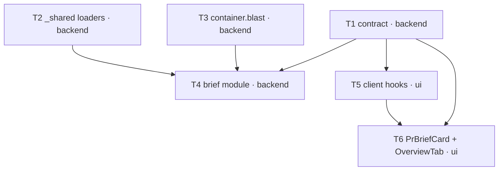

# Implementation Plan — SPEC-04 PR Why+Risk Brief

- **Spec (WHAT):** [`specs/cross/SPEC-04-2026-07-02-pr-why-risk-brief.md`](../specs/cross/SPEC-04-2026-07-02-pr-why-risk-brief.md) — Status: approved. Reuses `AC-1 … AC-16` verbatim.
- **Plan (HOW):** this file.
- **Date planned:** 2026-07-02

## Execution mode
**MULTI-AGENT (user-confirmed 2026-07-02).** A foundational trio with fully disjoint file sets
(contract redefinition, `_shared` loader lift, blast-facade wiring) parallelizes cleanly, followed
by a backend-module vs UI-card split. Recommended concurrency **≤3** workers.

---

## Resolved decisions (user-confirmed 2026-07-02 — restated for traceability)

- **Exec mode → MULTI-AGENT.** Three parallel groups (below).
- **Blast integration → expose `BlastService` + a summary-free `blastMapForPr` (deterministic
  summary, ZERO LLM).** Keeps the blast module's name-match caller fallback and matches AC-1's
  literal `BlastService.blastForPr → BlastRadius`; the default `blastForPr` makes a **2nd** LLM call
  (`blast/service.ts:66` → `summary.ts:51-78`) that would break the one-call budget (AC-2/AC-15).
  **This is task unit T3.** (Rejected alt: call `container.repoIntel.getBlastRadius` directly — fewer
  files but loses the caller fallback.)
- **Fallback persistence (AC-8) → persist-if-absent, never clobber a good brief.** A keyless
  first-Generate still caches an inspectable deterministic brief; an existing good brief is never
  overwritten by a degraded one.
- **`generated_at` → optional `generated_at?: string` on `Brief`, read from the json blob** (stored
  INSIDE json per AC-5; surfaced so the card can render "generated {relative}"). No new column.
- **HTTP shape → `POST /pulls/:id/brief → 200 { brief: Brief }`; `GET /pulls/:id/brief → Brief | null`**
  (GET mirrors intent's `Intent | null`).
- **`client/messages/en/brief.json` → replace the stale composite keys** (`block.intent/blast/risks/
  history`, `why.*` — for the never-wired `PrBrief`) with the new `brief` namespace.

No `[RESEARCH NEEDED]` gaps — every dependency is in-repo and verified.

---

## Requirements review (grounded)

- New module `server/src/modules/brief` (routes → service → repository + `helpers.ts`/`constants.ts`),
  registered in `server/src/modules/index.ts:29-43` (one import + one entry). Mirrors `blast`/`conventions`.
- **Pre-ship confirmed real:** `pr_brief` table `server/src/db/schema/reviews.ts:66-71` (`prId` PK/FK
  cascade, `json` jsonb notNull, **no** `workspace_id`, **no** `generated_at`); `risk_brief`
  feature-model default `openai`/`gpt-4.1` at `server/src/vendor/shared/contracts/platform.ts:60-66`
  (+ id enum `:17`); `PrBrief`/`Risk`/`RiskSeverity` at
  `server/src/vendor/shared/contracts/brief.ts:118-124,50-57,47-48`.
- **`PrBrief` is functionally unused** — grep found only definitions (both `brief.ts` copies), doc
  comments (`vendor/shared/index.ts:6`, `contracts/blast.ts:8` ×2, `modules/blast/README.md:41,58`)
  and a passthrough re-export **with no importer** at `client/src/lib/types.ts:35`. Safe to redefine.
- **No brief prompt ships** — `server/src/prompts/` holds only `onboarding.system.md`; authoring
  `brief.system.md` is a task unit.
- **Cross-module reads need no sibling imports:** `container.reviewRepo` (`platform/container.ts:105-107`)
  exposes `getPull(workspaceId,prId)` `reviews/repository.ts:30`, `getIntent(prId)` `:134`,
  `reviewsForPull(prId)` `:62`, `getPrFiles(prId)` `:38`, `getRepo(repoId)` `:34`.
- `wrapUntrusted(label, content)` exported from `@devdigest/reviewer-core` (`reviewer-core/src/prompt.ts:30-34`).
- Grounding-drop precedent: `modules/conventions/service.ts:63-90`. One-call+fallback precedent:
  `modules/blast/summary.ts:10-19,51-78`.
- **Note:** `contracts/why.ts:4-12` is a *separate* git-why feature — NOT this brief. Do not touch.

## Acceptance criteria → owning unit (ids verbatim; full `Verify:` hints in Test plan)

`AC-1`→T4 · `AC-2`→T4(+T3) · `AC-3`→T4 · `AC-4`→T4 · `AC-5`→T4(+T1) · `AC-6`→T4,T6 · `AC-7`→T6,T4 ·
`AC-8`→T4 · `AC-9`→T1,T4,T6 · `AC-10`→T4(+T2) · `AC-11`→T4 · `AC-12`→T6(+T1) · `AC-13`→T6 ·
`AC-14`→T6 · `AC-15`→T4,T3 · `AC-16`→T4.

## Non-functional requirements

- **Perf** (one call/generate, zero on read, no diff bodies) → T4/T3 · verified by AC-2/AC-15.
- **Security/authz** — untrusted issue+spec text `wrapUntrusted`+guard (T4/T2, AC-10); repo paths are
  data, only linked (T6, `MonoLink`, no `dangerouslySetInnerHTML`); API key only via `SecretsProvider`
  (enforced by `container.llm`→`buildLlm` `container.ts:179-199`).
- **Tenancy** — `pr_brief` has no `workspace_id` (`schema/reviews.ts:66-71`) → every route resolves
  the PR in-workspace via `container.reviewRepo.getPull(workspaceId, prId)` first (T4, AC-11).
- **Privacy** — no secrets in prompt/brief/logs; only derived signals (T4).
- **a11y** — `risk_level` by label **and** color; focus list keyboard-navigable with labeled links (T6, AC-9/14).
- **i18n** — `brief` namespace; model prose in workspace language, paths verbatim (T4 prompt, T6 strings, AC-14).
- **Observability** — cached `pr_brief` row inspectable; degraded brief is an explicit fallback, not a silent error (T4, AC-8).

## Scope

- **Touched:** `modules/brief` (new); `modules/_shared/pr-body-refs.ts` (new); `modules/reviews/intent-service.ts`
  (refactor to use `_shared`); `modules/blast/service.ts` + `platform/container.ts` (blast facade);
  `modules/index.ts` (register); `vendor/shared/contracts/brief.ts` ×2 + `client/src/lib/types.ts`;
  `client/src/lib/hooks/{brief.ts(new),index.ts}`; `client/.../pulls/[number]/_components/{PrBriefCard(new),
  OverviewTab/OverviewTab.tsx}`; `client/messages/en/brief.json`; `server/src/prompts/brief.system.md` (new).
- **Deliberately NOT touched:** `reviewer-core/**` (engine frozen, spec `:76-77`); `server/src/db/migrations/**`
  + **no `pnpm db:generate`** (pre-shipped table — **a `db:generate` in the diff is a hard-stop red flag**,
  spec `:72-73`); `modules/reviews/{run-executor,run.ts,routes}` (no review re-run — Non-goals);
  `contracts/why.ts` (separate git-why feature); the blast **route/mapper/fallback/summary** internals
  (reused via the container, not edited beyond `service.ts`'s new method).
- **Contracts changed:** `@devdigest/shared` `brief.ts` — replace unused `PrBrief` with `Brief`, add
  `ReviewFocus`; **must edit BOTH vendor copies byte-identically** + the client re-export at `client/src/lib/types.ts:35`.

## Task units

### [T1] Redefine the `Brief` contract (dual-vendored) · track: backend · group A
- **Files:**
  - `server/src/vendor/shared/contracts/brief.ts` — modify `:118-124`: replace `PrBrief` with
    `Brief = { what, why, risk_level: RiskSeverity, risks: Risk[], review_focus: ReviewFocus[], generated_at?: string }`;
    add `ReviewFocus = { path: string, line: number, reason: string }`; reuse existing `Risk` (`:50-57`)
    + `RiskSeverity` (`:47-48`). Leave `Intent`/`BlastRadius`/`SmartDiff` intact.
  - `client/src/vendor/shared/contracts/brief.ts` — modify: **byte-identical** to the server copy.
  - `client/src/lib/types.ts:35` — `export type { PrBrief, SmartDiff }` → `export type { Brief, SmartDiff }`
    (else typecheck fails once `PrBrief` is gone).
  - (cosmetic, optional) doc comments `vendor/shared/index.ts:6` ×2, `contracts/blast.ts:8` ×2.
- **Skills:** `zod`, `typescript-expert`, `onion-architecture`.
- **Pitfalls:** dual-vendor drift — `server/INSIGHTS.md:30` ("a contract change must be applied to BOTH
  copies or the apps drift"); barrel is `export *` (`vendor/shared/index.ts:17-28`) so `Brief`/`ReviewFocus`
  auto-export and `PrBrief` auto-removes.
- **DoD:** `cd server && pnpm typecheck` + `cd client && pnpm typecheck` clean; `pnpm vitest run test/contracts.test.ts`
  (server) passes; a `diff` of the two `brief.ts` copies is empty.
- **Depends on:** none.

### [T2] Lift PR-body ref loaders to `_shared` · track: backend · group A
- **Files:**
  - `server/src/modules/_shared/pr-body-refs.ts` — create: free functions `loadLinkedIssue(container, repoRef, body)`,
    `loadSpecDocs(container, repoRef, body)`, `isSafeRepoPath` + constants `SPEC_EXTS`/`MAX_SPEC_DOCS`/`MAX_SPEC_CHARS`,
    extracted **verbatim** from `intent-service.ts:106-167,12-15` (take `container`/ports as params — the
    `_shared/project-context.ts:1-7` header documents this cross-module pattern).
  - `server/src/modules/reviews/intent-service.ts` — modify: delete the lifted privates/constants and
    delegate to `_shared/pr-body-refs.js`. **Behavior-preserving.**
- **Skills:** `onion-architecture`, `security`, `typescript-expert`.
- **Pitfalls:** `server/INSIGHTS.md:55` — "modules/reviews now has TWO `isSafeRepoPath` … hardening one does
  NOT harden the other." Lifting to a single source is the fix; keep the md/mdx/txt/rst extension policy
  identical (behavior-preserving only — do NOT add the other guard's resolved-path check).
- **DoD:** existing intent/reviews unit suites still green (`cd server && pnpm vitest run test/reviews-helpers.test.ts`
  + any intent suite); `pnpm typecheck` clean.
- **Depends on:** none.

### [T3] Expose `BlastService` on the container + summary-free map read · track: backend · group A
- **Files:**
  - `server/src/platform/container.ts` — modify: add a lazy `get blast(): BlastService` getter (mirroring the
    `repoIntel` facade getter `:120-124`) + a `blast?` entry in `ContainerOverrides` (`:41-55`) for test injection.
  - `server/src/modules/blast/service.ts` — modify: add `blastMapForPr(workspaceId, prId): Promise<BlastRadius>`
    that runs the existing `build` pipeline (`:46-64`, incl. the name-match caller fallback) but uses
    `deterministicSummary(result)` (`summary.ts:10-19`) instead of `summarize` (`:66`) — **zero LLM calls**.
    (Refactor `build` to accept a summary strategy, or duplicate ~10 lines minus the `summarize` call.)
- **Skills:** `onion-architecture` (Container is the sole composition root for cross-module reuse — precedent
  `container.repoIntel`), `typescript-expert`.
- **Pitfalls:** default `blastForPr` makes a 2nd (blast-summary) LLM call (`service.ts:66` → `summary.ts:51-78`)
  — the brief must NOT use it or AC-15's "at most one model call" breaks. `deterministicSummary` needs no key.
- **DoD:** `pnpm typecheck`; existing blast tests green (`pnpm vitest run test/blast-mapper.test.ts test/blast-summary.test.ts`);
  a new unit asserts `blastMapForPr` triggers **zero** `container.llm` calls.
- **Depends on:** none.

### [T4] `brief` server module (routes → service → repository + prompt) · track: backend · group B
- **Files** (all new except `index.ts`):
  - `server/src/modules/brief/repository.ts` — `getBrief(prId): Promise<Brief|null>` (read `pr_brief.json`) +
    `upsertBrief(prId, brief): Promise<void>` (write json). Owns **only** the `pr_brief` SQL (`schema/reviews.ts:66-71`).
    Drizzle lives here only.
  - `server/src/modules/brief/service.ts`:
    - `getCachedBrief(workspaceId, prId)` — resolve PR in-workspace via `container.reviewRepo.getPull` → `NotFoundError`;
      read `pr_brief`; **zero LLM**.
    - `generateBrief(workspaceId, prId)` — assemble inputs: intent `reviewRepo.getIntent(prId)` (`:134`); blast
      `container.blast.blastMapForPr(workspaceId, prId)` (T3); smart-diff **counts** from `reviewRepo.getPrFiles(prId)`
      (`:38`) → `classifyFile` (`smart-diff.ts:99-114`) reduced to per-role counts; linked issue + specs via
      `_shared/pr-body-refs` (T2; needs `reviewRepo.getRepo` for owner/name); findings via `reviewRepo.reviewsForPull(prId)`
      (`:62`) → non-dismissed `{file, start_line, severity, title}`. Model: `resolveFeatureModel(container, workspaceId, 'risk_brief')`
      (`feature-models.ts:51-57`) → `container.llm(provider).completeStructured({ schema: Brief-shaped, schemaName, messages, maxRetries: 1 })`
      — **exactly one** call (mirror `conventions/service.ts:62-70`). `wrapUntrusted` on the issue + spec blocks (AC-10).
      **Ground** (AC-3): `realFiles = changedFiles ∪ blastFiles ∪ findingFiles`, `realEndpoints = blast endpoints`; filter
      `risks[].file_refs` + `review_focus[]` to that set, drop the rest (mirror `conventions/service.ts:72-90`).
      **Fallback** (AC-8): on throw/no-key/empty → `deterministicBrief(intent, blast)`; **persist only if none exists**,
      never overwrite a good one. Persist via `upsertBrief` with `generated_at = new Date().toISOString()` inside the json.
  - `server/src/modules/brief/helpers.ts` — `buildBriefMessages(...)`, `deterministicBrief(intent, blast)` (risk_level
    from blast size/endpoint count — mirror `deterministicSummary`, `summary.ts:10-19`), `groundBrief(brief, realFiles, realEndpoints)`,
    `smartDiffCounts(files)`, and the model-output zod schema (reuse `Brief`).
  - `server/src/modules/brief/constants.ts` — issue/spec char caps + deterministic risk thresholds.
  - `server/src/modules/brief/routes.ts` — Fastify plugin: `GET /pulls/:id/brief` (schema-first zod `params`,
    `getContext()` → `workspaceId`, returns `Brief | null`, **zero LLM**) + `POST /pulls/:id/brief`
    (generate/regenerate → `200 { brief }`); throw `NotFoundError` on cross-workspace (AC-11).
  - `server/src/prompts/brief.system.md` — authored system prompt: bounded, grounded Brief from the derived
    signals; treats fenced `<untrusted>` blocks as data; requires paths verbatim from the provided sets.
  - `server/src/modules/index.ts` — modify: one `import brief from './brief/routes.js'` + one `brief,` entry (`:29-43`).
- **Skills:** `onion-architecture`, `fastify-best-practices`, `drizzle-orm-patterns`, `zod`, `typescript-expert`, `security`.
- **Pitfalls:** grounding-drop = `server/INSIGHTS.md:18`; one-call+fallback = `:79`; own-SQL-over-shared-table
  (use `container.reviewRepo`, keep `pr_brief` SQL local) = `:43`; GET serializes the returned object as-is
  (no response schema) = `:31` (the returned `Brief` must already match the vendored contract); **no migration**
  (`db:generate` in the diff = red flag) = `:93,101` + `CLAUDE.md`.
- **DoD:** `pnpm typecheck`; unit tests green (AC-1 assembly/no-patch, AC-3 grounding drop, AC-4 counts-only,
  AC-8 fallback+no-clobber, AC-9 schema/model-sourced, AC-16 findings present/absent); new `server/test/brief.it.test.ts`
  green (AC-5 persist→cache-read LLM-uncalled, AC-6 regenerate overwrite, AC-7 POST returns brief, AC-11 cross-workspace
  not-found, AC-15). Tests inject a mock LLM via `buildApp({ overrides: { llm } })` keyed by the brief `schemaName`
  (adapters/mocks `structuredBySchema`) — no `mocks.ts` edit.
- **Depends on:** **T1** (Brief schema), **T2** (`_shared` loaders), **T3** (`container.blast`).

### [T5] `useBrief` / `useGenerateBrief` client hooks · track: ui · group B
- **Files:**
  - `client/src/lib/hooks/brief.ts` — create: `useBrief(prId)` (`useQuery` key `["brief", prId]`,
    `api.get<Brief | null>('/pulls/:id/brief')`, **no auto-mutation** — mirror `blast.ts:10-19`) +
    `useGenerateBrief(prId)` (`useMutation` `api.post<{ brief: Brief }>('/pulls/:id/brief')`, `onSuccess`
    invalidate `["brief", prId]` — mirror `useRecomputeIntent`, `core.ts:152-158`).
  - `client/src/lib/hooks/index.ts` — modify: re-export the two hooks.
- **Skills:** `frontend-ui-architecture`, `react-best-practices`, `next-best-practices`, `zod`, `typescript-expert`.
- **Pitfalls:** the hook is a **pure read** — generation is user-triggered, never auto-fired (contrast `usePrIntent`,
  `client/INSIGHTS.md:22`); adding a barrel export while `pnpm dev` runs can serve a stale barrel (`:66`) — restart dev.
- **DoD:** `cd client && pnpm typecheck` clean.
- **Depends on:** **T1** (Brief type).

### [T6] `PrBriefCard` + OverviewTab wiring + i18n · track: ui · group C
- **Files:**
  - `client/src/app/repos/[repoId]/pulls/[number]/_components/PrBriefCard/PrBriefCard.tsx` — create `"use client"` card.
    Top row: verdict/score/cost/findings from `usePrReviews(prId)` (`reviews.ts:55`) + `usePrRuns(prId)` (`:41`) via
    `latestReviewsPerAgent` (AC-13) — **not** the Brief; empty when no review. Body: `useBrief(prId)` — when `null`,
    show an explicit **Generate** button (`useGenerateBrief`), **no auto-fire** (AC-7); when present, render `risk_level`
    with color **and** label (AC-9), `what`/`why`, `risks[]`, and `review_focus[]` as `path:line` + reason +
    `MonoLink`→ internal Diff-tab deep-link `/repos/:repoId/pulls/:number?tab=diff&file=<path>&line=<line>` (AC-12,
    **amended 2026-07-03**: internal DevDigest diff, auto-scrolled to file:line — was `githubBlobUrl`), plus a **Regenerate**
    button (AC-6). Strings via `useTranslations("brief")` (AC-14). Design tokens only.
  - `.../PrBriefCard/{index.ts, styles.ts}` — create.
  - `.../PrBriefCard/PrBriefCard.test.tsx` — create: AC-7 (null → Generate, no POST; click → one POST then cache),
    AC-9 (label+color, label without color), AC-12 (focus `path:line`+reason+internal `?tab=diff&file=…&line=…` link),
    AC-13 (top row from review data), AC-14 (i18n + labeled links).
  - `.../OverviewTab/OverviewTab.tsx` — modify: render `<PrBriefCard prId={prId} repoFullName={repoFullName} headSha={headSha} />`
    **above** the existing `s.brief` grid (`:18-24`). Props already available (`:9-17`), fed by `PrDetailView.tsx:142-149`.
  - `client/messages/en/brief.json` — modify: replace stale composite keys with the new `brief` namespace (title, what,
    why, riskLevel high/medium/low, reviewFocus, risks, verdict/score/cost/findings labels, generate, regenerate,
    generating, empty/emptyHint, generatedAt).
- **Skills:** `frontend-ui-architecture`, `react-best-practices`, `next-best-practices`, `react-testing-library`,
  `zod`, `typescript-expert`, `security`.
- **Pitfalls:** next-intl **throws at runtime on any missing key** (`client/INSIGHTS.md:46`) — every `t("…")` must exist
  in `brief.json`; `@testing-library/user-event` is **not installed** — use `fireEvent` (`:72`); review-run cost is on
  `RunSummary` (keyed by `run_id`), **not** `ReviewRecord` — map `review.run_id → RunSummary` (`:38`); design tokens
  only, no Tailwind (`client/CLAUDE.md:19-22`) — prefer `@devdigest/ui` primitives (`Button`, `Badge`, `SectionLabel`, `Icon`, `MonoLink`).
- **DoD:** `cd client && pnpm typecheck` + `pnpm test` (PrBriefCard.test.tsx) green; card renders + deep-links in a `/run` drive.
- **Depends on:** **T1** (Brief type), **T5** (hooks). Disjoint from T4 → may overlap it.

## Parallelization graph

- **Group A (parallel ×3):** T1, T2, T3 — file sets fully disjoint (contract files / `_shared`+`intent-service` /
  `container`+`blast/service`).
- **Group B (parallel ×2):** T4 (backend module; needs T1+T2+T3), T5 (client hooks; needs T1).
- **Group C (×1):** T6 (needs T1+T5). Disjoint from T4 → a scheduler may float it alongside T4 once T5 lands.
- Recommended concurrency: **≤3**.

## Test plan

- **Existing tests that must still pass** (from each package root):
  - `cd server && pnpm vitest run test/contracts.test.ts` (T1).
  - `cd server && pnpm vitest run test/reviews-helpers.test.ts` + any intent suite (T2).
  - `cd server && pnpm vitest run test/blast-mapper.test.ts test/blast-summary.test.ts` (T3).
  - `cd client && pnpm test` (full client unit suite).
  - Baseline flakes to ignore: `test/indexer-pipeline.test.ts` Windows flake + occasional `reviews.it.test.ts`
    testcontainers timeout are pre-existing (`server/INSIGHTS.md:85,125`) — run targeted suites.
- **New tests to add:**
  - `server/src/modules/brief/*.test.ts` (unit, adapters mocked): AC-1/3/4/8/9/16.
  - `server/test/brief.it.test.ts` (**`.it.test.ts` suffix is load-bearing** = DB-backed via testcontainers,
    `server/CLAUDE.md:11-15`): AC-5/6/7/11/15/16.
  - `client/.../PrBriefCard/PrBriefCard.test.tsx` (RTL + Vitest, fetch/hooks mocked): AC-6/7/9/12/13/14.
- **Runtime-only ACs — need a real `/run` drive** (per "verify real functionality, not mocks", MEMORY):
  **AC-7** (first-open null → Generate → POST → cache round-trip in the running app), **AC-6** (Regenerate overwrites
  and re-renders), **AC-13** (top row composes real review data), **AC-12** (focus links open the internal Diff tab
  scrolled to the right file:line — amended 2026-07-03).
  Drive the running studio on a real PR after integration; mocked tests + static review won't catch a mis-pinned blob
  URL or an empty-review top row.

## Risks & review gates

- **Dual-vendor contract drift** (T1) — the two `brief.ts` copies must stay byte-identical; the `pr-self-review`
  gate should diff them before merge (`server/INSIGHTS.md:30`).
- **`intent-service` refactor** (T2) touches a working feature — the intent unit tests are the guard; if any lacks
  coverage of the lifted loaders, add a thin unit around `_shared/pr-body-refs` before merging.
- **One-call budget** (T3/T4) — verify `blastMapForPr` + generate make **exactly one** `container.llm` call; the
  blast-summary call is the easy regression. Assert call count in a unit.
- **Grounding correctness** (T4, AC-3) — a too-loose filter surfaces invented paths; a too-strict one drops real
  findings. Cross-check against a real blast map in the `/run` drive.
- **No-migration discipline** — any `pnpm db:generate` / `server/src/db/migrations/**` change in the diff is a
  **hard stop** (spec `:72-73`, `CLAUDE.md` do-not-touch).
- **DoD process gates** (spec `:363-370`): SDD order (spec + this plan committed **before** feature code — visible in
  git log), a cross-model review note, and a clean `plan-verifier` pass (every `AC-1 … AC-16` traced to code + tests).
