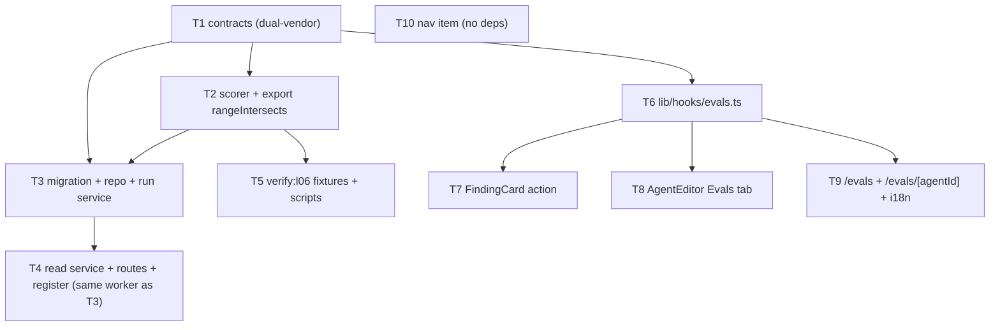

# Implementation Plan — Eval Pipeline (agent regression harness)

- **Spec**: `specs/cross/SPEC-05-2026-07-06-eval-pipeline.md` (SPEC-05, status: approved)
- **Plan date**: 2026-07-06
- **Execution mode**: **Multi-agent** (decided) — `implementer-backend` ×~4 + `implementer-ui` ×~3, worktree-isolated, per the wave graph.
- **Scorer reuse (R1)**: **Export `rangeIntersects`** from `reviewer-core` (decided) — additive, no behavior change; the scorer imports it. The "local overlap helper" fallback is NOT used.
- **Context pack**: see the **Appendix — Context pack** at the bottom of this file (grounded file:line map — implementers should read it before re-exploring; embedded here so it survives across sessions).

## Summary
Product-level eval system over real accept/dismiss data: turn a finding into an eval case in one click, run an
agent against its whole case set through the real `reviewPullRequest` engine, score `recall`/`precision`/
`citation_accuracy` **100% in code (zero LLM calls)** reusing `reviewer-core/src/grounding.ts`, and compare two
runs side by side. 10 task units across a backend track (`server/**` + `reviewer-core/**`) and a UI track
(`client/**`), joined only by the dual-vendored `EvalExpectation` contract (T1).

---

## Task units

Each unit is tagged `track:` and `parallel-group:`, names exact files, the skills to apply, INSIGHTS pitfalls, and a
definition-of-done tied to `AC-N`. Parallel groups have disjoint file sets; shared-file units are sequenced.

### [T1] Contracts: `EvalExpectation` + tighten `expected_output` + run-group/compare/global shapes (DUAL-VENDOR) · track: backend · group: A
- **Files** (both vendor copies edited in lockstep — ONE unit):
  - `server/src/vendor/shared/contracts/knowledge.ts` — add `EvalExpectation` `{ kind: 'must_find'|'must_not_flag', findings: {file,start_line,end_line,severity?,category?,title?}[] }`; `EvalCase.expected_output` `z.unknown()` → `EvalExpectation`.
  - `server/src/vendor/shared/contracts/eval-ci.ts` — `EvalCaseInput.expected_output` `z.unknown()` → `EvalExpectation`; add `EvalRunGroup` (group_id, agent_version, ran_at, recall/precision/citation_accuracy, traces_passed/total, cost_usd), `EvalCompare` ({a,b,delta:{recall,precision,citation_accuracy,cost_usd},a_system_prompt,b_system_prompt}), `GlobalEvalDashboard` (recent_runs[] + per-agent summary_rows[]), `EvalCaseWithState` (case + last-run pass|null + expected/actual counts).
  - `client/src/vendor/shared/contracts/knowledge.ts` + `client/src/vendor/shared/contracts/eval-ci.ts` — **identical** edits.
- **Skills**: `zod`, `typescript-expert`, `onion-architecture`, `security`.
- **Pitfalls**: dual-vendor drift — apply to BOTH copies, no sync script (`server/INSIGHTS.md:34`). Read path must `EvalExpectation.safeParse(row.expected_output)`, never cast (`server/INSIGHTS.md:63`).
- **DoD**: **AC-3** — `EvalExpectation.safeParse` accepts good `must_find`+`must_not_flag`, rejects malformed; both copies export identical schema; server+client `typecheck` clean; extend `server/test/contracts.test.ts`.
- **Depends on**: none.

### [T2] Pure scorer `scoring.ts` + export `rangeIntersects` (R1) · track: backend · group: A→B
- **Files**:
  - `reviewer-core/src/grounding.ts` — add `export` to `rangeIntersects` (additive; no behavior change).
  - `reviewer-core/src/index.ts` — re-export `rangeIntersects`.
  - `server/src/modules/evals/scoring.ts` — **create**, pure/LLM-free: `dedupeExpected` by `(file,start_line,end_line)`; `matchExpected(expected, produced, diff)` (same file AND range overlap via `buildLineIndex`+`rangeIntersects`; full-file kinds → file-presence only, mirroring `FULL_FILE_KINDS`); `scoreCase({expectation,produced,dropped,diff})` → `{recall_case|null, precision_case, pass, kept, dropped}`; `aggregateRun(caseResults)` → `{recall, precision, citation_accuracy, traces_passed, traces_total}` (recall = mean over must_find cases, =1 if none; precision = mean over all; citation pooled kept/(kept+dropped), =1 on empty).
  - `server/src/modules/evals/scoring.test.ts` — **create**, pure-unit vectors, no provider injected.
- **Skills**: `typescript-expert`, `onion-architecture`, `zod`, `security`.
- **Pitfalls**: full-file exemption must mirror the engine (`reviewer-core/src/grounding.ts:16,66`; `server/INSIGHTS.md:91`). Keep deterministic non-LLM logic in the module beside its consumer, NOT in reviewer-core (`server/INSIGHTS.md:81`). `scoring.ts` imports only `@devdigest/shared` types + the two grounding helpers — no `container`, no `llm` (makes AC-8 structural).
- **DoD**: **AC-5, AC-6, AC-7, AC-8 (scorer half), AC-17** — spec vectors pass (recall 0.5; run recall 0.75; no-must_find→1; precision<1 on must_not_flag hit; pooled citation 0.75; pass rule; traces_passed/total). `reviewer-core` typecheck clean.
- **Depends on**: T1 (type). Sequence after T1.

### [T3] Migration + evals repository + run service (`POST /agents/:id/eval-runs`, create-from-finding) · track: backend · group: B
- **Files**:
  - `server/src/db/schema/eval.ts` — add nullable `group_id uuid`, `agent_version integer`, `system_prompt text` to `evalRuns`; index on `group_id` and on `evalCases (owner_kind, owner_id)` (R3).
  - `server/src/db/migrations/00XX_*.sql` + `meta/*` — **generate via `pnpm db:generate`** (never hand-edit).
  - `server/src/modules/evals/repository.ts` — **create**, all Drizzle, every query `workspace_id`-scoped: `createCase`, `listCasesForAgent`, `insertRun` (per case, group snapshot), `getRunsForAgent`, group aggregates, `getGroup`, `getExpectedCasesForAgent`; workspace-scoped read of finding→review (`agent_id`,`pr_id`) + PR row for diff capture (own SQL over shared tables — `server/INSIGHTS.md:47`).
  - `server/src/modules/evals/service.ts` — **create**: `createCaseFromFinding(workspaceId, findingId)` (resolve finding→review→agent_id+pr_id, capture diff via `loadDiff`/`container.reviewRepo`, build `EvalExpectation` from finding kind, persist); `runSet(workspaceId, agentId)` (read agent ONCE for system_prompt/version/model/strategy/enabledSkillBodies; mint group_id; loop cases → validate → `reviewPullRequest` → `scoring` → `insertRun`; AC-16 skip-with-reason).
  - `server/src/modules/evals/constants.ts`, `helpers.ts` — **create** as needed.
- **Skills**: `onion-architecture`, `drizzle-orm-patterns`, `postgresql-table-design`, `fastify-best-practices`, `zod`, `security`, `typescript-expert`.
- **Pitfalls**: FK referencing columns are NOT auto-indexed — index `group_id`+`(owner_kind,owner_id)` then `db:generate` (`server/INSIGHTS.md:39`). `db:migrate`/`db:seed` silently no-op on Windows — apply via a runner or WSL/Git Bash and verify columns exist before `.it.test.ts` (`server/INSIGHTS.md:105,113`). Empty diff yields a false confident review — AC-16 skips empty `input_diff`, never sends it (`server/INSIGHTS.md:28`). Read cross-module data via own workspace-scoped `db.select()`, not a sibling Repository (`server/INSIGHTS.md:47`). Read the agent once (mid-run edit isolation).
- **DoD**: **AC-1, AC-2** (create-from-finding both kinds), **AC-4** (run set, one row/case, shared group_id+snapshots), **AC-8** (endpoint call-count == cases), **AC-16** (invalid+valid → group completes, invalid skipped) — all `.it.test.ts` with `MockLLMProvider`. typecheck clean.
- **Depends on**: T1, T2. Sequence after group A.

### [T4] Read service + dashboard/compare/global + routes + module registration · track: backend · group: B (SAME worker as T3, after T3)
- **Files** (shares `repository.ts`/`service.ts`/`routes.ts` with T3 → same worker):
  - `server/src/modules/evals/service.ts` — **modify**: `dashboardForAgent` (current+delta-vs-prior-group+trend+recent_runs+alert), `compareGroups(a,b)` (both aggregates+deltas+both agent_version+**both system_prompt snapshots**), `globalDashboard` (recent runs across agents + per-agent summary rows).
  - `server/src/modules/evals/repository.ts` — **modify**: group-aggregate + latest-group-per-agent reads (R2: `DISTINCT ON`/window, not JS-dedup), `workspace_id`-scoped; `EvalExpectation.safeParse` at read boundary.
  - `server/src/modules/evals/routes.ts` — **create**: `POST /agents/:id/eval-runs`, `POST /agents/:id/eval-cases/from-finding` ({finding_id}), `GET /agents/:id/eval-cases`, `GET /agents/:id/eval-runs`, `GET /agents/:id/eval-dashboard`, `GET /evals/compare?a=&b=`, `GET /evals` (global). Schema-first zod; `getContext()` scope; `NotFoundError`/`ValidationError`.
  - `server/src/modules/index.ts` — **modify**: one import + one registry entry `evals`.
- **Skills**: `fastify-best-practices`, `onion-architecture`, `drizzle-orm-patterns`, `zod`, `security`, `typescript-expert`.
- **Pitfalls**: latest-group-per-agent via `selectDistinctOn`, not fetch-all-then-JS-dedup (`server/INSIGHTS.md:36`). `safeParse` jsonb on read, not cast (`server/INSIGHTS.md:63`). Register module once (`server/src/modules/index.ts:30`).
- **DoD**: **AC-10** (dashboard after 2 runs), **AC-11** (compare → deltas + both versions + both prompt snapshots), **AC-18** (global read) — `.it.test.ts`; read path asserts zero `container.llm` calls. typecheck clean.
- **Depends on**: T3 (same worker).

### [T5] `verify:l06` fixtures + scripts (record + wire) · track: backend · group: C
- **Files**:
  - `server/src/modules/evals/__fixtures__/good-prompt.outcome.json` + `broken-prompt.outcome.json` — **create**: real recorded `ReviewOutcome` captures (record once from a live run over a small case set; **redact sensitive diff content**). Good finds the expected finding; broken misses it and/or adds a `must_not_flag` hit.
  - `server/src/modules/evals/scoring-fixtures.test.ts` — **create**: fixture-driven prompt-sensitivity test (AC-9) — score the set from each capture, assert recall/precision move as expected; no Postgres/Docker/key/provider.
  - `server/package.json` — **modify**: `"verify:l06": "vitest run src/modules/evals/scoring.test.ts src/modules/evals/scoring-fixtures.test.ts"` (mirrors `verify:l03`).
  - `package.json` (root) — **modify**: `"verify:l06": "cd server && pnpm verify:l06"` (explicit passthrough — not a workspace).
- **Skills**: `typescript-expert`, `onion-architecture`, `security`.
- **Pitfalls**: real fixtures, not a mock provider (spec Notes 2026-07-06; MEMORY "verify real functionality, not mocks"). Keep Postgres/Docker/key-free. Don't confuse reviewer-core's stubbed provider with these captured `ReviewOutcome` JSON inputs.
- **DoD**: **AC-9** (fixture-driven sensitivity), **AC-15** (`pnpm verify:l06` from repo root exits 0, log shows no outbound LLM/network).
- **Depends on**: T2. Parallel with T3/T4 (disjoint files).

### [T6] `lib/hooks/evals.ts` (all eval hooks incl. `useCreateEvalFromFinding`) · track: ui · group: D
- **Files**:
  - `client/src/lib/hooks/evals.ts` — **create**: `useCreateEvalFromFinding()` (POST `/agents/:id/eval-cases/from-finding`; invalidate `["eval-cases", agentId]`), `useAgentEvalCases(agentId)`, `useAgentEvalRuns(agentId)`, `useAgentEvalDashboard(agentId)`, `useRunEvalSet()` (POST `/agents/:id/eval-runs`; invalidate cases+runs+dashboard), `useEvalCompare(a,b)`, `useGlobalEvalDashboard()`. Keys `["eval-*", ...ctx]`.
- **Skills**: `react-best-practices`, `next-best-practices`, `frontend-ui-architecture`, `react-testing-library`, `zod`, `typescript-expert`.
- **Pitfalls**: never `fetch` in a component — hooks over `lib/api.ts`, invalidate on mutation (`client/CLAUDE.md`). New hook in its OWN file (not appended to `reviews.ts`) — avoids the stale-barrel dev trap (`client/INSIGHTS.md:68`). Import contracts from `@devdigest/shared`.
- **DoD**: **AC-12** (hook posts finding id; server maps accepted→must_find/dismissed→must_not_flag) — consumed by T7–T10. typecheck clean; a hook smoke test.
- **Depends on**: T1.

### [T7] FindingCard "Turn into eval case" action · track: ui · group: E
- **Files**:
  - `client/src/app/repos/[repoId]/pulls/[number]/_components/FindingCard/FindingCard.tsx` — **modify**: render a "Turn into eval case" `Button` in `s.actions` **only when** `accepted || dismissed`; click calls `useCreateEvalFromFinding()` with the finding id (local hook use — do NOT thread through `FindingsPanel`, keeps it disjoint).
  - `client/src/app/repos/[repoId]/pulls/[number]/_components/FindingCard/FindingCard.test.tsx` — **modify/add**: RTL — accepted shows action + calls hook; open finding does not render it.
- **Skills**: `react-best-practices`, `react-testing-library`, `frontend-ui-architecture`, `next-best-practices`, `typescript-expert`, `security`.
- **Pitfalls**: `user-event` NOT installed — use `fireEvent` (`client/INSIGHTS.md:74`). CSS tokens + `@devdigest/ui` `Button`, next-intl strings. Don't import a page-feature component into the shared diff-viewer (`client/INSIGHTS.md:26`).
- **DoD**: **AC-12** (RTL both cases). typecheck + client tests green.
- **Depends on**: T6. Disjoint from T8/T9/T10.

### [T8] AgentEditor Evals tab · track: ui · group: E
- **Files**:
  - `client/src/app/agents/[id]/_components/AgentEditor/constants.ts` — **modify**: add `{ key:"evals", labelKey:"editor.tabs.evals", icon:<IconName> }` to `TABS`.
  - `client/src/app/agents/[id]/_components/AgentEditor/AgentEditor.tsx` — **modify**: add `tab === "evals" ? <EvalsTab agentId={agent.id}/> : …`.
  - `client/src/app/agents/[id]/_components/AgentEditor/_components/EvalsTab/` — **create** `EvalsTab.tsx` + `index.ts` + `styles.ts` + `EvalsTab.test.tsx`: case list (pass/fail/never-run via `useAgentEvalCases`), "Run all" (`useRunEvalSet`, invalidate on success), "New eval case", per-run summary, **≥8-case hint** when `<8`, "View full dashboard →" → `/evals/[agentId]`.
  - `client/messages/<locale>/agents.json` — **modify**: `editor.tabs.evals` label.
- **Skills**: `react-best-practices`, `next-best-practices`, `frontend-ui-architecture`, `react-testing-library`, `typescript-expert`.
- **Pitfalls**: editor tab = `TABS` entry + `AgentEditor.tsx` branch (mirror skills/context). Missing `t()` key throws — partial namespace breaks the whole page (`client/INSIGHTS.md:48`). i18n namespaces auto-load (no registration). Target rows by content, not index (`client/INSIGHTS.md:58`).
- **DoD**: **AC-13** (seeded cases from mocked hook; Run all triggers mutation; list refreshes), **AC-14** (3 cases → hint; ≥8 → none), **AC-19 (partial)** ("View full dashboard →" → `/evals/[agentId]`) — RTL. typecheck + tests green.
- **Depends on**: T6. Disjoint from T7/T9/T10.

### [T9] Routes `/evals` (global) + `/evals/[agentId]` (trend + recent runs + 2-run Compare) + `evals` i18n · track: ui · group: F
- **Files**:
  - `client/src/app/evals/page.tsx` + `_components/GlobalEvalDashboard/` — **create**: read-only global — recent runs across agents + per-agent summary rows (`useGlobalEvalDashboard`).
  - `client/src/app/evals/[agentId]/page.tsx` + `_components/AgentEvalDashboard/` (+ `CompareModal/`) — **create**: metric trend + recent runs table + 2-run **Compare** modal (`useEvalCompare`, renders both `system_prompt` snapshots as a diff; deltas by icon/text, not color alone). Thin `"use client"` page reads `useParams`.
  - `client/messages/<locale>/evals.json` — **create**: the new namespace (all strings for T7/T8/T9 using `evals`).
  - `*.test.tsx` beside each component — **create**: RTL, hook mocked.
- **Skills**: `next-best-practices`, `frontend-ui-architecture`, `react-best-practices`, `react-testing-library`, `typescript-expert`, `security`.
- **Pitfalls**: pages thin → colocated `_components/` (`client/CLAUDE.md`). PowerShell globs `[agentId]` — use `-LiteralPath` for FS ops (`client/INSIGHTS.md:72`). CSS tokens + `@devdigest/ui` `Modal`/`Badge`; `fireEvent`; every `evals` key must exist. Prompt text is untrusted display — render as text/pre (`client/INSIGHTS.md:90`).
- **DoD**: **AC-18** (page renders summary rows + recent-runs list), **AC-19** (agent dashboard with trend + recent runs + 2-run Compare) — RTL. typecheck + tests green.
- **Depends on**: T6, T1. Disjoint from T7/T8/T10.

### [T10] Nav item "Eval Dashboard" under SKILLS LAB · track: ui · group: G
- **Files**: `client/src/vendor/ui/nav.ts` — **modify**: add `{ key:"evals", label:"Eval Dashboard", icon:<IconName>, href:"/evals", gKey:"e" }` to the SKILLS LAB group; add matching `SHORTCUTS` entry.
- **Skills**: `frontend-ui-architecture`, `typescript-expert`.
- **Pitfalls**: new top-level route needs a `NAV` item + `SHORTCUTS` `g <key>` line (`client/INSIGHTS.md:46`); `Sidebar` auto-renders — no Sidebar edit (`client/INSIGHTS.md:54`).
- **DoD**: **AC-19 (partial)** (nav renders "Eval Dashboard" under SKILLS LAB → `/evals`) — RTL. typecheck green.
- **Depends on**: none (may share T9's worker — no shared files).

---

## Parallelization graph (waves ≤5 disjoint-file workers)

- **Wave 1**: **T1** (contracts — everything imports it; land first) · **T10** (nav, no deps) may run now.
- **Wave 2** (after T1): **T2** ∥ **T6** ∥ **T10** (if not done) — disjoint (`reviewer-core`+`scoring.ts` vs `client/lib/hooks` vs `nav.ts`).
- **Wave 3** (after T2, T6): **T3→T4** (one backend worker, sequential inside) ∥ **T5** ∥ **T7** ∥ **T8** ∥ **T9** — 5 concurrent, all-disjoint file sets.

Shared-file sequencing: T1 is one dual-vendor unit (both copies, one worker). T3+T4 share `evals/{repository,service,routes}.ts` + `modules/index.ts` → one worker, T3 before T4. No two parallel-group members touch the same file.

---

## Test plan

- **Existing must still pass**: `cd server && pnpm vitest run test/contracts.test.ts` (extend for `EvalExpectation`) + `pnpm typecheck`; `cd reviewer-core && npm run typecheck` (R1 additive export); `cd client && pnpm test` + `pnpm typecheck`. Prefer targeted `pnpm vitest run src/modules/evals` (avoid the Windows indexer flake, `server/INSIGHTS.md:97`).
- **New**:
  - Pure unit: `scoring.test.ts` (AC-5/6/7/17), `scoring-fixtures.test.ts` (AC-9).
  - DB-backed `evals.it.test.ts` (self-skips without Docker — must use the `.it.test.ts` suffix, `server/CLAUDE.md`): AC-1, AC-2, AC-4, AC-8, AC-10, AC-11, AC-16, AC-18 with `MockLLMProvider` (`structuredBySchema`).
  - `verify:l06`: `pnpm verify:l06` from repo root exits 0, no LLM/network (AC-15).
  - UI RTL: `FindingCard.test.tsx` (AC-12), `EvalsTab.test.tsx` (AC-13/14/19), `AgentEvalDashboard`/`GlobalEvalDashboard`/nav (AC-18/19).

---

## Risks & review gates
- **Windows migration silently no-ops** (`server/INSIGHTS.md:105,113`) — after `pnpm db:generate`, apply via a runner or WSL/Git Bash and verify columns exist before `.it.test.ts`. Human-check the generated SQL is column-add + index only (never hand-edit existing files).
- **R1 touches `reviewer-core`** (frozen engine) — additive export only; architecture-reviewer confirms purity preserved (no I/O), no behavior change.
- **Dual-vendor drift (T1)** — highest-risk file-set; server and client copies must match. Gate: a contract test parses the same payloads in both.
- **Fixture capture (T5)** — one live run to record; redact sensitive diff before commit (Privacy NFR). Human-check no secrets in committed fixtures.
- **`expected_output` narrowing** — mitigated by `safeParse`-at-read (T4) returning skip/empty rather than throwing.

---

## AC → task-unit traceability
AC-1,2 → T3 · AC-3 → T1 · AC-4 → T3 · AC-5,6,7,17 → T2 · AC-8 → T2+T3 · AC-9 → T5 · AC-10,11 → T4 · AC-12 → T6+T7 · AC-13,14 → T8 · AC-15 → T5 · AC-16 → T3 · AC-18 → T4+T9 · AC-19 → T8+T9+T10.

## Handoff
Execute with `/implement plans/PLAN-SPEC-05-eval-pipeline.md` (multi-agent). Non-goal reminders: do NOT touch the `evals/` harness at repo root, the reviews/agents module logic (read-only via container), or `reviewer-core` beyond the single additive `rangeIntersects` re-export.

---

## Appendix — Context pack (grounded file:line map)
Front-loaded grounding so implementers verify targeted files instead of re-mapping the codebase. Verify by reading
the cited file only when a detail is load-bearing. (Note: `rangeIntersects` in `reviewer-core/src/grounding.ts` is
module-private in the starter — T2/R1 exports it.)

### Backend — schema (server/src/db/schema/)
- `eval.ts` — **already ships** `evalCases` (`eval_cases`: id, workspaceId FK→workspaces cascade, ownerKind
  enum['skill','agent'], ownerId, name, inputDiff, inputFiles jsonb, inputMeta jsonb, expectedOutput jsonb, notes)
  and `evalRuns` (`eval_runs`: id, caseId FK→eval_cases cascade, ranAt, actualOutput jsonb, pass, recall/precision/
  citationAccuracy doublePrecision, durationMs, costUsd). **ADD via `pnpm db:generate`** (new migration only):
  nullable `group_id uuid`, `agent_version integer`, `system_prompt text` on `eval_runs` + indexes on `group_id`
  and `eval_cases (owner_kind, owner_id)`. No new table.
- `reviews.ts` — `findings` (acceptedAt/dismissedAt, file/startLine/endLine/severity/category/title/kind).
- `agents.ts` — `agents` (systemPrompt, provider, model, strategy, repoIntel, version), `agentVersions`, `agentSkills`.
- Migrations: `pnpm db:generate` (drizzle-kit), `db:migrate`, `db:seed`.

### Backend — contracts (DUAL-VENDORED: edit BOTH server/src/vendor/shared + client/src/vendor/shared, lockstep, no sync)
- `contracts/knowledge.ts` — `EvalCase` (expected_output `z.unknown()` → **tighten to `EvalExpectation`**), `EvalRun`, `EvalOwnerKind`.
- `contracts/eval-ci.ts` — `EvalCaseInput` (expected_output → **tighten**), `EvalRunRecord`, `EvalDashboard`, `EvalTrendPoint`.
- `contracts/findings.ts` — `Finding`, `FindingKind`, `Severity`, `FindingCategory`. `contracts/review-api.ts` — `FindingRecord` (+ review_id, accepted_at, dismissed_at), `ReviewRecord` (agent_id).
- **NEW** `EvalExpectation` (both copies): `{ kind:'must_find'|'must_not_flag', findings:{file,start_line,end_line,severity?,category?,title?}[] }`.

### Backend — engine + scoring (reviewer-core/) — REUSE, keep pure
- `src/grounding.ts` — `buildLineIndex(diff)`, `groundFindings(findings,diff)→{kept,dropped}`, `rangeIntersects` (**module-private → export in T2**), `FULL_FILE_KINDS` (secret_leak/lethal_trifecta/phantom/hook = file-present-only).
- `src/review/run.ts` — `reviewPullRequest(systemPrompt, diff, {repo_intel, skills}, llm)` → `ReviewOutcome` { review.findings (kept), dropped[], grounding "N/M", costUsd, tokens }. `citation_accuracy = kept/(kept+dropped)`.
- `src/index.ts` — public API. Do not add I/O to reviewer-core (only the additive `rangeIntersects` re-export).

### Backend — module pattern + DI (server/src/)
- Pattern: `modules/<name>/{routes,service,repository,helpers}.ts`; routes→service(container)→repository(container.db); register in `modules/index.ts`; `getContext(container, req)→workspaceId`.
- DI: `platform/container.ts` — `container.llm(provider)`, `container.db`, `container.agentsRepo` (`getById`, `enabledSkillBodies`), `container.reviewRepo`, `container.jobs`, `container.runBus`.
- Reference: `modules/reviews/run-executor.ts` (agent-on-diff run), `modules/reviews/diff-loader.ts` `loadDiff`, `modules/reviews/routes.ts` (accept/dismiss), `modules/agents/*`. Mock: `server/src/adapters/mocks.ts` `MockLLMProvider` (`structuredBySchema`) for `.it.test.ts`.
- Verify: `server/package.json` `verify:l03` = `vitest run <file>`. Add `verify:l06` (scorer + fixture test) + root `package.json` passthrough `cd server && pnpm verify:l06`.

### Frontend (client/ — Next.js 15 App Router, CSS design tokens, next-intl, TanStack Query)
- `app/repos/[repoId]/pulls/[number]/_components/FindingCard/FindingCard.tsx` (+ `FindingsPanel/` wires `useFindingAction()`). Add "Turn into eval case" (acted findings only).
- `app/agents/[id]/_components/AgentEditor/` — `constants.ts` `TABS` + `AgentEditor.tsx` branch; add `_components/EvalsTab/`.
- `vendor/ui/nav.ts` NAV (WORKSPACE/SKILLS LAB) + `SHORTCUTS`. Routes `app/evals/page.tsx` + `app/evals/[agentId]/page.tsx`.
- `lib/api.ts` (api.get/post), `lib/hooks/reviews.ts` (query/mutation + invalidation pattern) → new `lib/hooks/evals.ts`. i18n: new `evals` namespace under `client/messages/<locale>/` (auto-loaded).
- Styling: `CSSProperties` + tokens (var(--accent)/(--crit)/(--warn)/(--bg-elevated)/(--border)), `@devdigest/ui` primitives. Tests: Vitest + RTL jsdom, fetch mocked, `fireEvent` (no user-event).

### Guardrails
- Separate packages (NOT a pnpm workspace); reviewer-core uses npm; migrations regenerated only; shared contracts dual-vendored (edit both, never fork); no linter added. Scoring: zero LLM calls. Every eval route `workspace_id`-scoped. User diff/JSON = untrusted data validated against `EvalExpectation`.
