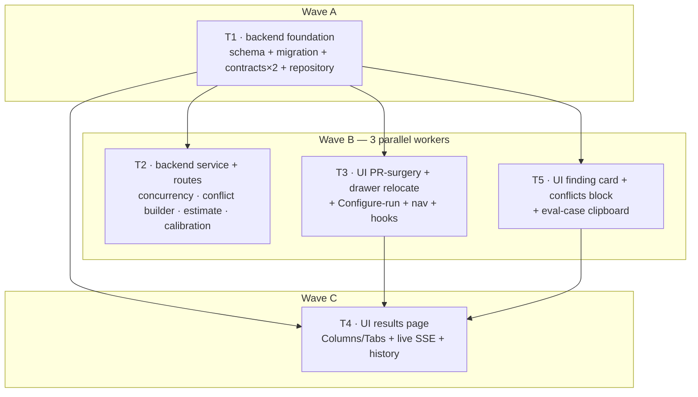

# Implementation Plan — SPEC-06 Multi-Agent Review

- **Spec (WHAT):** [`specs/cross/SPEC-06-2026-07-08-multi-agent-review.md`](../specs/cross/SPEC-06-2026-07-08-multi-agent-review.md) — Status: approved. Reuses `AC-1 … AC-25` verbatim.
- **Plan (HOW):** this file.
- **Date planned:** 2026-07-08

## Execution mode
**MULTI-AGENT (user-confirmed 2026-07-08).** Hard cap **5 task units / implementer agents** (user
constraint). **5 units across 3 waves**; wave B runs **3 workers in parallel** (T2 backend, T3
PR-surgery+configure, T5 finding-card+conflicts) — file sets disjoint, each depends only on the
wave-A foundation. The results page (T4) is isolated to its own wave so it imports ready components
instead of forking them.

---

## Resolved decisions (user-confirmed 2026-07-08 — restated for traceability)

- **Q1 — Linkage → FK column.** `multi_agent_run_id uuid REFERENCES multi_agent_runs ON DELETE SET
  NULL` on `agent_runs` + an explicit index leading with the FK column. One write, one read; no join
  table. **Owned by T1.**
- **Q2 — Estimate aggregation → client-side.** `GET /multi-agent/estimates` (workspace-scoped)
  returns each agent's `{duration_ms|null, cost_usd|null, has_history}`; the picker/Configure page
  aggregates the selected subset + `partial` flag. On start the server **re-computes** the estimate
  for the selected set and persists it (never trusts the client). **T2 serves, T3 aggregates.**
- **Q3 — i18n → three disjoint namespaces** (`multiAgentConfig` / `multiAgentReview` /
  `multiAgentFindings`) so T3/T4/T5 never share a JSON file (next-intl auto-globs namespaces).
- **Q4 — `/multi-agent` landing → REDIRECT to `/multi-agent/configure`.** No landing page in v1
  (history is per-PR and lives on the results page). `client/src/app/multi-agent/page.tsx` is a
  trivial server-component `redirect('/multi-agent/configure')`. Satisfies AC-18 (nav routes to the
  Multi-Agent Review surface).
- **Estimate storage (R2) — store only the estimate**; `agent_count` / `total_duration_ms` (max) /
  `total_cost_usd` (sum) are computed from the linked `agent_runs` at read (cost-at-read pattern).
  No completion callback — fire-and-forget stays simple.
- **Concurrency proof (R5)** — the it.test gives the injected `MockLLMProvider` a small per-call
  delay and asserts wall-clock ≈ one agent (not N×), or asserts the `[ranAt, ranAt+durationMs]`
  windows overlap.
- **Review gates (user constraint)** — after integration: **`plan-verifier` + `architecture-reviewer`
  in PARALLEL over ONE shared context pack** (integrated diff + key-file list gathered once). **NO
  `/code-review` multi-finder fan-out.** Implementers self-review their own diff.

No `[RESEARCH NEEDED]` gaps — every claim below is grounded in a real `path:line`.

---

## Requirements review (grounded)

- **Understood requirements** (restated from the spec):
  1. Replace the PR-page `RunReviewDropdown` with a multi-select **agent picker** (per-agent `~Ns`
     estimate, `Clear`, `Run multi-agent review (N)`, `Configure agents…` link) — AC-1.
  2. Add a **Configure-run page** (`/multi-agent/configure`): PR selector (step 1), agent checkbox
     cards with last-run summary + `time·cost` estimate (step 2), `Select all`, a summary estimate
     (`≈ 8.2s · $0.20 · parallel fan-out`), placeholder+disabled when no PR — AC-3/AC-4.
  3. New **pre-run estimate** mechanic: per-agent estimate from that agent's own past `agent_runs`
     (duration + `runCostUsd`), aggregated into a summary; no-history agents render `— · no history`,
     are excluded, summary marked partial — AC-5/AC-6.
  4. New **multi-run service + routes**: create one `multi_agent_runs` row, **fan out one
     single-agent execution per agent CONCURRENTLY** (`Promise.all` over the existing single-agent
     path, per-agent failure isolation, run-executor/engine unmodified), link the participating
     `agent_runs`, serve the `MultiAgentRun` contract (`columns[]` + `conflicts[]`,
     `total_duration_ms` = max) — AC-7/AC-8/AC-9.
  5. **Deterministic conflict builder** (no LLM): group persisted findings by same `file` +
     overlapping line range, ≥2-agent-take rule, per-agent `ConflictTake` incl. "did not flag" —
     AC-15/AC-16/AC-17.
  6. **Calibration persistence**: persist the pre-run estimate next to the multi-run; expose
     estimate + actual duration/cost — AC-22.
  7. **Results page** with Columns/Tabs switcher, live per-agent SSE status, `View trace` via the
     reused `RunTraceDrawer`, "Where agents disagree" block, history list, URL-addressable per
     multi-run — AC-10/11/12/13/14/15/21/25.
  8. **Reuse** finding Accept/Dismiss; `Turn into eval case` = client clipboard only;
     `Learn`/`Reply to author` disabled — AC-13/14/24.
  9. **Nav item** under a new `GLOBAL` section → `/multi-agent` — AC-18. **Dual-vendored** contract
     extension — AC-19. **i18n/a11y** — AC-20. **Double-click guard** — AC-23. **Tenancy** on every
     route.

- **Assumptions (grounded):**
  - `ReviewService.runReview` (`server/src/modules/reviews/service.ts:117`) is **fire-and-forget**
    (returns runIds immediately, executes in background) — so calling it **once per agent** under
    `Promise.all` yields concurrent background executions. **`ReviewRunExecutor.executeRuns` loops
    agents SEQUENTIALLY** (`run-executor.ts:128` `for … await runOneAgent`), so passing all N agents
    to ONE `runReview` would NOT be concurrent — the new service must issue **N separate
    single-agent `runReview` calls**.
  - **No `container.reviewService` getter exists** (`container.ts` has `agentsRepo`/`reviewRepo`/
    `blast` getters only) — the plan adds one (mirrors `get blast()` at `container.ts:136`).
  - `rangeIntersects` is **private/unexported** in `reviewer-core/src/grounding.ts:41` (only
    `buildLineIndex`/`groundFindings` are exported — `reviewer-core/src/index.ts:23`), and
    reviewer-core is **frozen**. The conflict builder implements a **local range-overlap helper**
    with the same semantics rather than importing `rangeIntersects`. (Correction to the spec's
    "reusing rangeIntersects" phrasing — same semantics, local implementation.)
  - Per-run cost is **derived at read-time** via `runCostUsd(model, tokensIn, tokensOut)`
    (`pricing.ts:48`) — never stored on `agent_runs` (server INSIGHTS 2026-06-16). Columns'
    `cost_usd`, totals, and estimates all use it. Failed/0-token → `null` → "—", never `$0.00`.
  - `RunTraceDrawer` and `RunReviewDropdown` are **both imported by `PrDetailView.tsx`**
    (`RunReviewDropdown` also by `PrDetailHeader.tsx`) — so the picker swap and the drawer
    relocation live in one unit (T3) to keep `PrDetailView.tsx` single-owner.
  - `activeKeyFor` already returns `"multi-agent"` for `/multi-agent` paths
    (`app-shell/helpers.ts:28`) — only the `NAV` registry needs the item.

## Acceptance criteria → owning unit (ids verbatim; full `Verify:` hints in the spec)

- **AC-1** picker (checkbox/agent, count label, Clear, footer link) — T3 · client unit
- **AC-2** confirm → one new `multi_agent_runs` row + navigate to its results page — T3 (client) + T2 (route/it.test)
- **AC-3** Configure-run page (cards + summary + Select all) — T3 · client unit
- **AC-4** no-PR placeholder + non-actionable run button — T3 · client unit
- **AC-5** per-agent estimate from own `agent_runs`, summary aggregates — T2 (service) + T3 (render) · unit + client unit
- **AC-6** no-history → `— · no history`, excluded, summary partial (`≥ ≈…`) — T2 + T3 · unit + client unit
- **AC-7** 1 row + N `agent_runs` linked, **concurrent** fan-out, failure isolation, executor unmodified — T2 · *.it.test.ts
- **AC-8** `MultiAgentRun` read, ws-scoped, cross-ws 404, `total_duration_ms` = max — T2 · *.it.test.ts
- **AC-9** `AgentColumn` mapping (status/verdict/score/summary/duration/cost/findings) — T2 · unit + *.it.test.ts
- **AC-10** live SSE status flips + `View trace` (reused drawer) — T4 · client unit
- **AC-11** failed column (null score), siblings unaffected, failure trace retrievable — T4 (client) + T2 (it.test)
- **AC-12** Columns/Tabs switcher — T4 · client unit
- **AC-13** expanded card (confidence/rationale/suggested fix + 5 buttons, Learn/Reply disabled) — T5 · client unit
- **AC-14** Accept/Dismiss fire finding-action; eval-case = clipboard, no route; Learn/Reply inert — T5 · client unit
- **AC-15** "Where agents disagree" block + `Show only conflicts` toggle — T5 (render) + T2 (builder unit) · client unit + unit
- **AC-16** deterministic grouping (file + line-range overlap, ≥2 takes, no LLM) — T2 · unit
- **AC-17** finding→agent attribution end-to-end — T2 (data) + T5 (consume) · unit
- **AC-18** nav item under GLOBAL, active on `/multi-agent` — T3 · client unit
- **AC-19** dual-vendored contract extension (both copies identical) — T1 · unit
- **AC-20** i18n namespace, non-color severity/score, keyboard — T3/T4/T5 · client unit
- **AC-21** `View trace` mounts the **existing** `RunTraceDrawer` (relocated, same component) with `run_id` — T3 (relocate) + T4 (mount) · client unit
- **AC-22** persist estimate + expose actual duration/cost — T1 (schema) + T2 (persist/expose) · *.it.test.ts
- **AC-23** run control disabled while a launch is in flight (exactly one row) — T3 (picker) + T4 (re-run) · client unit
- **AC-24** `Turn into eval case` builds `AgentCase` template → clipboard, no network — T5 · client unit
- **AC-25** URL-addressable per run + history list, new row per re-run — T2 (data/it.test) + T4 (list/render) · *.it.test.ts + client unit

## Non-functional requirements (carried from the spec)
- **Perf**: conflict grouping + both read paths deterministic, **zero LLM calls**; estimates read
  cached `agent_runs`; fan-out concurrent (wall-clock ≈ slowest agent); page consumes SSE replay,
  **no polling** → **T2** (no-LLM reads/estimate/builder; concurrent fan-out) + **T4** (SSE via
  `useRunEvents`, not polling). Verify: AC-7 (concurrency), AC-16 (no-LLM builder).
- **Security/authz** (A01 IDOR): every route resolves `getContext()` and scopes by `workspace_id`;
  selected `agent_ids` and the multi-run id resolved inside the caller's workspace (cross-ws →
  NotFound); start route **rate-limited** (mirror `POST /pulls/:id/review` `max:10/1min`,
  `routes.ts:30`); findings rendered as **data** (React auto-escapes; neutralized upstream by
  `INJECTION_GUARD`) — **T2** (routes) + **T4/T5** (render). Verify: AC-8 cross-ws 404.
- **Privacy**: no secrets in multi-run data, calibration, or logs; estimates/actuals from
  token/duration/cost aggregates only — **T2**.
- **a11y**: score/severity via label+icon (not color alone); picker, cards, Columns/Tabs switcher,
  conflict cells keyboard-navigable with labeled controls; disabled `Learn`/`Reply` expose "coming
  soon" accessibly — **T3/T4/T5**. Verify: AC-20.
- **i18n**: all new strings via `next-intl` namespaces (Q3); agent prose rendered verbatim — **T3/T4/T5**.
- **Tenancy**: multi-run read/write, estimate, calibration, finding action all ws-scoped — **T2**
  (finding actions already ws-scoped, `findings.ts:18`).
- **Observability**: each lane links to `View trace` (reused `RunTraceDrawer`) — **T4**.

## Scope
- **Modules touched**: new `server/src/modules/multi-agent-review/`; `server/src/db/schema/runs.ts`
  + a generated migration; `server/src/platform/container.ts` (add `reviewService` getter);
  `server/src/modules/index.ts` (register); both `vendor/shared/contracts/observability.ts`; new
  `client/src/app/multi-agent/**`; `client/src/vendor/ui/nav.ts`; new
  `client/src/lib/hooks/multiAgent.ts`; relocate `RunTraceDrawer` →
  `client/src/components/RunTraceDrawer/`; edit `PrDetailView.tsx` + `PrDetailHeader.tsx`; three new
  `messages/en/*.json`.
- **Modules deliberately NOT touched**: `reviewer-core/**` (frozen — read-only reuse);
  `server/src/modules/reviews/run-executor.ts` + engine internals (FROZEN — the new service
  orchestrates concurrency itself); `server/src/adapters/**` (reuse `pricing.ts` only); the
  `AgentStats`/`CuratorResult` contracts (future features — Non-goals);
  `client/src/app/repos/[repoId]/pulls/[number]/_components/RunTraceDrawer/**` internals (moved
  verbatim, **not** forked — AC-21).
- **Contracts changed**: `@devdigest/shared` `observability.ts` — add `MultiAgentRunRequest`,
  `AgentEstimate`, `MultiAgentEstimate`, `MultiAgentRunListItem`, and an `estimate?` field on
  `MultiAgentRun`. **Applied IDENTICALLY to BOTH vendor copies**
  (`server/src/vendor/shared/contracts/observability.ts` **and**
  `client/src/vendor/shared/contracts/observability.ts`) — dual-vendored, no sync script.

## Task units

### [T1] Backend foundation — schema + migration + dual-vendored contracts + repository · track: backend · wave A
- **Files**:
  - `server/src/db/schema/runs.ts` — modify: extend `multiAgentRuns` (add `estimate jsonb`
    [nullable, calibration]); add linkage per **Q1** — a `multiAgentRunId` uuid column on
    `agentRuns` `.references(() => multiAgentRuns.id, { onDelete: 'set null' })` **plus an explicit
    index leading with the FK column** (server INSIGHTS 2026-06-17).
  - `server/src/db/migrations/00NN_*.sql` + `meta/_journal.json` + `meta/00NN_snapshot.json` —
    create via **`pnpm db:generate`** (NEVER hand-edit).
  - `server/src/vendor/shared/contracts/observability.ts` — modify: add `MultiAgentRunRequest`,
    `AgentEstimate`, `MultiAgentEstimate`, `MultiAgentRunListItem`; add
    `estimate: MultiAgentEstimate.nullish()` to `MultiAgentRun`; export via the barrel.
  - `client/src/vendor/shared/contracts/observability.ts` — modify: **byte-identical** extension (AC-19).
  - `server/src/modules/multi-agent-review/repository.ts` — create: `createMultiRun(ws, prId,
    estimate)`, `getMultiRun(ws, id)` (ws-scoped), `listMultiRunsForPr(ws, prId)` (newest-first),
    `linkAgentRuns(multiRunId, runIds[])`, `getLinkedAgentRuns(multiRunId)` (join `agents` for
    name), `agentRunHistory(ws, agentId)` (done runs → duration/tokens/model for estimates). All
    Drizzle here only; every query ws-scoped.
  - `server/src/modules/multi-agent-review/constants.ts` — create (if needed): estimate window size.
  - `server/test/multi-agent-contracts.test.ts` — create: round-trip the new contracts; assert
    `MultiAgentRun.estimate` optional (AC-19 server side).
- **Skills**: `onion-architecture` (repository owns all Drizzle; ws-scoping), `drizzle-orm-patterns`
  (FK + index + jsonb), `postgresql-table-design`, `zod`, `typescript-expert`.
- **Known pitfalls** (INSIGHTS):
  - "`@devdigest/shared` is vendored INDEPENDENTLY into server/… and client/… (NO sync script) — a
    contract change must be applied to BOTH copies or the apps drift." — server/INSIGHTS.md 2026-06-16.
  - "Postgres does NOT auto-index a foreign key's REFERENCING column … Lead the composite with the
    join key." — server/INSIGHTS.md 2026-06-17.
  - "Never hand-edit an applied migration … edit `db/schema/*.ts` → `pnpm db:generate`." — server/README.md.
  - "A repository READ of an unconstrained `jsonb` column that flows out a GET must
    `Contract.safeParse(row.json)` … NOT `as Contract`." — server/INSIGHTS.md 2026-07-03 (reading
    `estimate jsonb` back).
  - Windows: `pnpm db:migrate` can silently no-op — validate the new column/index exists, not just
    exit 0 (server/INSIGHTS.md 2026-06-16/20).
- **Definition of done**: `cd server && pnpm typecheck` clean; `pnpm db:generate` produces exactly
  one new migration + snapshot + journal entry; `pnpm vitest run test/multi-agent-contracts.test.ts`
  green; both `observability.ts` copies diff-identical. Satisfies AC-19; foundation for
  AC-5/7/8/9/22/25.
- **Depends on**: none.

### [T2] Backend multi-run service + routes + registration + concurrency/conflict/estimate/calibration · track: backend · wave B
- **Files**:
  - `server/src/platform/container.ts` — modify: add `get reviewService(): ReviewService` (lazy,
    mirrors `get blast()` at `:136`; composition root is the one place allowed to import a module
    service).
  - `server/src/modules/multi-agent-review/service.ts` — create:
    - **start**: create the `multi_agent_runs` row, **server-compute + persist the estimate** for
      the selected set, then fan out **one `container.reviewService.runReview(ws, prId, [agent])`
      per selected agent under `Promise.all`** (each returns its runId immediately; executions
      overlap in the background), collect runIds, `linkAgentRuns`. Per-agent failure isolation is
      inherited (`run-executor.ts:146`). Return `{ id }` for navigation (AC-2/AC-7).
    - **read** `getMultiRun`: compose `MultiAgentRun` — `columns[]` from linked `agent_runs`
      (+ `agents` name; findings via `container.reviewRepo.reviewsForPull(prId)` filtered by
      `run_id`), `cost_usd` via `runCostUsd`, `total_duration_ms` = **max**, `total_cost_usd` =
      **sum**; `conflicts[]` from the conflict builder; attach persisted `estimate` (AC-8/9/22).
    - **estimate** service: per-agent from `agentRunHistory` (typical duration + `runCostUsd`); no
      usable history → `null` + `has_history:false` (AC-5/AC-6).
    - **list** history for a PR (AC-25).
  - `server/src/modules/multi-agent-review/helpers.ts` — create: **conflict builder** (pure,
    deterministic, NO LLM) — group persisted findings by `file`, cluster by overlapping
    `[start_line,end_line]` via a **local `rangesOverlap(aS,aE,bS,bE) = aS<=bE && bS<=aE`** helper;
    emit a `Conflict` only when **≥2 agents have a take** (≥2 flagged, or ≥1 flagged + ≥1
    done-but-not-flagged, or divergent severities); build `ConflictTake[]` incl. explicit "did not
    flag" (`verdict:'ignored'`) for done agents lacking an overlapping finding; retain `agent_id`
    everywhere (AC-15/16/17). Plus the **column mapper** + **estimate calc**.
  - `server/src/modules/multi-agent-review/routes.ts` — create (Fastify plugin, schema-first,
    ws-scoped): `POST /pulls/:id/multi-agent-run` (body `MultiAgentRunRequest`,
    `config.rateLimit {max:10,timeWindow:'1 minute'}`), `GET /multi-agent-runs/:id`,
    `GET /pulls/:id/multi-agent-runs`, `GET /multi-agent/estimates`. Resolve `getContext()`, throw
    `NotFoundError` for cross-ws (AC-8).
  - `server/src/modules/index.ts` — modify: one import + one entry `multiAgentReview`.
  - `server/src/modules/multi-agent-review/helpers.test.ts` — create: conflict-builder determinism
    (dup case, ≥2-take rule, "did not flag", single-agent-only → no group, divergent severities),
    estimate calc (AC-5/6), column mapper (AC-9), attribution (AC-17).
  - `server/test/multi-agent-review.it.test.ts` — create (DB-backed): AC-7 (1 row + 3 linked runs,
    **concurrency proof** via mock-LLM delay, one forced failure leaves two `done`), AC-8
    (`MultiAgentRun` validates; cross-ws id → 404; `total_duration_ms` = max), AC-11 (failed column
    null score + failure trace retrievable), AC-22 (estimate persisted + actual exposed), AC-25
    (two runs → two ids, no prior row mutated).
- **Skills**: `onion-architecture` (cross-module reuse via `container.reviewService`/`reviewRepo` —
  no sibling-internal import; Drizzle only in T1's repository), `fastify-best-practices`
  (schema-first, rate-limit, error envelope), `drizzle-orm-patterns`, `zod`, `typescript-expert`,
  `security` (A01 IDOR ws-scoping, rate-limit the expensive start route, findings-as-data).
- **Known pitfalls**:
  - **Concurrency trap**: `ReviewRunExecutor.executeRuns` runs agents **sequentially**
    (`run-executor.ts:128`). Do NOT pass all N agents to one `runReview` — issue **N separate
    single-agent `runReview` calls** (`service.ts:147` `void this.executor.executeRuns(...)` is
    fire-and-forget).
  - **`rangeIntersects` is unexported** (`reviewer-core/src/grounding.ts:41`), reviewer-core frozen —
    implement the local `rangesOverlap` helper (same semantics, documented). `buildLineIndex` is
    diff-based and not applicable at read time (no `UnifiedDiff`).
  - "Per-run cost is DERIVED at read-time (`runCostUsd`), never stored … Failed/unpriced/0-token →
    null → '—', never '$0.00'." — server/INSIGHTS.md 2026-06-16.
  - "Cross-module reuse goes through the container/service, not a sibling's internals." — server CLAUDE.md.
  - safeParse-at-read the `estimate jsonb` (server/INSIGHTS.md 2026-07-03).
  - `reviews.it.test.ts` testcontainers can flake under Docker contention (server INSIGHTS
    2026-06-24) — use the `waitForPrRuns` polling helper; self-skips without Docker.
- **Definition of done**: `cd server && pnpm typecheck` clean; helpers unit suite green;
  `pnpm vitest run test/multi-agent-review.it.test` green with Docker. Satisfies
  AC-5/6/7/8/9/11/15(builder)/16/17/22/25 (server side).
- **Depends on**: T1.

### [T3] UI — PR-page picker swap + RunTraceDrawer relocation + Configure-run page + nav + hooks · track: ui · wave B
- **Files**:
  - Create `client/src/app/repos/[repoId]/pulls/[number]/_components/MultiAgentPicker/`
    (`MultiAgentPicker.tsx` + `index.ts` + `constants.ts` + `styles.ts` +
    `MultiAgentPicker.test.tsx`) — checkbox per agent with `~Ns` estimate, `Clear`,
    `Run multi-agent review (N)`, `Configure agents…` → `/multi-agent/configure`; empty-agents
    state; **double-click guard** (AC-23). Delete the old `RunReviewDropdown/` folder.
  - `…/_components/PrDetailHeader/PrDetailHeader.tsx` — modify: swap `RunReviewDropdown` →
    `MultiAgentPicker` (sole callers are here + `PrDetailView` — both edits scoped into this unit).
  - `…/_components/PrDetailView/PrDetailView.tsx` — modify: swap the picker import **and** update
    the relocated `RunTraceDrawer` import path.
  - **Relocate** `RunTraceDrawer`: `git mv` the whole folder → `client/src/components/RunTraceDrawer/`
    (incl. `_components/TraceBody`, `constants.ts`, `helpers.ts`, `styles.ts`, `index.ts`,
    `RunTraceDrawer.test.tsx`) — **same component, not a fork** (AC-21).
  - `client/src/app/multi-agent/page.tsx` — create: server-component
    `redirect('/multi-agent/configure')` (**Q4**).
  - `client/src/app/multi-agent/configure/page.tsx` (thin) +
    `client/src/app/multi-agent/configure/_components/ConfigureRunView/` — PR selector (step 1),
    agent checkbox cards with last-run summary + `time·cost` estimate, `Select all`, summary
    estimate (`≈ …s · $… · parallel fan-out`), `Run multi-agent review (N)`, placeholder + disabled
    when no PR (AC-3/AC-4), partial-summary render (AC-6), double-click guard (AC-23).
  - `client/src/vendor/ui/nav.ts` — modify: add a `GLOBAL` section with
    `{ key:"multi-agent", label:"Multi-Agent Review", icon, href:"/multi-agent", gKey:… }` + a
    `SHORTCUTS` entry.
  - `client/src/lib/hooks/multiAgent.ts` — create: `useAgentEstimates`, `useStartMultiRun` (POST →
    returns id; invalidates history), `useMultiRun(id)`, `useMultiRunHistory(prId)` (T4 imports the
    last two).
  - `client/src/messages/en/multiAgentConfig.json` — create (picker + configure strings).
- **Skills**: `frontend-ui-architecture`, `react-best-practices`, `next-best-practices`,
  `react-testing-library`, `zod`, `typescript-expert`.
- **Known pitfalls**:
  - "Windows PowerShell treats `[param]` route folders as GLOB WILDCARDS … use `-LiteralPath`" —
    client/INSIGHTS.md 2026-06-22 → use `git mv` (Bash tool), not PowerShell `Move-Item`.
  - "next-intl **throws** when a `t()` key is missing … a partial namespace breaks the whole page."
    — client/INSIGHTS.md 2026-06-20.
  - "To surface a new top-level route you must add an item to `NAV` (and a `g <key>` line to
    `SHORTCUTS`), not just `activeKeyFor`." — client/INSIGHTS.md 2026-06-20.
  - "`@testing-library/user-event` is NOT installed — use `fireEvent`." — client/INSIGHTS.md 2026-06-24.
  - "Adding a NEW named export to an existing barrel while `pnpm dev` runs serves a STALE copy →
    restart dev." — client/INSIGHTS.md 2026-06-16.
  - Design tokens only (`var(--accent)`…), `@devdigest/ui` primitives, no Tailwind — client/CLAUDE.md.
- **Definition of done**: `cd client && pnpm typecheck` clean; `pnpm test` green incl. moved
  `RunTraceDrawer.test.tsx` (passing from the new location), `MultiAgentPicker.test.tsx`
  (AC-1/4/6/23), `ConfigureRunView.test.tsx` (AC-3/4/6), nav test (AC-18). Satisfies
  AC-1/3/4/5(render)/6(render)/18/20(config)/21(relocation)/23(picker).
- **Depends on**: T1 (client contract).

### [T5] UI — expandable finding card (actions + clipboard) + "Where agents disagree" block · track: ui · wave B
- **Files**:
  - `client/src/app/multi-agent/_components/AgentFindingCard/` (`AgentFindingCard.tsx` + `index.ts`
    + `helpers.ts` + `styles.ts` + `AgentFindingCard.test.tsx`) — expandable card: severity icon,
    title, category chip, `file:line`, **confidence %**, expanded rationale + `SUGGESTED FIX`;
    buttons `Accept`/`Dismiss` (reuse existing `useFindingAction`, `lib/hooks/reviews.ts:158` —
    unchanged), `Turn into eval case` (client clipboard only), `Learn` + `Reply to author`
    **disabled with accessible "coming soon" tooltip** (AC-13/14).
  - `…/AgentFindingCard/eval-case.ts` — create: build the evals `AgentCase` template
    `{ name, kind, prompt, practices, threshold, maxTurns }` from a finding,
    `navigator.clipboard.writeText`, toast; **no network** (AC-24).
  - `client/src/app/multi-agent/_components/ConflictsBlock/` (`ConflictsBlock.tsx` + `index.ts` +
    `helpers.ts` + `styles.ts` + `ConflictsBlock.test.tsx`) — render `conflicts[]`: one cell per
    participating agent, non-flagging agent explicitly "did not flag"; `Show only conflicts` toggle
    filters to groups with a divergence (AC-15). Pure presentational.
  - `client/src/messages/en/multiAgentFindings.json` — create (own namespace, **Q3**).
- **Skills**: `frontend-ui-architecture`, `react-best-practices`, `react-testing-library`, `zod`,
  `typescript-expert`, `security` (clipboard string is data, not executed; JSX auto-escape).
- **Known pitfalls**:
  - "`user-event` NOT installed — use `fireEvent`." — client/INSIGHTS.md 2026-06-24.
  - "next-intl throws on a missing key" — client/INSIGHTS.md 2026-06-20.
  - "`SeverityBadge` compact mode exposes only a bare number to SR — wrap with `title`+`aria-label`"
    — client/INSIGHTS.md 2026-06-16 (AC-20).
  - Finding titles/rationales/fixes are **untrusted LLM text** — render as data; serialize (never
    execute) into the clipboard string.
  - Don't import a page-feature `FindingCard` into a shared component — this card is self-contained
    and prop-driven (client/INSIGHTS.md 2026-06-24).
- **Definition of done**: `cd client && pnpm typecheck` clean; `pnpm test` green:
  `AgentFindingCard.test.tsx` (AC-13/14/24), `ConflictsBlock.test.tsx` (AC-15). Satisfies
  AC-13/14/15(render)/17(consume)/20/24.
- **Depends on**: T1 (client contract). **Independent of T3/T4.**

### [T4] UI — Multi-Agent Review results page (Columns/Tabs + live SSE + history) · track: ui · wave C
- **Files**:
  - `client/src/app/multi-agent/runs/[id]/page.tsx` — create (thin; `id` via `useParams`).
  - `client/src/app/multi-agent/runs/[id]/_components/MultiAgentResultsView/` — create:
    **Columns/Tabs switcher** (AC-12); **ColumnsView** (column per agent: name, score badge
    [label+icon], `duration·cost`, finding summaries, footer `View trace` + `N findings`);
    **TabsView** (tab per agent + summary card, renders **T5's `AgentFindingCard`**); **live
    per-agent status** via `useRunEvents(runIds)` (`lib/hooks/reviews.ts:187`, replay-first,
    running→done/failed, AC-10/11); `View trace` mounts the **relocated `RunTraceDrawer`**
    (`@/components/RunTraceDrawer`) with the agent's `run_id` + `agentName`/`prNumber`/`findings`/
    `running` (AC-21); render **T5's `ConflictsBlock`** below both modes (AC-15).
  - `client/src/app/multi-agent/_components/MultiRunHistoryList/` — create: list the PR's past
    multi-runs, most-recent first, each opening by id (AC-25); re-run control reuses
    `useStartMultiRun` with the double-click guard (AC-23).
  - `client/src/messages/en/multiAgentReview.json` — create (results-page strings).
- **Skills**: `frontend-ui-architecture`, `react-best-practices` (SSE effect hygiene),
  `next-best-practices` (`[id]` dynamic route, `"use client"`), `react-testing-library`, `zod`,
  `typescript-expert`.
- **Known pitfalls**:
  - Test SSE by mocking `useRunEvents`; `user-event` NOT installed — `fireEvent` (client/INSIGHTS.md).
  - "Live status arrives after mount / after reload → SSE replay buffer backfills; a completed
    multi-run reads columns from persisted `agent_runs` with no live stream" — spec Edge cases →
    only subscribe SSE while columns are `running`.
  - "next-intl throws on a missing key" — `multiAgentReview.json` must cover every key.
  - `View trace` MUST mount the **existing** relocated `RunTraceDrawer` — no new trace viewer
    (AC-21); pass all its props (`runId, agentName, prNumber, findings, running, onClose`, per
    `RunTraceDrawer.tsx:19`).
  - Design tokens + `@devdigest/ui` only — client/CLAUDE.md.
- **Definition of done**: `cd client && pnpm typecheck` clean; `pnpm test` green:
  `MultiAgentResultsView.test.tsx` (AC-8/9/10/11/12 — Columns↔Tabs toggle, mocked SSE flips
  running→done, failed column null score + siblings unaffected, `View trace` mounts
  `RunTraceDrawer` with the `run_id`), `MultiRunHistoryList.test.tsx` (AC-25). Satisfies
  AC-2(navigate target)/10/11(client)/12/21(mount)/23(re-run)/25(list).
- **Depends on**: T1 (contract), T3 (`multiAgent.ts` hooks + relocated `RunTraceDrawer`), T5
  (`AgentFindingCard` + `ConflictsBlock`).

## Parallelization graph
Groups have **disjoint file sets**; cross-group edges are dependencies (integrated before the next
wave starts). ≤3 concurrent workers (wave B).

- **Wave A**: T1 (solo — everything depends on it).
- **Wave B**: T2 ∥ T3 ∥ T5 (disjoint: T2 = `server/**` + `container.ts` + `modules/index.ts`; T3 =
  PR route + `configure` route + `/multi-agent/page.tsx` redirect + `nav.ts` + `multiAgent.ts`
  hooks + relocated drawer + `multiAgentConfig.json`; T5 = `multi-agent/_components/AgentFindingCard`
  + `ConflictsBlock` + `multiAgentFindings.json`). No shared file.
- **Wave C**: T4 (imports T3's hooks + relocated drawer and T5's components; owns `runs/[id]/**`,
  `MultiRunHistoryList`, `multiAgentReview.json`).

## Test plan
- **Existing tests that must still pass**:
  - `cd server && pnpm typecheck` + targeted unit suites (avoid the known Windows indexer flake):
    e.g. `pnpm vitest run test/contracts.test.ts test/pulls-status.test.ts`.
  - `cd client && pnpm test` — full jsdom suite, **including the relocated `RunTraceDrawer.test.tsx`**.
- **New tests** (per unit): T1 `server/test/multi-agent-contracts.test.ts`; T2
  `helpers.test.ts` (unit) + `server/test/multi-agent-review.it.test.ts` (DB-backed, concurrency
  proof); T3 `MultiAgentPicker.test.tsx` + `ConfigureRunView.test.tsx` + nav test; T5
  `AgentFindingCard.test.tsx` + `ConflictsBlock.test.tsx`; T4 `MultiAgentResultsView.test.tsx` +
  `MultiRunHistoryList.test.tsx`.

## Risks & review gates
- **Review gates (after all implementers integrate)**: gather **ONE shared context pack**
  (integrated diff + key-file list) once, then run **`plan-verifier` + `architecture-reviewer` in
  PARALLEL**, both consuming that single pack. **NO `/code-review` multi-finder fan-out** (user
  constraint + MEMORY `parallel-gate-agents-share-context-pack`). Implementers self-review their
  own diff.
- **Riskiest / hard-to-undo**:
  - **The migration** (T1) — `pnpm db:generate` only, never hand-edited; on Windows verify the
    column/index actually applied (silent no-op trap). Human check before merge.
  - **Concurrency correctness** (T2, AC-7) — the sequential-executor trap; the it.test must
    genuinely prove overlap (mock-LLM delay), not just row creation.
  - **`RunTraceDrawer` relocation** (T3, AC-21) — moved, not forked; confirm no PR-page regression
    and that T4 mounts it from the new path; the moved test must pass.
  - **Dual-vendor contract drift** (T1, AC-19) — gate with a diff of the two `observability.ts` files.
