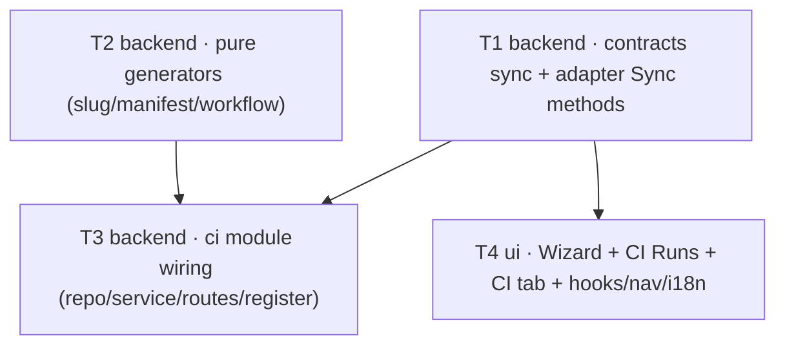

# Implementation Plan — SPEC-07 Export to CI

- **Spec (WHAT):** [`specs/cross/SPEC-07-2026-07-08-export-to-ci.md`](../specs/cross/SPEC-07-2026-07-08-export-to-ci.md) — Status: approved. Reuses `AC-1 … AC-20` verbatim.
- **Plan (HOW):** this file.
- **Date planned:** 2026-07-08
- **Execution mode:** MULTI-AGENT — 4 units in 2 waves (T1 ‖ T2 → T3 ‖ T4), ≤2 concurrent workers (confirmed by user 2026-07-08).
- **Context pack:** the SPEC-07 briefing (FINAL SIMPLIFIED SCOPE + PLAN/IMPLEMENT CONSTRAINTS) — authoritative simplification decisions restated in Execution notes below.

## Resolved decisions (planner clarifications, answered by user 2026-07-08)
- **Q1 — YAML serialization → add `yaml ^2.6.1` to `server/package.json`** (the exact version `agent-runner` vends). Guarantees the AC-1 round-trip (studio `yaml.stringify` ↔ runner `yaml.parse`); no hand-rolled emitter.
- **Q2 — `action:'files'` ("Copy files as a zip") creates NO `ci_installations` row.** Only `action:'open_pr'` upserts an installation (AC-15's "WHEN a GitHub-Actions export succeeds"); the `files` path returns the bundle with no DB/branch/PR side effect (AC-14). Trade-off accepted: a manual installer has no CI-tab installation/Sync target until they re-export via `open_pr`.
- **Q3 — AC-18 repo/target enrichment → extend `CiRun`** with two additive nullish fields (`repo`, `target_type`) in BOTH vendor copies, matching the existing `agent`/`duration_s` enrichment precedent (`server/INSIGHTS.md:35`). No client-side join, one fetch, one contract.

## Requirements review
- **Understood requirements** (restated from the approved spec + authoritative briefing):
  1. Add a `server/src/modules/ci/` module (routes → service → repository per onion) that **serializes a tuned agent to an `AgentManifest` YAML** at `.devdigest/agents/<slug>.yaml`, using the SAME Zod contract the given runner reads — one contract, two consumers.
  2. **Generate** a self-contained, least-privilege `.github/workflows/devdigest-review.yml` (security posture is load-bearing) that runs `node .devdigest/runner/index.js` and uploads `devdigest-result.json`.
  3. Assemble the **export bundle** (manifest + one `.md` per enabled skill + empty `memory.jsonl` + the pre-built runner `dist/*` + workflow), preview it with only the workflow editable.
  4. **Install** via two paths: "Open a PR" (atomic commit to `devdigest/ci` + open/reuse PR) or "Copy files as a zip" (bundle only). Persist a `ci_installations` row on a GHA `open_pr` export, upserted on `(agent_id, repo)`, workspace-scoped.
  5. **Sync (PULL)**: a manual action that lists the repo's `devdigest-review.yml` runs, downloads each run's `devdigest-result.json` artifact via the studio token, `safeParse`s `CiResultArtifact`, and upserts a `ci_runs` row. Two new GitHub-adapter methods.
  6. **UI**: 4-step Export Wizard (Target → Preview → Configure → Install), a global CI Runs page, and an agent-page CI tab (installations + history + Fail-CI-on writing `agents.ciFailOn`). All strings via next-intl; tenancy scoped by workspace throughout.
  7. v1 = GitHub Actions end-to-end only; all spec Non-goals respected.

- **Assumptions** (verified by the planner on this tree):
  - The `agent-runner/` package is present on this branch and byte-identical to upstream; its `dist/` (`index.js` + `300.index.js` + `package.json`) is the verbatim static asset shipped as `.devdigest/runner/*`. Verified on disk: exactly those three files (`index.js` 1.5 MB, `300.index.js` 5.8 KB, `package.json` `{"type":"module"}`).
  - The server serves GET responses by returning the object as-is (input-only schema validation) — enrichment fields can be added to a returned object plus the vendored type (`server/INSIGHTS.md:35`).
  - `container.agentsRepo` is the sanctioned way for the new `ci` module to read the agent + its enabled skills without importing the `agents` module's internals (`server/INSIGHTS.md:47`; `server/src/platform/container.ts:101`).
  - The `agents.ciFailOn` write reuses the **existing** `PUT /agents/:id` route (already accepts `ci_fail_on` — `server/src/modules/agents/routes.ts:143,147` + `repository.ts:147`) and the existing `useUpdateAgent` hook (`client/src/lib/hooks/agents.ts:61`) — no new endpoint.
  - GitHub Actions artifacts download as a **zip**; the server already ships `fflate` (used by skills import, `server/INSIGHTS.md:69`) to unzip and extract `devdigest-result.json`.
  - Skills have no `slug` column — skill file names kebab-case `skill.name` (`server/src/db/schema/skills.ts:19`).
  - `client/messages/en/ci.json` is already pre-shipped (exportWizard/ciTab/runs/page keys); AgentEditor tab labels resolve under the `agents` namespace (`editor.tabs.*`), not `ci`.
  - `MockGitHubClient implements GitHubClient` — widening the port forces a mock edit or typecheck fails (matters even with no tests, since `/verify` typechecks).

- **Research needed**: none. The runner is an integration boundary with a fully specified contract (`AgentManifest` in / `CiResultArtifact` out).

## Acceptance criteria (restated verbatim from the spec — traceability anchors)
Ids reused verbatim; `Verify:` hints carried as **documentation only** (implementers write NO tests — see Execution notes).
- **AC-1** — serialize agent → YAML at `.devdigest/agents/<slug>.yaml` via the same `AgentManifest` contract; parsing the YAML back deep-equals the input. · Verify: unit (manifest round-trip) → **doc-only**; at implement time drive `POST /agents/:id/ci/preview` and confirm the emitted YAML re-parses.
- **AC-2** — manifest maps `name`/`system_prompt`/enabled-skill slugs/`strategy`/`ci_fail_on`, emits `provider:'openrouter'` + `model` verbatim, contains NO key/secret. · Verify: unit → **doc-only**.
- **AC-3** — `<slug>` = kebab(agent name); each enabled skill → `.devdigest/skills/<skill-slug>.md`. · Verify: unit → **doc-only**.
- **AC-4** — bundle = exactly `agents/<slug>.yaml` + one `skills/<slug>.md` per enabled skill + empty `memory.jsonl` + `runner/index.js` (verbatim) + `workflows/devdigest-review.yml`; Preview lists all, only workflow editable. · Verify: unit + client unit → **doc-only**.
- **AC-5** — Wizard shows 4 ordered steps (Target → Preview → Configure → Install) with a labeled step indicator; 4 Target cards, only GitHub Actions functional. · Verify: client unit → **doc-only**.
- **AC-6** — workflow `permissions:` is exactly `contents: read` + `pull-requests: write`, nothing else. · Verify: unit → **doc-only**.
- **AC-7** — triggers on `pull_request` (configured subset), NOT `pull_request_target`. · Verify: unit → **doc-only**.
- **AC-8** — no PR-comment event under `on:` (`issue_comment`/`pull_request_review_comment` absent). · Verify: unit → **doc-only**.
- **AC-9** — key only via `${{ secrets.OPENROUTER_API_KEY }}`; review step is `node .devdigest/runner/index.js` (no marketplace `uses:`); no key-shaped literal in any bundle file. · Verify: unit → **doc-only**.
- **AC-10** — `post_as` (`github_review`|`pr_comment`|`none`) carried into the export; Configure states blocking merges needs Fail-CI-on + a required status check (no App). · Verify: client + unit → **doc-only**.
- **AC-11** — "Secrets expected" lists `OPENROUTER_API_KEY` ("not set") + `GITHUB_TOKEN` ("ready"); wizard never reads/writes/verifies repo Secrets. · Verify: client unit → **doc-only**.
- **AC-12** — workflow includes an `actions/upload-artifact` step for `devdigest-result.json`. · Verify: unit → **doc-only**.
- **AC-13** — `action:'open_pr'` atomically commits the bundle to `devdigest/ci` (never base), then opens/reuses a PR, returns `pr_url`. · Verify: `*.it.test.ts` → **doc-only**; drive install live.
- **AC-14** — `action:'files'` returns the bundle without committing/opening a PR. · Verify: `*.it.test.ts` → **doc-only**.
- **AC-15** — a GHA export upserts a `ci_installations` row `(agent_id, repo, target_type='gha')` workspace-scoped; re-export ⇒ no duplicate; two repos ⇒ two rows. · Verify: `*.it.test.ts` → **doc-only**.
- **AC-16** — Sync lists `devdigest-review.yml` runs, downloads each artifact, `safeParse`s `CiResultArtifact`, upserts a `ci_runs` row (mapped fields, `source='ci'`), workspace-resolved; no inbound endpoint/webhook/poll. · Verify: `*.it.test.ts` → **doc-only**.
- **AC-17** — a malformed artifact is rejected with NO `ci_runs` row (no partial write); other runs continue. · Verify: unit + `*.it.test.ts` → **doc-only**.
- **AC-18** — CI Runs page lists `ci_runs` ⋈ `ci_installations` (repo, target, status, relative time, link), workspace-scoped via installation → agent → workspace. · Verify: client + `*.it.test.ts` → **doc-only**.
- **AC-19** — CI tab shows installations by repo + history + Add-to-CI (opens Wizard) + Update-CI-config (re-export to `devdigest/ci`, reuse PR) + Fail-CI-on persisting to `agents.ciFailOn` and serialized into the next manifest. · Verify: client + `*.it.test.ts` → **doc-only**.
- **AC-20** — non-GHA targets (`circle`|`jenkins`|`cli`) render the card but perform no preview/commit/PR/Sync in v1. · Verify: client unit → **doc-only**.

## Non-functional requirements (carried from the spec — they shape design)
- **Perf**: export = bounded GitHub REST sequence; Sync = bounded list-runs + download; **no LLM call in the studio path**. → assign **T3** (service). Verify: observe no `container.llm` call on export/sync.
- **Security / authz** (lethal trifecta, load-bearing): least-privilege permissions (AC-6), key via Secrets only (AC-9), `pull_request` not `_target` (AC-7), no comment triggers (AC-8), self-contained runner (AC-9), export via reviewed PR to `devdigest/ci` never base (AC-13). Apply the `security` rubric to `workflow.ts` and to Sync's trust boundary. → assign **T2** (workflow/manifest) + **T3** (commit target, Sync `safeParse`) + **T4** (wizard never reads Secrets, AC-11).
- **Tenancy**: every export/sync/list resolves the agent (or installation) within `workspace_id` first; `ci_runs` (no `workspace_id` col) is scoped through `ci_installation → agent`. → assign **T3** (repository + service).
- **Untrusted input**: the Sync-downloaded `CiResultArtifact` and any GitHub-echoed repo/PR string are DATA — `safeParse`d, rendered/linked, never executed. → **T3** (Sync), **T4** (render).
- **Privacy / secrets**: no API key in the manifest, workflow, committed bundle, DB, or logs (AC-2/AC-9). → **T2** + **T3**.
- **a11y**: wizard keyboard-navigable with a labeled step indicator; run status conveyed by label not color; CI Runs links accessible. → **T4**.
- **i18n**: all new client strings via next-intl (`ci` ns, plus the CI tab label under the `agents` ns); repo names/paths verbatim. → **T4**.
- **Observability**: export/sync visible via server logs (files committed, runs ingested/skipped) without leaking secrets. → **T3**.

## Scope
- **Modules touched**:
  - `server/src/modules/ci/` (NEW: `slug.ts`, `manifest.ts`, `workflow.ts`, `constants.ts`, `helpers.ts`, `repository.ts`, `service.ts`, `routes.ts`) + registration in `server/src/modules/index.ts`.
  - `server/src/adapters/github/octokit.ts` + `server/src/adapters/mocks.ts` + the port in `server/src/vendor/shared/adapters.ts`.
  - `server/src/vendor/shared/contracts/eval-ci.ts` + `client/src/vendor/shared/contracts/eval-ci.ts` (dual-vendor).
  - `server/package.json` (add `yaml`).
  - `client/src/lib/hooks/ci.ts` (NEW); `client/src/app/ci/` (NEW page); `client/src/app/agents/[id]/_components/AgentEditor/` (CI tab + Export Wizard, wiring `AgentEditor.tsx` + `constants.ts`); `client/src/vendor/ui/nav.ts`; `client/messages/en/ci.json` + `client/messages/en/agents.json`.
- **Modules deliberately NOT touched** (so workers don't drift): the **multi-agent-review** service, the **PR feed**/`pulls`, `reviewer-core/**` (the runner boundary is the YAML manifest + JSON artifact — the studio never imports the runner), `agent_runs` (CI runs go ONLY to `ci_runs`), `server/src/db/migrations/**` and `server/src/db/schema/**` (no migration — starter tables reused as-is), `agent-runner/**` internals (GIVEN infra; read `dist/` only).
- **Contracts changed**: `@devdigest/shared` `eval-ci.ts` — client copy synced from server (fills the missing `AgentManifest` + `Ci*` shapes); plus two additive nullish fields on `CiRun` (`repo`, `target_type`) — **apply to BOTH vendor copies** (dual-vendor, no sync script).

## Task units

### [T1] Shared contracts sync + GitHub adapter Sync methods · track: backend · parallel-group: A
- **Files** (disjoint):
  - `client/src/vendor/shared/contracts/eval-ci.ts` — **modify**: replace the stale file with the complete server copy (adds `AgentManifest`, `CiExportInput`, `CiInstallation`, `CiExport`, `CiRunStatus`, `CiRun`, `CiResultArtifact`, and the `ConformanceInput.provider` `openrouter` member) so the client can import them.
  - `server/src/vendor/shared/contracts/eval-ci.ts` — **modify**: add two additive fields to `CiRun` — `repo: z.string().nullish()`, `target_type: CiTarget.nullish()` (enrichment for AC-18), mirroring the existing `agent`/`duration_s` nullish fields.
  - `client/src/vendor/shared/contracts/eval-ci.ts` — **modify**: apply the SAME two `CiRun` fields (byte-identical to server — dual-vendor).
  - `server/src/vendor/shared/adapters.ts` — **modify**: add to `GitHubClient` two methods — `listWorkflowRuns(repo: RepoRef, workflowFile: string): Promise<WorkflowRunMeta[]>` and `downloadRunArtifact(repo: RepoRef, runId: number, artifactName: string): Promise<Uint8Array | null>`; add the `WorkflowRunMeta` interface (`id`, `html_url`, `pr_number: number | null`, `created_at`, `conclusion: string | null`).
  - `server/src/adapters/github/octokit.ts` — **modify**: implement both methods over `octokit.rest.actions.listWorkflowRuns` / `listWorkflowRunArtifacts` + `downloadArtifact` (returns zip `ArrayBuffer` → `Uint8Array`), wrapped in the existing `withRetry`/`withTimeout` like every sibling method.
  - `server/src/adapters/mocks.ts` — **modify**: implement the two methods on `MockGitHubClient` (small in-memory run list + a fixture zip or `null`) so the class still satisfies `implements GitHubClient` (required for typecheck even without tests).
- **Skills to apply**: `onion-architecture` (port in shared, impl in adapter, mock alongside), `zod` (contract edits), `typescript-expert` (ESM `.js` imports, `Uint8Array`), `security` (the download returns untrusted bytes — treat as data downstream).
- **Known pitfalls** (quoted INSIGHTS):
  - "`@devdigest/shared` is vendored INDEPENDENTLY into server/src/vendor/shared/ and client/src/vendor/shared/ … a contract change … must be applied to BOTH copies or the apps drift." — `server/INSIGHTS.md:34` / `client/INSIGHTS.md:42`. Both `CiRun` edits must be byte-identical.
  - "GET routes … the returned object is serialized as-is — surface a new computed field … by adding it to the returned object + the vendored zod type, no response-schema change needed." — `server/INSIGHTS.md:35`.
- **Definition of done**: `cd server && pnpm typecheck` and `cd client && pnpm typecheck` clean; `MockGitHubClient` compiles against the widened `GitHubClient`; client can `import { AgentManifest, CiExport, CiRun } from '@devdigest/shared'`. **Do not write tests.**
- **Depends on**: none.

### [T2] CI pure generators (slug · manifest · workflow) · track: backend · parallel-group: A
- **Files** (disjoint from T1 and from T3):
  - `server/src/modules/ci/slug.ts` — **create**: `slugify(name): string` (lowercase, non-alphanumeric → `-`, collapse repeats, trim) — used for BOTH the agent slug (`.devdigest/agents/<slug>.yaml`) and each skill slug (`.devdigest/skills/<slug>.md`, since skills have no `slug` column — only `name`, per `server/src/db/schema/skills.ts:19`). (AC-3)
  - `server/src/modules/ci/manifest.ts` — **create**: pure `buildManifest(agent, enabledSkills)` → `AgentManifest` (name, `provider:'openrouter'` forced, `model` verbatim, `system_prompt` from `agent.systemPrompt`, `skills` = enabled-skill slugs, `strategy`, `ci_fail_on` from `agent.ciFailOn`; NO secret) + `manifestToYaml(manifest): string` via `yaml.stringify` (AC-1/AC-2). Also expose the skill-file map (`slug → body`) for the bundle.
  - `server/src/modules/ci/workflow.ts` — **create**: `buildWorkflowYaml(input): string` string-template with the load-bearing security posture — `on: pull_request: types: [<subset of opened/synchronize/reopened from input.triggers>]` (never `pull_request_target`, AC-7; no comment events, AC-8); `permissions:` **exactly** `contents: read` + `pull-requests: write` (AC-6); steps: `actions/checkout`, `actions/setup-node`, review step `run: node .devdigest/runner/index.js` (self-contained, no marketplace `uses:`, AC-9) with `env:` `OPENROUTER_API_KEY: ${{ secrets.OPENROUTER_API_KEY }}`, `GITHUB_TOKEN: ${{ secrets.GITHUB_TOKEN }}`, `GITHUB_REPOSITORY: ${{ github.repository }}`, `PR_NUMBER: ${{ github.event.pull_request.number }}`, `DEVDIGEST_POST_AS: <post_as>` (AC-9/AC-10 — this closes the runner INSIGHTS open question: `post_as` reaches the runner via the `DEVDIGEST_POST_AS` env var, default `github_review`); and an `actions/upload-artifact` step uploading `devdigest-result.json` (AC-12). NO literal key anywhere (AC-9).
  - `server/src/modules/ci/constants.ts` — **create**: `DEVDIGEST_DIR`, `CI_BRANCH = 'devdigest/ci'`, `WORKFLOW_PATH = '.github/workflows/devdigest-review.yml'`, `RESULT_FILENAME = 'devdigest-result.json'`, artifact name, the pinned action versions.
  - `server/package.json` — **modify**: add `"yaml": "^2.6.1"` to `dependencies` (matches `agent-runner/package.json`); the implementer runs `cd server && pnpm install` in its worktree.
- **Skills to apply**: `zod` (build to the `AgentManifest`/`CiFile` shape), `security` (workflow invariants AC-6..9/12; no secret in manifest AC-2), `typescript-expert` (pure functions, ESM `.js` imports).
- **Known pitfalls**:
  - The workflow is the trifecta surface — every one of AC-6/AC-7/AC-8/AC-9/AC-12 is a security invariant, not a nicety. Emit `permissions` as exactly two keys; assert no `pull_request_target`, no comment events, no `uses:` marketplace action on the review step, no key literal.
  - AgentManifest round-trip (AC-1): `manifestToYaml` output must `AgentManifest.parse` back deep-equal — use `yaml.stringify` (the lib the runner parses with), not hand concatenation, so the multiline `system_prompt` block scalar round-trips.
  - pnpm/worktree install gotcha: adding a dep then `pnpm install` in a worktree can hit the "pnpm-workspace.yaml purge" / `.bin` wipe traps (project memory). If install misbehaves, keep the workspace files and use `CI=true`, or let integration add the dep on the integrated tree before T3.
- **Definition of done**: `cd server && pnpm typecheck` clean with `yaml` resolvable; `buildManifest`/`manifestToYaml`/`buildWorkflowYaml`/`slugify` exported and pure (no DB, no adapter, no `container`). **Do not write tests.**
- **Depends on**: none (uses the already-complete server `AgentManifest`/`CiFile` contracts).

### [T3] CI module wiring (repository · service · routes · register) · track: backend · parallel-group: B
- **Files** (disjoint from T4):
  - `server/src/modules/ci/repository.ts` — **create**: all Drizzle for `ci_installations` + `ci_runs`, workspace-scoped via a join to `agents`. Methods: `upsertInstallation(workspaceId, agentId, repo, targetType)` (resolve agent's workspace first; app-level select-by-`(agentId,repo)`-then-insert/update — no DB unique constraint per Non-goal); `listInstallationsForAgent(workspaceId, agentId)`; `getInstallation(workspaceId, installationId)` (joined to agent for workspace scope); `upsertRun(row)` (dedup on `(ci_installation_id, github_url)`); `listRuns(workspaceId)` (`ci_runs ⋈ ci_installations ⋈ agents WHERE workspace_id`, enriched with agent name + repo + target_type, AC-18); `listRunsForAgent(workspaceId, agentId)`.
  - `server/src/modules/ci/helpers.ts` — **create**: `readRunnerFiles()` — robustly resolve `<repoRoot>/agent-runner/dist` (via `fileURLToPath(import.meta.url)` + `node:path`, or a `DEVDIGEST_RUNNER_DIR` env override), `readdirSync(dir, { recursive: true })`, and return `CiFile[]` mapping each `dist/<rel>` → `.devdigest/runner/<rel>` (editable:false) — MUST ship `index.js` + `300.index.js` + `package.json` (grounded fact: shipping only `index.js` silently breaks the lazy chunk loader). Plus `parseRepo("owner/name") → RepoRef`, and the ci_runs field mapper from `CiResultArtifact` + run meta.
  - `server/src/modules/ci/service.ts` — **create**: `preview(workspaceId, agentId, input)` (resolve agent via `container.agentsRepo.getById`; enabled skills via `container.agentsRepo.linkedSkills` filtered `binding.enabled && skill.enabled`; assemble the bundle `CiFile[]` = manifest (editable:false) + skill `.md` files + empty `memory.jsonl` + runner files + workflow (editable:true) — AC-4); `install(...)` (`open_pr` → `commitFiles({branch:'devdigest/ci', base, ...})` then `findOpenPr ?? openPullRequest`, return `pr_url`, upsert installation — AC-13/AC-15; `files` → return bundle only, NO commit/PR/installation row — AC-14 + resolved Q2; non-`gha` → no functional export, AC-20); `sync(workspaceId, installationId)` (resolve installation in workspace; `gh.listWorkflowRuns(repo,'devdigest-review.yml')`; per run `gh.downloadRunArtifact` → `fflate.unzipSync` → read `devdigest-result.json` → `CiResultArtifact.safeParse` → skip on failure with NO row, AC-17 → else `upsertRun` mapped fields `source='ci'`, AC-16). All external calls via `await container.github()`; NO `container.llm` (perf NFR).
  - `server/src/modules/ci/routes.ts` — **create**: Fastify plugin, schema-first, `getContext()` tenancy on every route: `POST /agents/:id/ci/preview` (body `CiExportInput` → `CiFile[]`), `POST /agents/:id/ci/install` (body `CiExportInput` → `CiExport`), `POST /ci/installations/:id/sync` (→ ingested runs), `GET /ci/runs` (→ enriched `CiRun[]`, AC-18), `GET /agents/:id/ci/installations` (→ `CiInstallation[]`), `GET /agents/:id/ci/runs` (→ `CiRun[]`, CI-tab history). Map rows → contract DTOs at the seam. (Fail-CI-on uses the existing `PUT /agents/:id`.)
  - `server/src/modules/index.ts` — **modify**: one import + one `ci` entry in the `modules` registry.
- **Skills to apply**: `onion-architecture` (repository owns Drizzle; service takes `Container`, no `new` adapter, no sibling-module import; routes thin + schema-first), `drizzle-orm-patterns` (workspace-scoped joins, app-level upsert), `fastify-best-practices` (schema-first `params`/`body`, `getContext`, `AppError`/`NotFoundError`), `security` (commit to `devdigest/ci` not base AC-13; Sync `safeParse` trust boundary; no key in logs), `zod` (`safeParse` on the artifact), `typescript-expert`.
- **Known pitfalls**:
  - "POSIX-only path/URL string assumptions keep breaking on Windows … Always use node:url `pathToFileURL`/`fileURLToPath` … never hand-concatenate `/` or `file://`." — `server/INSIGHTS.md:26`. `readRunnerFiles` path resolution AND the `.devdigest/runner/<rel>` mapping must use `node:path` (`join`, `relative`, POSIX-normalize the committed path), never string `/`.
  - "safeParse-at-read is the only boundary backstop … `Contract.safeParse(row.json)` … NOT `row.json as Contract`." — `server/INSIGHTS.md:63`. The downloaded artifact is untrusted → `CiResultArtifact.safeParse`, skip on failure (AC-17).
  - "To read a repo's identity … from a NON-repos module, do a workspace-scoped select inside your OWN repository … NOT importing repos' RepoRepository." — `server/INSIGHTS.md:47`. The `ci` repo owns its `ci_*` SQL; agent/skill reads go via `container.agentsRepo`, never an `agents`-module import.
  - "Postgres does NOT auto-index a foreign key's REFERENCING column." — `server/INSIGHTS.md:39`. `ci_runs.ci_installation_id` has no index and we add none (Non-goal: no migration) — accepted for v1 (tiny tables); do not "fix" it with a migration.
  - App-level upsert without a DB unique constraint has a TOCTOU window (`server/INSIGHTS.md:22`) — acceptable for the manual, low-concurrency wizard/Sync; note it, don't over-engineer (spec Proposed improvement, deferred).
  - Skills-import precedent for unzip: `fflate.unzipSync` with a filter is the established in-repo unzip (`server/INSIGHTS.md:69`) — reuse it for the artifact zip; do not add a new zip dep.
- **Definition of done**: `cd server && pnpm typecheck` clean; module registered; `/verify` drives a live `POST /agents/:id/ci/preview` (bundle = the five kinds, only workflow editable), an `install` with `action:'files'` (no PR side effect) and — with a `GITHUB_TOKEN` — `action:'open_pr'` (commit to `devdigest/ci`, PR url returned), and a `sync` against a fixture. **Do not write tests.**
- **Depends on**: **T1** (adapter methods + `CiRun` enrichment), **T2** (imports `slug`/`manifest`/`workflow`/`constants`, needs `yaml`).

### [T4] Client: Export Wizard + CI Runs page + agent CI tab + hooks/nav/i18n · track: ui · parallel-group: B
- **Files** (disjoint from all backend units):
  - `client/src/lib/hooks/ci.ts` — **create**: `useCiPreview` / `useCiInstall` / `useSyncInstallation` (mutations over `api.post`), `useCiRuns` (query `["ci-runs"]`), `useAgentInstallations(agentId)` / `useAgentCiRuns(agentId)` (queries); invalidate on mutation. Fail-CI-on reuses the existing `useUpdateAgent`.
  - `client/src/app/agents/[id]/_components/AgentEditor/_components/ExportWizard/` — **create**: modal, 4 ordered steps with a labeled step indicator — **Target** (4 cards; only `gha` advances to a functional export, others inert AC-5/AC-20; repo `owner/name` input) → **Preview** (file list; only the workflow rendered as an editable `<textarea>`, others read-only, AC-4; calls `useCiPreview`) → **Configure** (trigger checkboxes opened/synchronize/reopened; "Secrets expected" panel `OPENROUTER_API_KEY`="not set" + `GITHUB_TOKEN`="ready", never calls a secrets API, AC-11; "Post results as" github_review/pr_comment/none + branch-protection hint, AC-10) → **Install** ("Open a PR" AC-13 / "Copy files as a zip" AC-14; calls `useCiInstall`).
  - `client/src/app/agents/[id]/_components/AgentEditor/_components/CiTab/` — **create**: installations grouped by repo + per-repo status + run history (`useAgentCiRuns`), **Add to CI** (opens the Wizard), **Update CI config** (re-export to `devdigest/ci`, reuses PR — same `install` path, AC-19), **Fail CI on** control persisting via `useUpdateAgent({patch:{ci_fail_on}})` (AC-19).
  - `client/src/app/agents/[id]/_components/AgentEditor/AgentEditor.tsx` + `constants.ts` — **modify**: add `{ key: "ci", labelKey: "editor.tabs.ci", icon: "..." }` to `TABS` and render `<CiTab agentId={agent.id} />` for `tab === "ci"` (this also auto-extends the page's `VALID_TABS` allowlist).
  - `client/src/app/ci/page.tsx` + `client/src/app/ci/_components/CiRunsView/` — **create**: thin page → `CiRunsView` table over `useCiRuns` (repo, target type, status, relative run time, link to the GitHub run/PR), AC-18.
  - `client/src/vendor/ui/nav.ts` — **modify**: add a **CI Runs** item to the `NAV` array (`href:'/ci'`) + a `SHORTCUTS` entry; ensure `activeKeyFor` resolves it.
  - `client/messages/en/ci.json` — **modify** (already pre-shipped): extend with any keys the components reference (steps indicator, configure hints, install cards) — every `t()` key must exist.
  - `client/messages/en/agents.json` — **modify**: add `editor.tabs.ci` (the tab label resolves under the `agents` namespace, not `ci`).
- **Skills to apply**: `frontend-ui-architecture` (colocate the Wizard/CI tab under the agent page `_components`; the global CI Runs page is thin → `_components/CiRunsView`), `next-best-practices` (App Router page, `"use client"` on interactive leaves), `react-best-practices` (wizard step state local; server data via TanStack Query, not `useState`), `zod`/`typescript-expert` (import `CiExport`/`CiRun`/`CiExportInput` from `@devdigest/shared`), `security` (never render key material; treat GitHub-echoed strings as data), `react-testing-library` (**doc-only** — no tests).
- **Known pitfalls**:
  - "The sidebar nav is a HARDCODED list in `client/src/vendor/ui/nav.ts` … To surface a new top-level route you must add an item to `NAV` (and a `g <key>` line to `SHORTCUTS`), not just `activeKeyFor`." — `client/INSIGHTS.md:46`.
  - "i18n namespaces auto-load … next-intl throws when a `t(...)` key is missing … a partial namespace breaks the whole page." — `client/INSIGHTS.md:48`. Cross-check every referenced key ↔ `ci.json`/`agents.json`.
  - The **AgentEditor** tabs use `t(tb.labelKey)` under the `agents` ns (`AgentEditor.tsx:17-18`, `constants.ts:11-15`) — the CI tab label goes in `agents.json` `editor.tabs.ci`, matching its siblings (the PR-detail tab bar's hardcoded-English pattern in `client/INSIGHTS.md:56` does NOT apply here).
  - "Tailwind is installed but the app styles with CSS design tokens … Don't add Tailwind utility classes." + "prefer `@devdigest/ui` primitives." — `client/CLAUDE.md`. Use `var(--accent)` etc. and `Button`/`Badge`/`Modal`.
  - Adding a new named export while `pnpm dev` runs can serve a stale barrel — restart dev / `rm -rf .next` if `(0, _mod.fn) is not a function` (`client/INSIGHTS.md:68`).
  - a11y: labeled step indicator; status by label not color alone (spec Non-functional).
- **Definition of done**: `cd client && pnpm typecheck` clean; `/verify` drives the studio — the Wizard walks 4 steps, Preview shows the file list with only the workflow editable, Configure shows both secret rows + the branch-protection hint, Install shows both paths; the CI tab renders installations + history + the three controls and Fail-CI-on persists; the CI Runs page renders a row with repo/target/status/time/link; the CI Runs nav item appears. **Do not write tests.**
- **Depends on**: **T1** (client contract sync). Independent of T3 at compile time (API calls are runtime strings).

## Parallelization graph
Group by disjoint file sets; sequence real dependencies. ≤2 concurrent workers.

- **Wave 1 (parallel, 2 workers): T1 ‖ T2** — disjoint files (shared/adapters vs `modules/ci` generators + `package.json`), no upstream deps.
- **Wave 2 (parallel, 2 workers): T3 ‖ T4** — disjoint files (server `modules/ci` + `index.ts` vs `client/**`). T3 needs T1+T2; T4 needs only T1. Integrate Wave 1 (including `server/pnpm install` for `yaml`) onto HEAD before forking Wave-2 worktrees (implementer worktrees fork from committed HEAD; chain deps by committing Wave 1 first).

## Test plan
Implementers write **NO tests** (user constraint). Verification is by build + typecheck + driving the running app (`/verify`), and by the existing suites staying green:
- **Must still pass** (regression, do not break): `cd server && pnpm typecheck`; `cd client && pnpm typecheck`; the existing server unit suites unrelated to CI (e.g. `cd server && pnpm vitest run test/contracts.test.ts`) — noting the pre-existing Windows `indexer-pipeline.test.ts` failures are baseline noise (`server/INSIGHTS.md:97`); `cd client && pnpm test` (existing client suites unaffected).
- **Behavioral drive at implement time** (the real functionality gate — verify real functionality, not mocks): exercise `POST /agents/:id/ci/preview` → confirm the five-kind bundle + workflow-only-editable + a re-parseable manifest YAML; `install` `files` vs `open_pr`; `sync` against a fixture artifact (valid → row; malformed → skipped); then drive the studio Wizard/CI-tab/CI-Runs surfaces.
- The spec's `Verify:` hints (unit / `*.it.test.ts` / client unit) are retained as **documentation** of what a later test pass would assert; they are NOT authored now.

## Risks & review gates
- **Security (highest)**: the generated workflow is the lethal-trifecta surface — a human must be able to explain every line (AC-6..9/12) before merging the config PR. `architecture-reviewer` + `pr-self-review` (`security` rubric) must scrutinize `workflow.ts` and the Sync `safeParse` boundary. Hard to undo if a weak workflow is committed to a real repo.
- **Runner bundle completeness**: shipping only `index.js` silently breaks the lazy chunk loader — `readRunnerFiles` MUST emit all `dist/*` (`index.js` + `300.index.js` + `package.json`). Verify the committed `.devdigest/runner/` file set in the install drive.
- **Dual-vendor drift**: the `CiRun` field addition + the client `eval-ci.ts` sync must be byte-identical across both copies (no sync script) — a `plan-verifier`/`pr-self-review` check.
- **Path portability (Windows)**: `readRunnerFiles` and the committed `.devdigest/runner/<rel>` paths must be POSIX-normalized regardless of the Windows dev host.
- **Tenancy**: every `ci` route/query must resolve within `workspace_id` (installation → agent) — an IDOR check gate.
- **Human gate before merge**: opening a real PR to a target repo (`open_pr`) is an outbound side effect — keep it behind the user's explicit action; do not auto-run against a real repo during verification unless the user provides a throwaway fork.

## Execution notes (user-mandated constraints — baked in)
- **No tests, any unit.** Every task unit's brief must state verbatim: **"Do not write tests"** (no unit/integration/TDD/RTL files). No `test-writer-*` track exists in this plan. Verification = `/verify` (build + typecheck + exercise the real running app). The spec's `Verify:` hints are documentation only.
- **Bounded post-review fix loop** (in `/implement`): **at most 2 fix subagents total** and **at most 2 rounds** — no unbounded fan-out. Both are cost/simplicity guards consistent with "simple v1, iterate later."
- Reuse ONE shared context pack across the parallel review gates (plan-verifier / architecture-reviewer / code-review) rather than each re-running `git diff` + re-reading the same files.
