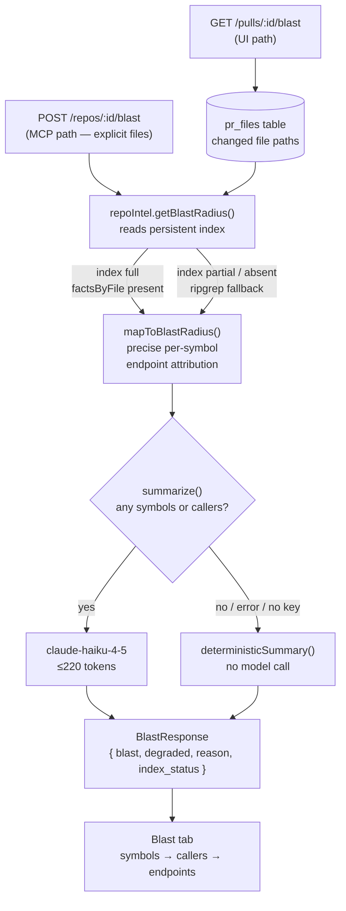

# Blast Radius — reading the impact map

The **Blast tab** on a pull request shows which parts of the codebase a PR's
changed files can break: changed symbols → who calls them → the HTTP endpoints
and cron jobs that reach those callers. All data comes from the repo-intel index
built at clone time. The only model call is one optional one-paragraph summary;
the map itself costs no analysis at request time.

## What the Blast tab shows

The tab has three layers:

1. **Stat badges.** A quick count of changed symbols, total callers, unique
   impacted endpoints, and (if any) impacted crons. A **Partial index** badge
   appears here when `degraded: true` in the API response.
2. **Summary card.** A one-paragraph plain-text description of downstream
   breakage risk. Produced by `claude-haiku-4-5` (max 220 tokens); falls back
   to a deterministic count sentence when the API key is absent or the call
   fails.
3. **Downstream tree.** One block per changed symbol that has at least one
   caller:
   - Symbol name and kind (function, class, etc.).
   - Each caller as `file:line`, linked to the GitHub blob at the PR's head
     SHA so line numbers stay accurate even after the branch is updated.
   - Endpoint and cron badges showing the entry points reachable through that
     symbol's callers.

If no changed symbol has a caller, the tab shows an empty state. A warning
banner appears above the tree whenever the index is partial.

## How to read the tree

Each block in the downstream tree represents one changed symbol that is called
by other code. Read it as follows:

```
calculateTotal  [function]  3 callers
  src/billing/invoice.ts:42     applyDiscount
  src/billing/receipt.ts:17     generateReceipt
  src/api/routes/checkout.ts:88 POST /checkout
                                [endpoint: POST /checkout]
```

- The **symbol header** names the changed function or class and shows how many
  callers exist.
- Each **caller row** is the enclosing function name at the call site, with a
  clickable `file:line` link to GitHub.
- The **endpoint/cron badges** below the callers list the HTTP routes and cron
  jobs that can reach the changed symbol through those callers.

Click a `file:line` link to open the exact call site on GitHub. The URL is
pinned to the PR's head SHA (`headSha` prop on `BlastTab`), so the line numbers
remain accurate even after the branch changes.

## Data flow



The two paths through `repoIntel.getBlastRadius()`:

- **Persistent path** (index full): `BlastResult` includes `factsByFile`, a
  per-caller-file map of endpoints and crons. `mapToBlastRadius` uses it to
  attribute endpoints precisely to each changed symbol.
- **Degraded path** (ripgrep fallback): `BlastResult` has no `factsByFile`.
  `mapToBlastRadius` falls back to the flat `impactedEndpoints` union on every
  downstream entry; `crons_affected` is always `[]`.

Both paths share the same `summarize()` step and produce an identical
`BlastResponse` shape. The `degraded` flag signals which path was taken.

## What "Partial index" means and how to fix it

The **Partial index** badge and warning banner appear when `degraded: true` in
the response from `GET /pulls/:id/blast`. This means `repoIntel.getBlastRadius()`
fell back to ripgrep because the persistent index was absent, incomplete, or
built on an older indexer version.

Consequences when the index is degraded:

- Endpoint attribution is imprecise: every downstream entry in the tree gets the
  same flat endpoint union instead of the endpoints specific to its callers.
- Cron attribution is unavailable: `crons_affected` is always empty.
- The `reason` field in the response gives a machine hint: `"no_data"` when no
  index exists yet, `"index_partial"` when indexing completed only partially,
  `"flag_off"` when `REPO_INTEL_ENABLED` is false.

**To fix it**, trigger a re-index on the repository. From the Studio UI, navigate
to the repository's settings and click **Re-index**, or call the API directly:

```
POST /repos/:id/resync
```

Once the indexer finishes and `index_status` reports `"full"`, the next blast
query takes the persistent path and endpoint attribution becomes precise.

## The zero/one model-call guarantee

The blast feature makes **at most one model call** per request:

- Zero calls when both `changedSymbols` and `callers` are empty (returns
  `deterministicSummary` immediately).
- One call to `claude-haiku-4-5` when symbols or callers are present, capped at
  220 tokens and temperature 0.3.
- Any failure — missing API key, provider error, empty completion — falls back to
  `deterministicSummary` with no retry. The `summary` field is always populated.

The map itself (symbol lookup, caller discovery, endpoint attribution) is pure
index reads. No model is involved in building the tree.

## MCP tool: `get_blast_radius`

The same blast data is available to AI agents through the MCP server's
`get_blast_radius` tool:

```
repo   — "owner/name", e.g. "acme/payments-api"
files  — repo-relative paths of the changed files to analyze
```

The tool resolves `owner/name` to a repo id via `resolveRepo`, then calls
`POST /repos/:id/blast`. It returns a structured output matching `BlastResponse`
plus a text summary string. When the result is empty and the index is degraded,
the tool includes a re-index hint (`"re-index the repo for full results"`) in
its text output.

Use this tool in an agent workflow to get blast radius context before generating
a code-review finding or a risk assessment, without triggering a full review run.

## Module reference

The API routes, contract types, service pipeline, mapper logic, and degraded
semantics are documented in detail in
`server/src/modules/blast/README.md`.

## Out of scope

These capabilities are deliberately not part of the current implementation:

- **Graph view** — a visual node/edge graph of the impact map.
- **"Prior PRs touching these files" panel** — cross-PR file-overlap history
  (the `PrHistoryItem` contract exists in `brief.ts` but the blast tab does not
  use it).
