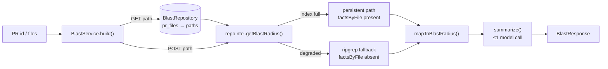

# `blast` — PR impact map

The `blast` module maps a pull request's changed files to the code they can
break: changed symbols → who calls them → impacted HTTP endpoints and cron jobs.
It reads the existing repo-intel index; it does **no parsing at request time**.
The only model touch in the entire feature is one optional cheap-model paragraph
with a deterministic fallback when the key is absent or the call fails.

## Routes

| Method | Path | Auth scope | Body | Returns |
|--------|------|-----------|------|---------|
| `GET` | `/pulls/:id/blast` | workspace-scoped tenancy guard | — | `BlastResponse` |
| `POST` | `/repos/:id/blast` | auth check only | `{ files: string[] }` | `BlastResponse` |

**`GET /pulls/:id/blast`** — the UI path. Resolves `workspaceId` via `getContext`,
looks up the pull request in `pullRequests` scoped by `workspace_id` (throws
`NotFoundError` if absent), reads the persisted changed-file paths from `pr_files`,
and calls `BlastService.blastForPr(workspaceId, prId)`.

**`POST /repos/:id/blast`** — the MCP-facing path. The body is validated by
`FilesBody = z.object({ files: z.array(z.string()) })`. Calls `getContext` for
authentication, then delegates to `BlastService.blastForFiles(req.params.id, req.body.files)`.
Tenancy for the index read is repo-keyed (consistent with `GET /repos/:id/index-state`).

## Contract (`@devdigest/shared`)

`BlastResponse` is defined in `contracts/blast.ts` and dual-vendored to
`client/src/vendor/shared/`:

```typescript
{
  blast: BlastRadius;
  degraded?: boolean;           // true when the facade fell back to ripgrep
  reason?: string | null;       // "no_data" | "index_partial" | "flag_off" | …
  index_status?: string | null; // "full" | "partial" | "degraded" | "failed"
}
```

`BlastRadius` is defined in `contracts/brief.ts` (also the LLM-output type in
`PrBrief`):

```typescript
{
  changed_symbols: Array<{ name: string; file: string; kind: string }>;
  downstream: Array<{
    symbol: string;               // the changed symbol being reached
    callers: Array<{ name: string; file: string; line: number }>;
    endpoints_affected: string[];
    crons_affected: string[];
  }>;
  summary: string;
}
```

The `degraded`/`reason`/`index_status` transport fields ride alongside `blast`
rather than inside `BlastRadius` because `BlastRadius` is also used as the LLM
output type in `PrBrief`.

## Pipeline



## Service (`service.ts`)

`BlastService` is instantiated once per route plugin from `app.container`. The
two public methods converge on a private `build(repoId, changedFiles)` that runs
in order:

1. Calls `container.repoIntel.getBlastRadius(repoId, changedFiles)` — pure index
   reads, no parsing at request time.
2. Calls `summarize(container, result)` — at most one model call.
3. Calls `mapToBlastRadius(result, summary)` — pure transform, no I/O.
4. Calls `container.repoIntel.getIndexState(repoId)` — resolves the repo-wide
   index status for the response envelope.
5. Assembles `BlastResponse`, merging the per-query `result.degraded`/`result.reason`
   from the facade with `state.degraded`/`state.degradedReason` (the per-query
   signal takes precedence via `??`).

## Repository (`repository.ts`)

`BlastRepository` holds the two SQL reads that turn a PR id into a changed-file
list:

- `getPull(workspaceId, prId)` — selects from `pullRequests` filtered by both
  `workspaceId` and `id` (tenancy guard). Returns `PullRow | undefined`; the
  service throws `NotFoundError` when undefined.
- `getPrFilePaths(prId)` — selects `path` from `pr_files` where `prId` matches.
  These rows are written when the PR detail first loads.

Similar reads exist in the `reviews` module. The duplication is intentional: the
project forbids importing another module's repository directly.

## Mapper (`mapper.ts`)

`mapToBlastRadius(result, summary)` is a pure function (no I/O, no model) that
transforms `BlastResult` (the facade's flat camelCase type) into `BlastRadius`
(the snake_case HTTP contract).

**Grouping.** The facade returns callers as a flat list, each tagged with the
changed symbol it reaches via `viaSymbol`. The mapper groups them by `viaSymbol`
into `downstream[]`, preserving the facade's rank ordering.

**Endpoint/cron attribution** differs by path:

- **Persistent path** (`result.factsByFile` is present): for each changed symbol,
  the mapper unions the endpoints and crons from `factsByFile` over the symbol's
  distinct caller files. This gives precise per-symbol attribution.
- **Degraded path** (`result.factsByFile` is absent): the mapper falls back to
  the flat `result.impactedEndpoints` union on every `downstream` entry and sets
  `crons_affected` to `[]`.

## Summary (`summary.ts`)

`summarize(container, result)` produces the one-paragraph `summary` field:

- **Zero calls:** if both `changedSymbols` and `callers` are empty, returns
  `deterministicSummary(result)` immediately without touching the model.
- **One call:** otherwise calls `container.llm('anthropic').complete(...)` with
  model `claude-haiku-4-5` (`BLAST_SUMMARY_DEFAULT_MODEL` in `constants.ts`),
  temperature 0.3, and a cap of `BLAST_SUMMARY_MAX_TOKENS` (220 tokens). The
  system prompt requests one plain-text paragraph (max 70 words) of downstream
  breakage risk; the user turn contains a bounded text rendering of the map
  (up to 30 changed symbols and 50 callers).
- **Fallback:** any error — missing API key, provider error, empty completion —
  returns `deterministicSummary(result)` with no retry.

`deterministicSummary` reports symbol count, caller count, and distinct endpoint
count as a single sentence and is always available without a model.

## Degraded / partial semantics

The `degraded` flag on `BlastResponse` is `true` when the facade fell back to
ripgrep. The service sets it to `result.degraded ?? state.degraded ?? false`.

When degraded:

- `factsByFile` is absent on `BlastResult`, so the mapper falls back to the flat
  endpoint union (per-symbol precision is lost; `crons_affected` is always `[]`).
- The UI renders a "Partial index" badge and a warning banner.
- `reason` carries a machine string (`"no_data"`, `"index_partial"`, etc.).
- `index_status` carries the repo-wide index state.

To promote to the persistent path, re-index the repo via `POST /repos/:id/resync`.

## What this module reuses

The heavy lifting — symbol extraction, caller lookup, ripgrep fallback, caller
capping (20 per symbol), rank-based ordering, declaration-file exclusion — is all
inside `repoIntel.getBlastRadius()` in `src/modules/repo-intel/service.ts`. The
`blast` module never reimplements any of it; it only maps and wraps the facade's
output.
