# Spec: Project Context  |  Spec ID: SPEC-02  |  Status: approved
Supersedes: none
Date: 2026-07-01
Module: cross

## Problem & why
A repo's own markdown — specs, docs, architecture notes, invariants — is written for humans and never
reaches the review agent, so reviewers cannot hold a PR against the project's stated rules. DevDigest
already ships an unfilled `## Project context` prompt slot (`reviewer-core/prompt.ts`, `PromptParts.specs`)
and the trace fields to observe it (`PromptAssembly.specs`, `RunTrace.specs_read`), but nothing discovers,
attaches, or injects those documents today. This feature lets a config author browse the repo's markdown,
**manually attach** chosen documents to an agent or a skill, and have their text read fresh and injected as
an untrusted block at run time — turning a doc from a humans-only artifact into something that *steers the
reviewer*. It is deliberately the first of two features; a future agent that verifies an implementation
against a spec and blocks merge is out of scope here (see Non-goals).

## Goals / Non-goals
**Goals**
- Discover every `.md` under folders named `specs`, `docs`, or `insights` (any depth) in the reviewed
  repo's clone and list them, each with a `specs | docs | insights` badge, on a new **Project Context** screen
  that is **read + attach only** in v1 (browse, preview, attach/detach — no write-back to the clone).
- Let a user **manually** attach/detach and **order** documents on an Agent editor **Context** tab and a
  Skill editor Context section ("Project context to use"), persisting only the ordered document **paths**.
- Make an agent's effective context = its own attached docs **plus** docs inherited from every skill it uses.
- At run time, deterministically read the attached files from the clone and inject them into the existing
  `## Project context` slot as an **untrusted** block.
- Show, in the editor, a deterministic **token estimate** (per-doc + total) at attach time.
- Surface, per document, a deterministic **"Used by N agents"** count and a **coverage %** across the
  workspace's agents — computed with no LLM/embeddings.
- Make the injection **auditable** in the run trace: which paths were injected (`specs_read`), their token
  size (Stats), and the exact injected full text (expandable Prompt-assembly block).
- Add **zero** new LLM/model calls: deterministic file reading + prompt assembly + token counting only.

**Non-goals**   <!-- explicit boundaries — what we are NOT doing -->
- **Auto-selection** of documents per PR (a future "flash-selector" that auto-picks relevant specs) — v1 is
  manual attach only.
- A **spec-conformance / merge-blocking agent** that verifies an implementation against a spec — the planned
  second feature; only mentioned here as a future bridge.
- Any **new LLM call** (discovery, attach, token counting, and injection are all deterministic).
- Embedding / semantic RAG over the docs, and any **chunking/indexing** of attached documents — the existing
  `code_chunks` embedding path (and the mockup's "Indexed: N files · chunks" footer) is tied to the future
  auto-selection infra, not to v1's manual attach + inject, and would add OpenAI calls that break the
  zero-new-LLM-calls constraint.
- **Writing back to the clone** from the Project Context screen — the toolbar's create / new-folder / upload
  actions and the Preview/**Edit** toggle do not persist in v1; the screen is **read + attach only**.

## User stories
- As a reviewer-config author, I want to **browse** all spec/markdown documents in the project on a Project
  Context page, so that I can see what context is available to steer reviews.
- As a reviewer-config author, I want to **attach and order** specific documents to a skill or an agent from
  their Context tabs, so that I control exactly what a reviewer reasons against.
- As a reviewer-config author, I want the editor to **count tokens** for the attached docs at attach time
  (per-doc + total), so that I understand how much each prompt will grow before I run it.
- As a reviewer, I want an agent's attached documents **read from the repo and injected as text** into the
  review prompt when a run starts, so that the reviewer reasons against the project's own rules.
- As a reviewer-config author, I want the run view to show me **what was actually put into the prompt** —
  including an **expandable, full-text** "Project context" block in the prompt assembly — so that I can open
  and read the exact injected text and audit it, not just a path list plus a token count.
- As a reviewer, I want a reviewer with an attached invariant (e.g. "`api/` must not import `db/` directly")
  to **catch a PR that violates it and cite the attached spec**, so that project rules are enforced in review.

## Acceptance criteria (EARS)
<!-- Each criterion is ONE testable statement with a stable ID + Verify hint. -->
- **AC-1** — The reader SHALL discover, within the reviewed repo's clone, every `.md` file matching the glob
  `**/{specs,docs,insights}/**/*.md` (folders named `specs`/`docs`/`insights` at any depth, repo-wide),
  excluding non-`.md` and binary files; the discovery roots SHALL be overridable via config with a
  **default of repo-wide** (the whole clone).
  - Verify: unit (glob matcher over a fixture tree; default repo-wide + config override) + *.it.test.ts (reader route)
- **AC-2** — WHEN the Project Context screen loads, the system SHALL list each discovered document with its
  repo-relative path and a badge (`specs | docs | insights`) derived from its nearest matching ancestor folder.
  - Verify: *.it.test.ts (list route) + client unit (badge/path render)
- **AC-3** — IF no document matches the discovery glob, THEN the Project Context screen SHALL render an empty
  state rather than an error or a blank pane.
  - Verify: client unit (empty state)
- **AC-4** — The Agent editor SHALL provide a **Context** tab (styled like the Skills tab) listing attachable
  documents as ordered rows (drag handle, checkbox, name, badge), where the per-row **checkbox toggles
  attach/detach** and the **"Filter…" box is a display filter over the visible document list only** (no
  per-document enable/disable toggle and no sub-section injection in v1); WHEN the user attaches/detaches or
  reorders documents and saves, the system SHALL persist the **ordered document paths** in the agent's
  metadata and SHALL NOT persist document text.
  - Verify: *.it.test.ts (agent stores ordered paths, no text) + client unit (checkbox attach/detach + filter narrows list)
- **AC-5** — The system SHALL render project context under a single `## Project context` header as **two
  distinct sub-blocks** — the agent's **own** attached docs first, then the **skill-inherited** docs — and
  SHALL preserve attachment order within each sub-block so an earlier-ordered document appears earlier.
  - Verify: unit (two sub-blocks, own-before-inherited, ordering preserved) + client unit (drag reorder persists order)
- **AC-6** — The Skill editor SHALL provide the same Context UI under "Project context to use" (with the note
  "Any agent using this skill inherits these documents"), SHALL persist the skill's attached document paths in
  the skill's metadata, and its "SERIALIZES AS" preview SHALL use the canonical `## Project context` header
  (not `## Project specifications`).
  - Verify: *.it.test.ts (skill stores paths) + client unit (skill Context section; preview header == `## Project context`)
- **AC-7** — WHEN an agent uses one or more skills, the agent's **effective** project context SHALL equal its
  own attached documents plus the documents inherited from every skill it uses, rendered as the two sub-blocks
  of AC-5; each **unique** document SHALL be injected **once** — a document attached both agent-own and via a
  skill is kept in the **agent-own** sub-block (omitted from the skill sub-block), and one attached only via
  multiple skills is kept at its **first** position in effective order.
  - Verify: unit (effective-set resolution + dedupe: agent-own wins, else first-in-order) + *.it.test.ts (agent+skill inheritance)
- **AC-8** — The system SHALL read attached document contents **fresh from the clone at run time** and SHALL
  never bake document text into the stored agent/skill prompt or metadata.
  - Verify: unit (stored config contains no doc text) + *.it.test.ts (edit-doc-then-run reflects new text)
- **AC-9** — WHEN a run executes, the run-executor SHALL resolve the agent's effective attached paths, read
  each file from the clone, and inject the concatenated contents into the engine's `## Project context`
  prompt slot (`PromptParts.specs`).
  - Verify: *.it.test.ts (specs slot populated on a run) + unit (run-executor passes `specs`)
- **AC-10** — The system SHALL wrap injected project-context content as **untrusted** data (delimiter-fenced
  via `wrapUntrusted` + governed by the system `INJECTION_GUARD`), so document text cannot override system or
  skill instructions and cannot escape the `## Project context` block (delimiter-close attempts are escaped).
  - Verify: unit (wrapUntrusted applied; `</untrusted>` escaped) — grounded in `reviewer-core/prompt.ts`
- **AC-11** — WHERE no document is attached (own or inherited), the assembled prompt SHALL omit the
  `## Project context` section entirely, byte-identical to the pre-feature prompt.
  - Verify: unit (omit-when-empty, prompt unchanged)
- **AC-12** — The system SHALL make **zero** additional LLM/model calls to discover, list, attach, count
  tokens for, or inject project-context documents.
  - Verify: unit (mock LLM call count unchanged vs baseline) + *.it.test.ts
- **AC-13** — IF an attached path is missing or unreadable from the clone at run time (e.g. deleted after a
  re-sync), THEN the run SHALL skip that document, continue the review, and record the skip in the run trace,
  and SHALL NOT crash the run.
  - Verify: unit (missing file skipped, run proceeds) + *.it.test.ts
- **AC-14** — WHEN a run completes, the run trace SHALL record `specs_read` as the ordered list of document
  paths actually injected for that run (skipped/missing paths excluded).
  - Verify: *.it.test.ts (`specs_read` populated) + unit
- **AC-15** — The run trace Stats SHALL report the **token size** of the injected project-context block,
  computed with the repo's existing tokenizer adapter (`cl100k_base`, `ceil(chars/4)` fallback) from
  repo-intel, and that count SHALL reflect the text actually injected.
  - Verify: *.it.test.ts (stats size present) + unit (count == cl100k_base tokens of injected text)
- **AC-16** — The run trace's Prompt-assembly SHALL expose a "Project context — attached specs" entry that is
  **expandable to the exact injected full text** for that run (auditable text, not just paths + a count).
  - Verify: client unit (expand renders `assembly.specs`) + *.it.test.ts (`assembly.specs` persisted)
- **AC-17** — WHEN documents are attached in the Agent or Skill editor, the editor SHALL display a per-document
  and total **token estimate** for the attached set, computed deterministically without any LLM call using the
  repo's shared tokenizer adapter (`cl100k_base`, `ceil(chars/4)` fallback) — one approximate estimate across
  all providers, no new dependency.
  - Verify: client unit (per-doc + total shown) + unit (cl100k_base tokenizer, no LLM)
- **AC-18** — WHEN a reviewer with an attached spec stating an invariant (e.g. "module `api/` must not import
  `db/` directly") reviews a PR that violates it, the reviewer SHALL surface a finding that flags the violation
  and cites the attached spec.
  - Verify: e2e / manual (live-check scenario; model-dependent — asserted as a guarded acceptance demo, not a
    deterministic unit)
- **AC-19** — The system SHALL scope document discovery and attachment resolution by `workspace_id` and
  **each reviewed PR's own repo clone**, resolving attached repo-relative paths against that PR's clone at run
  time, so that a review injects only documents from the repo it is grounded in and never from another
  workspace's or repo's clone.
  - Verify: *.it.test.ts (cross-workspace / cross-repo isolation; paths resolved against the PR's own clone)
- **AC-20** — WHEN the attached set's total token estimate is large, the editor SHALL surface a **warning**,
  but the system SHALL still inject the **full** attached set at run time — no hard cap, no truncation, and no
  dropping of documents.
  - Verify: client unit (warning shown past threshold) + unit (run injects full set; nothing truncated/dropped)
- **AC-21** — The Project Context screen SHALL show, per document, a deterministic **"Used by N agents"** count
  and a **coverage %** — computed with **no** LLM or embedding call — where "Used by N agents" is the count of
  the workspace's agents whose **effective** project context includes the document and "coverage %" is the
  share of the workspace's agents whose effective context includes it.
  - Verify: unit (count + coverage over agent attachments, no LLM) + client unit (indicator renders)

## Edge cases
- **No documents discovered** → Project Context screen and Context tabs show empty states (AC-3).
- **Attached path deleted after re-sync** → skipped, surfaced in the trace, run continues (AC-13).
- **Non-`.md` / binary files** under a matching folder → excluded from discovery (AC-1).
- **Very large document / attached set** → the editor **warns** when the attached set is large, but the run
  **injects everything** — no hard cap, no truncation, no dropping (the author controls what they attach)
  (AC-17, AC-20).
- **Same document attached at both agent and (inherited) skill level**, or via two skills → deduped to a
  **single** injection: kept in the agent-own sub-block if also attached agent-own, else at its first position
  in effective order (AC-7).
- **Path traversal** — an attached/stored path resolving outside the clone dir must be rejected, not read.
- **Skill disabled / binding disabled** — an agent inherits context only from skills that actually feed the
  prompt (mirrors the enabled-binding rule for skill bodies). There is **no** per-document enable/disable
  toggle in v1: the per-row checkbox is attach/detach only (AC-4).
- **Document edited between runs** → next run injects the new text (read-fresh, AC-8); token size in Stats
  changes accordingly.
- **Repo not yet indexed / clone absent** → discovery returns empty; runs degrade to no project-context block
  (no crash), same shape as the pre-feature prompt.

## Assumptions & Dependencies
**Assumptions**
- The engine's `## Project context` slot (`PromptParts.specs` → `PromptAssembly.specs`) and the trace fields
  `specs_read` / `assembly.specs` already exist and are the injection + audit surface (confirmed in
  `reviewer-core/prompt.ts` and `contracts/trace.ts`; today hardcoded to `[]`/omitted in
  `modules/reviews/run-executor.ts`).
- The reader/file-IO lives **server-side** (the engine stays pure — no filesystem); the run-executor supplies
  the already-read `specs` strings to `reviewPullRequest`.
- Discovery is **repo-wide** by default — the glob runs over the whole clone; the roots are overridable via
  config. The mockup's `.devdigest/specs/` is merely the currently-selected root shown in the browser, not a
  hard discovery root.
- Attached document paths are **repo-relative** and resolved against **each reviewed PR's own repo clone**
  under `DEVDIGEST_CLONE_DIR` at run time; a path missing/unresolvable in that clone is skipped (AC-13). No
  `repo_id` / no new repo linkage is added on agents or skills in v1.
- Agents and skills are `workspace_id`-scoped; agents carry no `repo_id` today (`server/src/db/schema/agents.ts`),
  and v1 does not add one.
- The engine keeps its **existing prompt block order** (… → Repo skeleton → Project context → … per
  `prompt.ts`); v1 does **not** reorder the emitted prompt, and the run-trace lists blocks in their real
  emitted order (the mockup's "Project context before Repo skeleton" is corrected to match the engine).

**Dependencies**
- `reviewer-core` prompt assembly (`assemblePrompt`, `wrapUntrusted`, `INJECTION_GUARD`).
- `modules/reviews/run-executor.ts` (the run-executor; wires `specs` + `specs_read` + Stats).
- `modules/agents` and `modules/skills` (persist attached paths; expose effective-context resolution).
- Repo clone/walk under `DEVDIGEST_CLONE_DIR`; the `repo-intel` walk (`walk.ts`) is a candidate host for the
  discovery glob (placement is a HOW decision for the planner).
- Shared Zod contracts (`contracts/knowledge.ts` Agent/Skill; `contracts/trace.ts` PromptAssembly/RunStats),
  **dual-vendored** into `server/src/vendor/shared/` **and** `client/src/vendor/shared/` — both copies change.
- A Drizzle migration for the new attached-context storage (columns or join tables on agents/skills) via
  `pnpm db:generate` (schema ships `code_chunks` but no attach model — `server/src/db/schema/context.ts`).
- Client: new `client/src/app/project-context/` route + Context tabs mirroring the existing Skills tab.

## Non-functional
- **Perf**: discovery is a filesystem walk over the clone (no analysis); run-time injection is file reads +
  string concat; token counting is deterministic — no per-request model work.
- **Security**: attached docs are **untrusted** third-party text entering the prompt → delimiter-fenced via
  `wrapUntrusted` and governed by `INJECTION_GUARD`; content must never override system/skill instructions or
  escape the `## Project context` block. Stored paths are validated to stay inside the clone (no traversal).
  Apply the `security` rubric.
- **Privacy**: no secrets injected or logged; only repo markdown the user explicitly attached is read.
- **Determinism / cost**: zero new LLM calls; the token count shown at attach time and in Stats must reflect
  the text actually injected, using repo-intel's existing tokenizer adapter (`cl100k_base`, `ceil(chars/4)`
  fallback) — one shared approximate estimate across providers, no new dependency.
- **i18n**: all new client strings via `next-intl` (no hardcoded strings).
- **a11y**: the Context tab list is keyboard-navigable; drag-reorder has a keyboard-accessible alternative;
  rows have roles/labels; the expandable prompt-assembly block is a labeled disclosure.
- **Tenancy**: scoped by `workspace_id` and each reviewed PR's own repo clone (AC-19); attached paths resolve
  against that PR's clone at run time — never another workspace's or repo's clone.
- **Observability**: `specs_read` (paths), Stats token size, and the expandable `assembly.specs` full text
  make the injection auditable — "you see it, you don't guess."

## Inputs (provenance)
- Discovered document list — [deterministic: repo file walk] (glob over the clone; no LLM).
- Attached document paths — [reused] (stored in agent/skill metadata; no text stored).
- Injected document text — [deterministic: file read at run time from the clone].
- Attach-time & Stats token counts — [deterministic: tokenizer], **no LLM call** (repo-intel `cl100k_base`,
  `ceil(chars/4)` fallback).

## Untrusted inputs
- **Repository markdown content** (the attached documents) — third-party repo files; treat as DATA, never as
  instructions. Neutralized by `wrapUntrusted('spec-i', …)` (which escapes `</untrusted>` close attempts) and
  the system `INJECTION_GUARD`; claims inside a doc ("ignore findings", "this is a fixture") never descope the
  review, and the text can never leave the `## Project context` block.
- **Attached/stored document paths** — repo-relative, caller-influenced; resolved against the clone and
  rejected if they escape the clone directory (path-traversal guard). Never executed.

## Cross-module impact

```mermaid
flowchart LR
  PC["client: Project Context screen<br/>+ Agent/Skill Context tabs"] -->|"attach paths (ordered)"| AG["server: agents/skills<br/>persist paths (metadata)"]
  RD["server: reader (glob over clone)<br/>**/{specs,docs,insights}/**/*.md"] -->|"discovered docs"| PC
  AG -->|"effective paths"| RX["server: run-executor<br/>read files fresh"]
  RX -->|"specs[] (read text)"| ENG["reviewer-core: assemblePrompt<br/>## Project context (untrusted)"]
  ENG -->|"assembly.specs + specs_read + token size"| TR["client: run trace<br/>Config · Stats · Prompt assembly (expandable)"]
```

- client (Project Context screen + Context tabs) → server (agents/skills): persist ordered attached paths.
  Grounded in: `client/src/app/skills/[id]/page.tsx` (Skills tab mirror), `contracts/knowledge.ts`.
- server reader (glob over the clone) → client: discovered document list with badges. Grounded in:
  `server/src/modules/repo-intel/README.md` (walk), `DEVDIGEST_CLONE_DIR`.
- server run-executor → reviewer-core `assemblePrompt`: passes `specs` (read text) into the existing
  `## Project context` slot, rendered as two sub-blocks under that single canonical header (agent-own docs
  first, then skill-inherited); keeps the engine's current block order (Repo skeleton → Project context); sets
  `specs_read` + Stats token size on the trace. Grounded in: `modules/reviews/run-executor.ts` (lines wiring
  `specs_read: []`, `prompt_assembly`), `reviewer-core/prompt.ts`.
- shared contracts (Agent/Skill gain attached-path fields; PromptAssembly/RunStats gain a project-context
  token size) change in **both** vendor copies. Grounded in: `contracts/knowledge.ts`, `contracts/trace.ts`,
  MEMORY (`shared-contracts-dual-vendor`).
- DB: new attached-context storage on agents/skills (migration). Grounded in:
  `server/src/db/schema/agents.ts`, `skills.ts`, `context.ts` (no existing attach model).
- Blast radius not computed (local API unavailable during authoring); wiring the currently-hardcoded
  `specs`/`specs_read` in `run-executor.ts` is the highest-fan-in touch point.

## Proposed improvements
- Include attached context paths in `AgentVersionConfig` (mirrors the existing `skills: string[]` snapshot), so
  an agent version replays with the same context set for reproducibility/eval. — Status: open.
- Per-slot token attribution already flagged as a goal in `contracts/trace.ts` (repo_map comment); add a
  project-context entry alongside it rather than a bespoke field. — Status: open.
- Surface, in the Context tab, which attached paths are currently **missing** from the clone (pre-run warning),
  reusing the AC-13 skip signal so authors fix stale attachments before a run. — Status: open.
- Reuse the skills' per-binding `enabled`/`order` pattern for the attached-context rows to keep UI + storage
  consistent across the two tabs. — Status: open.
