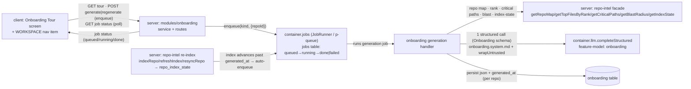

# Spec: Onboarding Generator (Onboarding Tour)  |  Spec ID: SPEC-03  |  Status: approved
Supersedes: none
Date: 2026-07-02
Module: cross

## Resolved decisions
<!-- The three prior open questions are USER-CONFIRMED (2026-07-02); no open [NEEDS CLARIFICATION] remain. -->
- **First tasks source (NC-1 → AC-15)** — CONFIRMED **LLM-generated** from the already-grounded facts (file
  rank, critical paths, conventions) within the **same single composite** structured call; no new GitHub fetch,
  no new data path.
- **Share link scope (NC-2 → AC-21)** — CONFIRMED **Copy-current-URL only**: copies the current authenticated
  in-app page URL to the clipboard; creates **no** public/shared artifact and **no** unauthenticated surface.
  Public / workspace-scoped sharing is an explicit Non-goal for v1.
- **Staleness & generation (NC-3)** — CONFIRMED **Background + auto-on-re-index**. Generation runs as a
  **background job** (`container.jobs`): the client POSTs to trigger, which **enqueues** and returns immediately
  with a status handle, then **polls** job status (`queued` / `running` / `done` / `failed`), showing a
  "generating…" state while in progress (AC-23). A **re-index that advances the index past the tour's
  `generated_at`** auto-enqueues a background regeneration (AC-24). The manual **Regenerate** action still
  exists but now **enqueues** a background job (non-blocking) behind a confirm as a cost-bounding nicety (AC-9);
  the "stale" indicator is repurposed to surface the polled job status (AC-22).

## Problem & why
Someone dropped into an unfamiliar repo has no fast way to get oriented: they must reverse-engineer the
architecture, guess which files matter, and hunt for how to run it locally. DevDigest already indexes every
added repo (repo map, file rank, import graph, blast radius, index file-count) but exposes none of that as a
newcomer's guided tour. This feature adds a **generated Onboarding Tour**, scoped to the active/selected repo,
that composes those existing repo-intel facts and runs **one** LLM pass to write a five-section tour —
architecture overview + diagram, critical paths, how to run locally, a guided reading path, and first tasks —
persisted per repo, regenerated on demand (as a **background job** the client triggers then polls), and
**auto-regenerated when the repo is re-indexed**. Unlike SPEC-02 Project Context (deliberately zero-LLM), this
feature is **generative**: it mirrors how `conventions`, the Intent Layer (`intent-service`), and
`blast/summary` already call `container.llm` from a **server module** while `reviewer-core` stays frozen. Much
of the surface is pre-shipped starter scaffolding (an `onboarding` table, the `Onboarding` contract, an
`onboarding` feature-model, an `onboarding.system.md` prompt, an `onboarding` i18n namespace, and
`activeKeyFor` already routing `/onboarding` → `onboarding-tour`) — v1 wires these into a working screen.

## Goals / Non-goals
**Goals**
- Add a top-level **Onboarding Tour** nav item (its own icon) scoped to the active repo, plus a repo-scoped
  screen with breadcrumb `<owner>/<repo> > Onboarding Tour` and header `Onboarding for <repo-name>`.
- Render **exactly five** collapsible sections in order — **Architecture overview** (prose with inline
  file refs + a Mermaid request-flow diagram), **Critical paths** (top files, each with a one-line rationale,
  a deterministic "used by N routes" count, and an Open action), **How to run locally** (numbered shell steps,
  each copyable), **Guided reading path** (ordered files each with a one-line "why"), **First tasks** — with a
  left "ON THIS PAGE" anchor nav.
- **Generate** the tour with **one** structured LLM call over the shared `Onboarding` schema, using the
  workspace's `onboarding` feature-model, **grounded** on deterministic repo-intel facts (repo map, top-ranked
  critical files, dependency/reading-path chains, blast-radius counts) + capped key-file excerpts.
- **Persist & cache** the tour per repo in the existing `onboarding` table and show a subtitle
  `Generated from index of {N} files · last refreshed {relative}` — `{N}` from `repoIntel.getIndexState`,
  the timestamp from `onboarding.generatedAt`.
- **Generate as a background job**: the client POSTs to trigger generation, which **enqueues** a job on the
  shared `container.jobs` runner and returns immediately with a status handle; the client then **polls** a
  status route (`queued` / `running` / `done` / `failed`) and shows a "generating…" state while it runs
  (mirroring how reviews run fire-and-forget and how repo-intel indexing enqueues `INDEX_JOB_KIND`).
- **Auto-regenerate on re-index**: WHEN a repo re-index advances the index past an existing tour's
  `generated_at`, the system auto-enqueues a background regeneration (no user action), scoped to the repo's
  `workspace_id` — the tour stays fresh as the code moves on.
- Provide a **Regenerate** action (confirm → **enqueue** a non-blocking background regeneration that, on
  completion, replaces the persisted tour) and a **Share link** action (copies the current authenticated in-app
  URL — no public surface) in the header, plus an **"updating…" / generation-status** indicator driven by the
  polled job state (with a brief "stale" badge for the window between a re-index and the auto-enqueued job
  completing).
- **Degrade gracefully**: a deterministic tour skeleton when no model/API key is available (mirroring
  `blast/summary`), an empty "Generate" state before first generation, and an "index this repo first" state
  when the repo is not cloned/indexed.
- Treat every repo-derived input to the model as **untrusted** data.

**Non-goals**   <!-- explicit boundaries — what we are NOT doing -->
- **Re-indexing** or changing repo-intel — the tour only **reads** the facade; indexing is starter infra.
- Editing `reviewer-core` — the review engine stays frozen; generation lives in a server module that calls
  `container.llm` (as `conventions` / `blast/summary` / `intent-service` do).
- **Writing the tour back** to the repo clone, or any repo mutation — the screen is read + generate only.
- A **per-PR** or diff-scoped onboarding; the tour is repo-scoped and PR-agnostic.
- **Scheduled / cron / timer-based** regeneration — auto-regeneration is triggered **only** by a re-index that
  advances the index past the tour's `generated_at` (AC-24), never by a clock or a background scheduler.
- **Auto-generating the FIRST tour on screen load** — an untoured repo still shows the manual "Generate" CTA
  (AC-5); a re-index of a repo with **no** persisted tour does **not** create one (AC-24). Auto-regeneration
  only refreshes a tour that already exists.
- **Public or workspace-scoped share links / share tokens** — the "Share link" action only copies the current
  **authenticated** in-app URL (AC-21); no public or unauthenticated surface is created in v1 (revisit later
  behind a dedicated security pass).
- Embeddings / semantic RAG over the repo — generation grounds on the deterministic repo-intel facts only.

## User stories
- As a developer new to a repo, I want a generated tour of its architecture, critical files, and how to run it,
  so that I can get oriented in minutes instead of reverse-engineering the codebase.
- As a newcomer, I want an ordered reading path with a one-line reason per file, so that I read the codebase in
  a sensible order rather than alphabetically.
- As a newcomer, I want copyable local-setup commands grounded in the repo's real scripts, so that I can run it
  locally without guessing.
- As a repo owner, I want to Regenerate the tour after the code has moved on, so that the onboarding reflects
  the current index.
- As any user, I want the tour to still render something useful when no LLM key is configured, so that the
  screen is never a dead error.

## Acceptance criteria (EARS)
<!-- Each criterion is ONE testable statement with a stable ID + a Verify hint. -->
- **AC-1** — The system SHALL add a top-level **Onboarding Tour** nav item (key `onboarding-tour`, its own
  icon, an `:repoId`-templated href resolved against the active repo) to the sidebar **WORKSPACE** section, and
  `activeKeyFor` SHALL highlight it on the tour route (it already maps `/onboarding` → `onboarding-tour`).
  - Verify: client unit (NAV contains the item; `resolveHref` fills `:repoId`; `activeKeyFor` returns `onboarding-tour`)
- **AC-2** — WHEN the Onboarding Tour screen loads for the active/selected repo, the system SHALL scope all
  data to that repo's id (the nav `:repoId` active-repo context, per SPEC-02) and render the breadcrumb
  `<owner>/<repo> > Onboarding Tour` and the header `Onboarding for <repo-name>`.
  - Verify: client unit (breadcrumb + header from active repo) + *.it.test.ts (route scoped by repo id)
- **AC-3** — The screen SHALL render **exactly the five** sections in this order — Architecture overview,
  Critical paths, How to run locally, Guided reading path, First tasks — each as a **collapsible card**, with a
  left **"ON THIS PAGE"** anchor nav listing the five section titles that scrolls to each card.
  - Verify: client unit (five titled cards in order; anchor nav links to each)
- **AC-4** — The system SHALL persist the generated tour per repo in the existing `onboarding` table
  (`repo_id` PK, `json`, `generated_at`) and render the subtitle
  `Generated from index of {filesIndexed} files · last refreshed {relative(generatedAt)}`, where
  `filesIndexed` comes from `repoIntel.getIndexState(repoId)` and the timestamp from `onboarding.generatedAt`.
  - Verify: *.it.test.ts (row persisted + read back) + client unit (subtitle renders count + relative time)
- **AC-5** — WHEN no tour is persisted for the repo, the screen SHALL render the **"Generate onboarding tour"**
  empty state (i18n `onboarding.generate.*`) with a generate action and SHALL NOT auto-generate.
  - Verify: client unit (empty state + CTA; no auto-fetch of generation)
- **AC-6** — WHEN generation runs (first generate or Regenerate), the system SHALL produce the whole tour (all
  five sections) via **exactly one** structured model call — `container.llm(provider).completeStructured` with
  the shared `Onboarding` schema and the `onboarding.system.md` template — using the workspace's `onboarding`
  feature-model resolved via `resolveFeatureModel(container, workspaceId, 'onboarding')` (registry default
  `openrouter` / `deepseek/deepseek-v4-flash`).
  - Verify: unit (one `completeStructured` call; schema == `Onboarding`; model from `resolveFeatureModel`)
- **AC-7** — The generation input SHALL be assembled **deterministically** from repo-intel facts — the cached
  repo map (`getRepoMap`), top-ranked critical files (`getTopFilesByRank` / `getFileRank`), reading-path
  dependency chains (`getCriticalPaths`), and blast-radius "used by N" counts (`getBlastRadius`) — plus capped
  key-file excerpts, and the model SHALL be instructed to use **only real paths** present in those facts (never
  invent paths, scripts, routes, or dependencies).
  - Verify: unit (fact assembly calls the named facade methods; prompt carries the grounding rules)
- **AC-8** — The system SHALL **bound** generation input to a capped set of top-ranked files plus the
  token-budgeted cached repo map, and SHALL NOT read or send the full repository file list — so a repo of N
  files (e.g. 12,450) never sends N files to the model.
  - Verify: unit (input file count ≤ cap; full-tree read not performed)
- **AC-9** — WHEN the user clicks **Regenerate** and **confirms** the confirmation prompt, the system SHALL
  **enqueue a non-blocking background regeneration job** (via `container.jobs`) and return immediately with the
  job/status handle; on the job completing it SHALL **replace** the persisted tour (`json` + `generated_at`) for
  that repo and the subtitle's last-refreshed SHALL reflect the new `generated_at`; while the job is
  `queued`/`running` the UI SHALL show the `regenerating` state driven by the polled status; **dismissing** the
  confirm SHALL enqueue no job, make no model call, and leave the persisted tour unchanged.
  - Verify: *.it.test.ts (confirm enqueues exactly one job; on job done the single repo row is overwritten) + client unit (Regenerate requires confirm; confirm triggers the enqueue + shows the polled `regenerating` state; cancel enqueues nothing)
- **AC-10** — The **Architecture overview** section SHALL render a markdown `body` (prose with inline
  code/file references) and a Mermaid **request-flow diagram** taken from `OnboardingSection.diagram`; the
  diagram is LLM-generated Mermaid rendered client-side (the `mermaid` dependency in `client/package.json`).
  - Verify: client unit (renders body + a mermaid diagram for the architecture section) + unit (architecture section carries a non-null `diagram`)
- **AC-11** — IF a section's Mermaid `diagram` fails to parse/render, THEN the system SHALL **omit** the
  diagram and render the rest of the section, never an error or raw mermaid text (the prompt already states
  "invalid diagrams are dropped").
  - Verify: client unit (invalid/failed diagram is hidden; body still renders)
- **AC-12** — The **Critical paths** section SHALL list the most important files, each with a **one-line
  rationale**, a deterministic **"used by N routes"** count derived from repo-intel blast-radius, and an
  **Open** action linking to the file.
  - Verify: client unit (each row shows rationale + "used by N" + Open) + unit ("used by N" derives from `getBlastRadius`, not the model)
- **AC-13** — The **How to run locally** section SHALL render **numbered shell command steps**, each with a
  copy-to-clipboard button, and the steps SHALL be grounded in the repo's real setup facts (e.g.
  `package.json` scripts, `docker-compose`, `.env.example`, README excerpts) — not invented commands.
  - Verify: client unit (numbered steps each with a copy button) + unit (steps grounded in provided setup facts)
- **AC-14** — The **Guided reading path** section SHALL render a **numbered ordering of real files** to read,
  each with a one-line "why", ordered by the repo-intel reading-path/rank (`getCriticalPaths`), **not**
  alphabetically or by date.
  - Verify: client unit (ordered list, each with a "why") + unit (order derives from `getCriticalPaths`)
- **AC-15** — The **First tasks** section SHALL present suggested starter tasks for a newcomer, **generated by
  the LLM** from the already-grounded repo-intel facts (file rank, critical paths, conventions) within the
  **same single composite** `completeStructured` call (AC-6) — the system SHALL NOT perform any additional
  GitHub fetch or open a new data path to produce them.
  - Verify: client unit (first-tasks list renders) + unit (tasks are read from the single `Onboarding` completion; no extra fetch/data path is invoked)
- **AC-16** — The system SHALL treat **all repo-derived content** fed to the model (file excerpts, paths,
  symbol names, repo map, setup facts) as **untrusted** — delimiter-fenced via `wrapUntrusted` inside the
  prompt's `<untrusted>…</untrusted>` blocks and governed by the template's SECURITY guard — so repo text
  cannot change the generation instructions, inject content, or cause invented paths.
  - Verify: unit (`wrapUntrusted` applied to every repo-derived block; SECURITY guard present) — grounded in `onboarding.system.md` + `reviewer-core` `wrapUntrusted`
- **AC-17** — The system SHALL resolve the repo **within the caller's `workspace_id`** before reading or
  writing its `onboarding` row (the table is keyed by `repo_id` only, with no `workspace_id` column), so a
  caller cannot read or regenerate the tour of a repo outside their workspace.
  - Verify: *.it.test.ts (cross-workspace repo → not found / rejected; row untouched)
- **AC-18** — IF the model call fails, the API key is absent, or the completion is empty, THEN the system SHALL
  return a **deterministic tour skeleton** built from repo-intel facts (repo map, top-ranked files, critical
  paths, parsed setup scripts) instead of an error, and SHALL NOT overwrite a previously-good persisted tour.
  - Verify: unit (fallback skeleton produced; existing good tour not overwritten) — mirrors `blast/summary` `deterministicSummary`
- **AC-19** — IF the repo is not cloned/indexed yet, THEN the screen SHALL show an **"index this repo first"**
  state and generation SHALL be unavailable, without crashing (mirroring the conventions not-cloned guard
  "Repo is not cloned yet — index it first.").
  - Verify: client unit (not-indexed state) + *.it.test.ts (generation guarded when clone/index absent)
- **AC-20** — All new client strings SHALL come from `next-intl` (the `onboarding` namespace, no hardcoded
  strings); section cards and the "ON THIS PAGE" anchor nav SHALL be keyboard-navigable with labeled in-page
  links, and each copy-command button SHALL have an accessible label.
  - Verify: client unit (strings via `useTranslations('onboarding')`; roles/labels on anchors + copy buttons)
- **AC-21** — The header SHALL provide a **"Share link"** action that **copies the current authenticated in-app
  page URL to the clipboard**, and SHALL NOT create any public, shared, or unauthenticated artifact or endpoint
  (public / workspace-scoped share tokens are a Non-goal for v1 — see Non-goals).
  - Verify: client unit (Share link copies the current authenticated page URL to the clipboard) + *.it.test.ts / unit (no public or unauthenticated share endpoint is added to the module)
- **AC-22** — WHEN a generation/regeneration job for the repo is `queued` or `running` (read from the polled
  job status), the screen SHALL show an **"updating…"** generation-status indicator; AND WHEN the index has
  advanced past the tour's `generated_at` (comparing `repoIntel.getIndexState(repoId)` —
  `lastIndexedSha`/`updatedAt` — against `onboarding.generatedAt`) but the auto-enqueued job has not yet
  completed, the screen MAY show a brief **"stale"** badge for that window; WHEN no job is in flight and
  `generated_at` is not older than the index, neither indicator SHALL show.
  - Verify: client unit ("updating…" shown while polled status is queued/running; brief stale badge shown when index is newer than `generatedAt` and the job is not yet done; both hidden when idle and fresh) + unit (indicators derive from the polled job status and `getIndexState` vs `generatedAt`)
- **AC-23** — Generation (first generate and Regenerate) SHALL run as an **asynchronous background job**: the
  client **POSTs** to trigger, which **enqueues** the job on `container.jobs` (`JobRunner`, `server/src/platform/jobs.ts`)
  and **returns immediately** with a status handle (the enqueued job id), and the client SHALL **poll** a
  **GET status route** for the job state — `queued` / `running` / `done` / `failed` (the `jobs.status` enum,
  `server/src/db/schema/ops.ts`) — showing the `generating` / `regenerating` state while `queued`/`running` and
  rendering the persisted tour when `done`; the request SHALL NOT block on the model call (mirroring reviews'
  fire-and-forget `void executeRuns(...)` in `reviews/service.ts:147` and repo-intel's `INDEX_JOB_KIND` enqueue).
  - Verify: *.it.test.ts (POST enqueues exactly one job and returns a status handle without blocking on the model; GET status route returns queued→running→done; on done the persisted tour is readable) + client unit (loading state shown while the polled status is queued/running; tour rendered when done)
- **AC-24** — WHEN a repo re-index **completes and advances the index past an existing tour's `generated_at`**
  (the index job that runs `indexRepo`/`refreshIndex`/`resyncRepo` and bumps `repo_index_state`
  `lastIndexedSha`/`updatedAt`, `repo-intel/service.ts:174-184`), the system SHALL **auto-enqueue exactly one**
  background regeneration job for that repo (no user action), scoped to the repo's `workspace_id`; WHEN **no**
  tour is persisted for that repo, a re-index SHALL **not** auto-enqueue a first generation (first generation
  stays the manual CTA, AC-5).
  - Verify: *.it.test.ts (a re-index that advances the index enqueues one onboarding regeneration job when a tour exists, and enqueues none when no tour exists; the enqueued job carries the repo's `workspace_id`) + unit (auto-enqueue is triggered by index advancement vs `generatedAt`, never on screen load)

## Edge cases
- **No tour persisted** → "Generate onboarding tour" empty-state CTA; no auto-generation (AC-5).
- **Repo not cloned/indexed** → "index this repo first" state; generation guarded (AC-19).
- **No API key / model down / empty completion** → deterministic skeleton; existing good tour not overwritten
  (AC-18).
- **Invalid Mermaid** in a section → diagram dropped, rest of the section renders (AC-11).
- **Very large repo (e.g. 12,450 files)** → generation input bounded to a capped ranked-file set + cached repo
  map; the full file list is never sent (AC-8).
- **Cross-workspace repo id** → not found / rejected; the `onboarding` row is never read or written (AC-17).
- **Re-index after generation** → the index advances (`filesIndexed`/`lastIndexedSha` move); the system
  **auto-enqueues** a background regeneration (AC-24) and the screen surfaces an **"updating…"** indicator (a
  brief stale badge for the window until the job lands, AC-22); on the job completing, `generated_at` catches up.
- **Re-index of an un-toured repo** → no persisted tour, so **no** auto-generation is enqueued (AC-24); the
  screen keeps its "Generate" CTA (AC-5).
- **Concurrent / overlapping regeneration** (manual Regenerate + an auto-on-re-index enqueue, or repeated
  clicks) → jobs run on the concurrency-limited `container.jobs` queue; the persisted `repo_id`-keyed row is
  last-writer-wins (AC-9). Manual Regenerate is gated behind a **confirm** to bound LLM cost (AC-9); the plan
  may de-dupe an already-in-flight job (see Proposed improvements).
- **Section taxonomy drift** — three pre-shipped surfaces disagree on the section list (the prompt's diagram
  kinds `architecture` / `routes_and_apis`, the i18n `generate.body` five "overview, architecture, key modules,
  getting started, conventions & gotchas", and the mockup's five). v1 collapses these to **one canonical list**
  — the mockup's five, in order (see Assumptions → "Canonical section list"); `onboarding.system.md`
  `{{sections}}` and `onboarding.json` are reconciled to it as a HOW-level implementation consequence.

## Assumptions & Dependencies
**Assumptions**
- The feature is heavily **pre-scaffolded** and v1 wires it up (no new migration for the tour store):
  - `onboarding` table (`server/src/db/schema/context.ts`: `repo_id` PK, `json` jsonb, `generated_at`
    timestamptz default now) — the persisted + timestamped cache.
  - `Onboarding` / `OnboardingSection` / `OnboardingLink` contracts (`contracts/knowledge.ts`):
    `Onboarding = { sections }`, `OnboardingSection = { kind, title, body (markdown), diagram (mermaid,
    nullish), links: {label, path}[] }`.
  - `onboarding` feature-model (`contracts/platform.ts` `FEATURE_MODELS`: label "Onboarding Tour",
    default `openrouter` / `deepseek/deepseek-v4-flash`), already listed in the Settings Feature-Models picker.
  - `server/src/prompts/onboarding.system.md` — the system prompt (single structured-JSON output, `{{sections}}`
    + `{{language}}` slots, `<untrusted>` SECURITY guard, mermaid rules, "invalid diagrams are dropped",
    "never invent paths"), loaded via `loadPromptTemplate`.
  - `onboarding` i18n namespace (`client/messages/en/onboarding.json`: title, regenerate/regenerating, generate
    empty-state, loadError).
  - `activeKeyFor` already maps `pathname.includes('/onboarding')` → `onboarding-tour`
    (`client/src/components/app-shell/helpers.ts`).
- Generation is **LLM-composed-from-deterministic-facts** via a **single** structured call (per
  `onboarding.system.md` "as structured JSON" + `{{sections}}`) — NOT a per-section split and NOT a
  deterministic-per-section pipeline. The Mermaid diagram is **LLM-generated** (dropped if invalid). The "used
  by N routes" counts and the reading-path ordering come from **deterministic** repo-intel facts fed into that
  call.
- The tour route is **repo-scoped** (like Pull Requests `/repos/:repoId/pulls`), distinct from the existing
  **top-level** `/onboarding` "add your first repo" route (`client/src/app/onboarding/` → `AddRepoView`). Both
  currently match `activeKeyFor`'s `/onboarding` substring — the planner must ensure the repo-scoped tour route
  and the first-run add-repo route coexist without mis-highlighting.
- **Canonical section list (single source of truth)** — v1 has exactly **one** section taxonomy: the mockup's
  **five sections, in order** — **(1) Architecture overview · (2) Critical paths · (3) How to run locally ·
  (4) Guided reading path · (5) First tasks** (enforced by AC-3). This supersedes the divergent pre-shipped
  taxonomies (the prompt's `routes_and_apis` diagram kind and the `onboarding.json` `generate.body` five). As a
  **HOW-level implementation consequence** (not a new requirement), `onboarding.system.md` `{{sections}}` and
  `client/messages/en/onboarding.json` must be updated to match this canonical list; the plan phase owns that
  reconciliation.
- Repos are `workspace_id`-scoped (`repos.workspace_id`); the tour inherits tenancy by resolving the repo
  within the workspace before touching the `onboarding` row (AC-17).
- The repo is already indexed by repo-intel before a meaningful tour can be generated; an unindexed repo
  degrades (AC-18/AC-19), it does not trigger indexing.

**Dependencies**
- repo-intel facade (`modules/repo-intel/service.ts`): `getRepoMap`, `getFileRank`, `getTopFilesByRank`,
  `getCriticalPaths` (explicitly the "onboarding reading-path" method), `getBlastRadius`, `getIndexState`.
- `onboarding` table (`db/schema/context.ts`) — **no new migration**.
- Shared `Onboarding*` contracts (`contracts/knowledge.ts`), **dual-vendored** into `server/src/vendor/shared/`
  **and** `client/src/vendor/shared/` — both copies change if the contract is extended.
- `onboarding` feature-model + `resolveFeatureModel` (`modules/settings/feature-models.ts`) + the Settings
  Feature-Models picker.
- `onboarding.system.md` (`loadPromptTemplate`) + `wrapUntrusted` (exported from `@devdigest/reviewer-core`).
- `container.llm(provider).completeStructured` (the same mechanism `conventions` uses).
- New server module `modules/onboarding` (routes → service, mirroring `conventions`/`blast`), registered
  statically in `modules/index.ts`.
- **Background jobs runner** `container.jobs` (`JobRunner`, `server/src/platform/jobs.ts:30`, `p-queue`-backed)
  + the `jobs` table (`db/schema/ops.ts:6` — `workspace_id` FK, `status` enum `queued|running|done|failed`,
  `attempts`/`startedAt`/`finishedAt`/`error`). The onboarding module registers a generation job **kind** (one-shot
  at startup, mirroring `repo-intel/service.ts:174` `registerIndexJobHandlers` and `repos/service.ts:46`
  `registerCloneJobHandler`) and its POST route enqueues via `container.jobs.enqueue(workspaceId, kind, {repoId})`.
- **GET generation-status route** so the client can poll the job state (reads the enqueued `jobs` row by id,
  scoped to `workspace_id`) — the same background-execution + status-observability pattern reviews use
  (`agent_runs.status`, `reviews/service.ts:147`; `reapStaleRuns` boot-reaper, `reviews/service.ts:106`).
- **Auto-on-re-index hook**: repo-intel owns re-indexing (`indexRepo`/`refreshIndex`/`resyncRepo` +
  `INDEX_JOB_KIND`/`REFRESH_JOB_KIND`/`RESYNC_JOB_KIND` handlers, `repo-intel/service.ts:124-184`) and advances
  `repo_index_state` (`repo-intel/repository.ts:300-342`). Auto-regeneration must be wired at the composition
  root (not by importing a sibling module's internals — server CLAUDE.md) so an index advance enqueues an
  onboarding regeneration job (AC-24) — the exact hook mechanism is a HOW for the plan phase.
- Client: `nav.ts` NAV item (+ `SHORTCUTS`), a repo-scoped onboarding route + `_components`, the `onboarding`
  i18n namespace, `mermaid` (`^11` in `client/package.json`), CSS design tokens.

## Non-functional
- **Perf**: no re-indexing — reads the persistent index (repo map is cached + token-budgeted); generation input
  is bounded (AC-8); at most **one** model call per generate/regenerate (AC-6); a persisted tour renders with
  zero model calls. Generation runs as a **background job**, so the POST-trigger request returns immediately
  (no request blocked on the model, AC-23); the model call happens on the concurrency-limited `container.jobs`
  queue.
- **Async job & polling**: generation is decoupled from the request via `container.jobs` (`JobRunner` +
  `jobs` table) — the trigger enqueues and returns a status handle, the client polls a GET status route
  (`queued`/`running`/`done`/`failed`); the queue's built-in timeout + retry/backoff (`withTimeout`/`withRetry`,
  `jobs.ts:65-82`) bound a stuck generation. Auto-regeneration on re-index is enqueued the same way (AC-24).
- **Security**: repo file content / paths / symbol names fed to the model are **untrusted** — `wrapUntrusted` +
  the `<untrusted>` SECURITY guard; the model must ignore embedded instructions and never invent paths (AC-16).
  The **Share link** action copies only the current **authenticated** in-app URL — it creates **no** public or
  unauthenticated surface (AC-21); public / workspace-scoped sharing is a Non-goal deferred behind a dedicated
  security pass. Apply the `security` rubric.
- **Privacy**: no secrets in the prompt, tour, or logs; API key only via `SecretsProvider` (as `blast/summary`).
  Only repo files needed for grounding are read, capped in size.
- **a11y**: collapsible cards + "ON THIS PAGE" anchors are keyboard-navigable with labeled in-page links; copy
  buttons and the diagram have accessible labels/alt text (AC-20).
- **i18n**: all new client strings via `next-intl` `onboarding` namespace; generation writes titles/body in
  `{{language}}` while keeping identifiers/paths/scripts verbatim (per the prompt) (AC-20).
- **Tenancy**: the `onboarding` row is keyed by `repo_id` only — every read/write first resolves the repo
  inside the caller's `workspace_id` (AC-17). The generation **job** and its **status poll** are workspace-scoped
  natively — `jobs.workspace_id` is `NOT NULL` (`ops.ts:10`) and `enqueue(workspaceId, …)` stamps it
  (`jobs.ts:49`); the GET status route reads the job row scoped to the caller's `workspace_id`, and the
  auto-on-re-index enqueue (AC-24) carries the repo's `workspace_id`.
- **Job observability**: the generation job's lifecycle is auditable via the `jobs` row (`status`, `attempts`,
  `started_at`/`finished_at`, `error`; `jobs_status_idx`) — degraded/failed generations are visible, not silent;
  a boot-reaper for jobs left `running` by a dead process mirrors reviews' `reapStaleRuns`
  (`reviews/service.ts:106`).
- **Determinism / cost**: a cheap flash-class default model, one call per generation, a deterministic fallback
  skeleton with no key (AC-18); "used by N" and reading-path order are deterministic repo-intel reads.
- **Observability**: `generated_at` + `filesIndexed` make the tour's freshness auditable in the subtitle;
  degraded (no-key / not-indexed) states are explicit, not silent errors.

## Inputs (provenance)
- Repo map — [deterministic: repo-intel] `getRepoMap` (cached, token-budgeted).
- Critical files + rank — [deterministic: repo-intel] `getTopFilesByRank` / `getFileRank`.
- Reading-path chains — [deterministic: repo-intel] `getCriticalPaths`.
- "Used by N routes" counts — [deterministic: repo-intel] `getBlastRadius`.
- Index file-count for the subtitle — [deterministic: repo-intel] `getIndexState().filesIndexed`.
- Local-setup facts (scripts, services) — [deterministic: repo files] capped `package.json` / `docker-compose`
  / `.env.example` / README excerpts.
- Section prose, Mermaid diagram, per-file rationale, reading-path "why", and first tasks — [new: 1 LLM call]
  a single `completeStructured` over the shared `Onboarding` schema, **run inside the background job**;
  [deterministic] fallback skeleton when the model/key is unavailable.
- Generation trigger — [caller: POST] the client-initiated generate/regenerate, or [auto] the re-index hook
  (AC-24); both **enqueue** a job via `container.jobs.enqueue(workspaceId, kind, {repoId})`
  (`server/src/platform/jobs.ts:49`).
- Generation status — [reused: jobs runner] the enqueued `jobs` row (`status`/`attempts`/`error`,
  `db/schema/ops.ts:6`), read by the GET status-poll route scoped to `workspace_id`.
- Persisted tour + `generated_at` — [reused] the existing `onboarding` table, written by the job on completion.

## Untrusted inputs
- **Repository file contents / paths / symbol names / repo map / setup facts** fed to the model — third-party
  repo data; treat as DATA, never as instructions. Neutralized by `wrapUntrusted` inside the prompt's
  `<untrusted>…</untrusted>` blocks and the template's SECURITY guard; embedded instructions, role changes, or
  "ignore the rules" text never take effect, and the model must ground every claim only on the provided facts
  (never invent paths/scripts/routes).
- **`repoId` / active-repo selection** — caller-influenced; resolved within the caller's `workspace_id` and
  never trusted to reach another workspace's repo (AC-17).

## Cross-module impact

- client (Onboarding Tour screen + nav item) → server `modules/onboarding` routes: GET tour, POST
  generate/regenerate (**enqueue**, returns a status handle), GET job status (**poll**). Grounded in:
  `modules/conventions/routes.ts` (extract/list route pattern), reviews' fire-and-forget + status-row pattern
  (`modules/reviews/service.ts:147`), `nav.ts`, `app-shell/helpers.ts` (`activeKeyFor`).
- server `modules/onboarding` → `container.jobs`: POST enqueues a generation job (registered kind, one-shot at
  startup); the handler runs the deterministic-fact assembly + the single LLM call off-request and persists on
  completion; the GET status route reads the `jobs` row scoped to `workspace_id`. Grounded in:
  `platform/jobs.ts:30/49` (`JobRunner`/`enqueue`), `db/schema/ops.ts:6` (`jobs` table), `repos/service.ts:46`
  + `repo-intel/service.ts:174` (register-handler one-shot precedent).
- **re-indexing is owned by repo-intel** (`indexRepo`/`refreshIndex`/`resyncRepo` +
  `INDEX_JOB_KIND`/`REFRESH_JOB_KIND`/`RESYNC_JOB_KIND`, `repo-intel/service.ts:124-184`, advancing
  `repo_index_state` at `repo-intel/repository.ts:300-342`). The **auto-regenerate hook** attaches at the
  composition root — an index advance past the tour's `generated_at` enqueues an onboarding regeneration job
  (AC-24) **without** importing a sibling module's internals (server CLAUDE.md boundary). Exact hook mechanism
  (post-index callback vs. enqueue-at-end-of-index-handler) is a HOW for the plan.
- server `modules/onboarding` → repo-intel facade: pure index reads for the deterministic facts. Grounded in:
  `modules/repo-intel/service.ts` (`getRepoMap`/`getTopFilesByRank`/`getCriticalPaths`/`getBlastRadius`/
  `getIndexState`), `modules/repo-intel/README.md` ("Onboarding reading-path" consumer).
- server `modules/onboarding` → `container.llm.completeStructured`: one structured call with the shared
  `Onboarding` schema, `onboarding.system.md`, and `resolveFeatureModel('onboarding')`. Grounded in:
  `modules/conventions/service.ts`, `modules/settings/feature-models.ts`, `platform/prompts.ts`.
- persistence → `onboarding` table (`repo_id`, `json`, `generated_at`) — no migration. Grounded in:
  `db/schema/context.ts`.
- shared contracts `Onboarding*` already exist and are **dual-vendored**; any extension (e.g. an
  `OnboardingLink` gaining a rationale / used-by count — see Proposed improvements) changes both vendor copies.
  Grounded in: `contracts/knowledge.ts`, MEMORY (`shared-contracts-dual-vendor`).
- Blast radius **not computed during authoring** (the local DevDigest MCP / API is unavailable, consistent with
  SPEC-01/02); "used by N routes" is asserted as a runtime `getBlastRadius` read. The highest-fan-in touch
  point is the new `modules/onboarding` service composing the repo-intel facade.

## Proposed improvements
These are **non-blocking recommendations** for the plan phase to decide — they are NOT requirements and MUST
NOT be treated as acceptance criteria.
- Extend `OnboardingLink` with optional `rationale` and `usedBy` (count) so **Critical paths** per-file
  metadata is structured rather than encoded in `label`/`body`; keeps the "used by N routes" count deterministic
  and separate from LLM prose. (The per-file rationale + "used by N routes" count itself **is** required — see
  AC-12; only the specific contract shape is a recommendation, not a mandate.) — Status: open (plan decides).
- Offer a **deterministic architecture-diagram** alternative built from the import graph (`file_edges` /
  `getCriticalPaths`) as a fallback to (or reconciliation with) the LLM Mermaid, for reproducibility and to
  survive the "invalid diagram dropped" path. — Status: open (plan decides).
- Snapshot the resolved feature-model + an input-fact digest alongside the tour (mirrors SPEC-02's
  AgentVersionConfig idea) so a generation is reproducible / eval-able. — Status: open (plan decides).

<!-- Folded into requirements during NC resolution (2026-07-02): section-taxonomy reconciliation → canonical
     five-section list (Assumptions + AC-3); "stale" badge → AC-22.
     NC resolution FINALIZED (2026-07-02, user-confirmed): NC-1 first tasks = LLM-generated (AC-15, unchanged);
     NC-2 share link = copy-current-URL (AC-21, unchanged); NC-3 = background + auto-on-re-index — reworked
     AC-9 (confirm→enqueue), AC-22 (poll-status indicator), AC-23 (async job + poll) and added AC-24
     (auto-enqueue on re-index); removed the "no background job" / "no auto-regenerate" Non-goals; re-added the
     `container.jobs` dependency. Status raised draft → approved (no open [NEEDS CLARIFICATION]). -->

