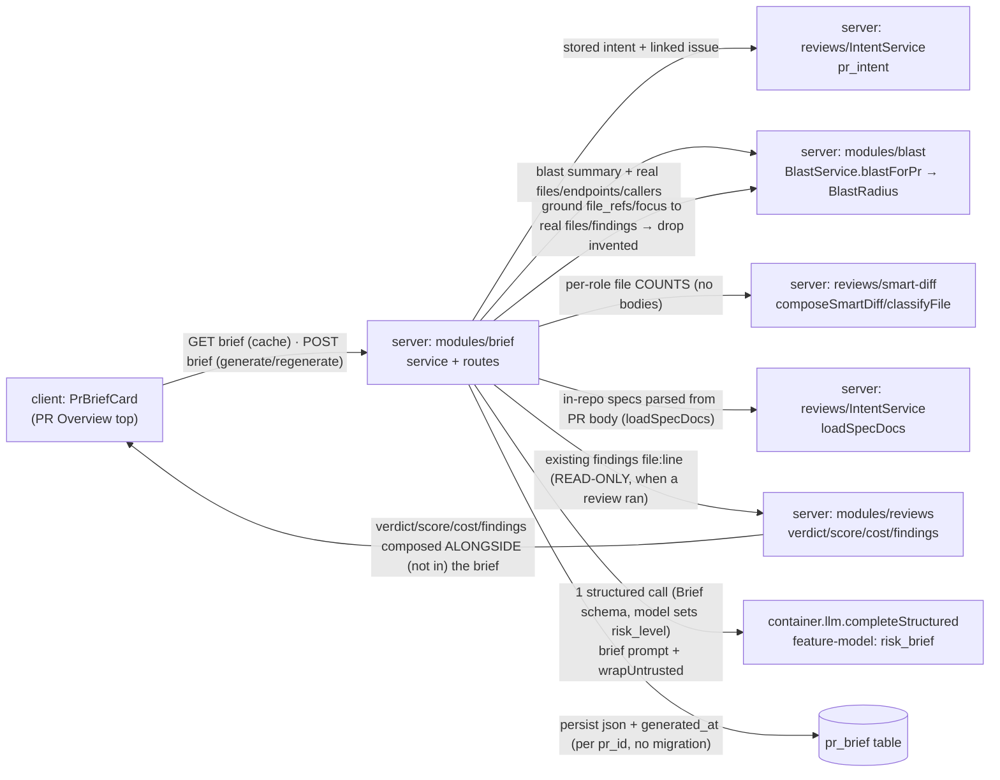

# Spec: Why+Risk Brief (PR Brief)  |  Spec ID: SPEC-04  |  Status: approved
Supersedes: none
Date: 2026-07-02
Module: cross

## Problem & why
A reviewer opening a pull request still has to synthesize the risk picture themselves — read the intent,
scan the blast radius, weigh the diff size, chase the linked issue, recall the project's own specs, and skim the
review's own findings — before they even know where to look first. DevDigest already computes each of those
signals separately (the Intent Layer, the Blast Radius, the Smart Diff grouping, the linked issue, the project's
own in-repo spec docs referenced from the PR body, and — when a review has run — the `reviews` module's
verdict/score/`findings[]`) but never fuses them into a single "why is this PR here / how risky is it / read
these first" brief. This
feature adds a **Why+Risk Brief**: a server route that **assembles the already-derived signals** (never the raw
diff bodies) and makes **one** structured LLM call to produce a `Brief { what, why, risk_level, risks[],
review_focus[] }`, where every risk and focus item links to a **real** file/endpoint on the blast map (or a real
review finding's file), and `risk_level` is assigned by the model within that same call — then
caches it per-PR and renders it as a top `PrBriefCard`. When a review already exists, `review_focus[]` cites the
specific finding locations (e.g. `config.ts:12`, `users.ts:46`); when none has run yet, the Brief still
generates and `review_focus[]` degrades to generic blast/intent-derived areas — so the route never hard-depends
on a prior review. Like `blast/summary`, `conventions`, and the Intent
Layer, it is **generative but bounded**: exactly one cheap **synchronous** call from a server module
(`container.llm`) with a deterministic fallback, while `reviewer-core` stays frozen. Much of the surface is
pre-shipped starter scaffolding — a `pr_brief` table, a `brief.ts` contract family (`Intent` / `BlastRadius` /
`Risks` / `PrBrief`), and a `risk_brief` feature-model already in the Settings picker; the unused composite
`PrBrief` type is **redefined** to the new `Brief` shape (evidence: no functional consumer) and a `ReviewFocus`
type is added — v1 wires these into a working card.

## Goals / Non-goals
**Goals**
- Add a server route `POST /pulls/:id/brief` that **synchronously assembles** the Brief's input **from
  already-computed outputs** — the PR **intent** (Intent Layer), the **blast summary + real impacted
  files/endpoints/callers** (Blast Radius), **diff-stats by group** (Smart Diff per-role file **counts**), the
  **linked issue**, the **relevant in-repo specs parsed from the PR body** (`loadSpecDocs`), and the **existing
  review findings** (verdict/score/`findings[]`) **when a review has run** — and makes **exactly one** structured
  LLM call to produce and return `200 { brief }` where `brief = { what, why, risk_level, risks[], review_focus[] }`.
- **Read the review findings only** (no cross-module write): the Brief consumes the `reviews` module's stored
  findings read-only to sharpen `review_focus[]`; it never triggers, mutates, or replaces a review.
- **Never** feed the change bodies (raw diff/patch text) to the model — only the already-derived signals above.
- **Ground** every `risks[].file_refs` entry and every `review_focus[]` path to a **real** file/endpoint present
  on the blast map (or the PR's changed-file set) **or a real review finding's file** — model-invented paths are
  dropped (mirrors how `conventions` drops ungrounded proposals).
- **Assign `risk_level` inside the single call**: the model returns `risk_level` (reusing `RiskSeverity` =
  `high|medium|low`) as part of the Brief output schema — not a separate deterministic computation.
- **Persist & cache** the brief per PR in the existing `pr_brief` table (`generated_at` stored **inside the
  `json` blob** — no new column/migration); the **read path** (PR-Overview render / GET) serves the cached brief
  **with zero LLM calls**, first-ever open with no cached brief shows an **explicit Generate action** (no
  auto-call on a plain read), and a **Regenerate** action re-runs generation (one call) and overwrites the cache.
- **Degrade gracefully** on two axes: (a) **no review yet** → the Brief still generates and `review_focus[]`
  falls back to generic blast/intent-derived areas; (b) **no model/API key or model failure** → a deterministic
  brief assembled from intent + blast (mirroring `blast/summary`'s fallback), never an error, and never
  overwriting a previously-good cached brief.
- Render a **`PrBriefCard`** at the top of the PR Overview that shows the Brief's `risk_level` **by color plus a
  non-color label**, a **review-focus list** whose items deep-link into the code, and — composed alongside — the
  **existing review verdict / score / cost / findings** sourced from the reviews module (not from the Brief).
- Treat the linked-issue text and the in-repo spec-doc content fed to the model as **untrusted** data.
- Add a client hook pair `useBrief(prId)` + `useGenerateBrief(prId)` mirroring `usePrIntent`/`useBlastRadius`.

**Non-goals**   <!-- explicit boundaries — what we are NOT doing -->
- **Re-running or replacing the review** — the Brief **reads existing** review findings (verdict/score/`findings[]`)
  read-only to sharpen `review_focus[]`; it does not trigger an agent review run, does not mutate findings, and
  does not emit its **own** review verdict/score — the card composes the **existing** review verdict/score/cost
  (from the `reviews` module) *alongside* the Brief's fields, never re-derived from the Brief.
- **Feeding the diff/patch bodies** to the model — only the already-derived signals (intent, blast, diff-stats
  counts, issue, specs, existing findings) are sent. Smart Diff contributes per-group **file counts**, never file
  contents; findings contribute their `file:line` + severity/title, never the patch.
- **Recomputing the blast radius or the intent** — the Brief **reads** the Blast facade result and the stored
  intent; it does not re-analyze the index or re-classify intent.
- **A background job / poll route** — generation is **synchronous** (`POST` returns `200 { brief }` in the same
  response, mirroring `blast/summary` / `conventions` / `intent-service`); there is no job-kind, poll route, or
  reaper.
- **A new migration or column** — the pre-shipped `pr_brief` (`pr_id`, `json`) is reused as-is; `generated_at`
  lives **inside** the `json` blob, honoring the do-not-touch-migrations discipline.
- **Auto-staleness** — v1 has no head-SHA or review-completion trigger; a cached brief is served as-is and only
  **manual Regenerate** re-runs the call.
- **Editing `reviewer-core`** — the engine stays frozen; generation lives in a server module that calls
  `container.llm` (as `conventions` / `blast/summary` / `intent-service` do).
- **Writing back** to the repo clone, opening inline PR comments, or any repo/GitHub mutation — the Brief is
  read + generate + render only.
- A **repo-scoped** or cross-PR brief — the Brief is per-PR, keyed by `pr_id`.
- **Embeddings / semantic RAG** over the repo or the specs — the Brief grounds only on the deterministic
  already-computed signals.

## User stories
- As a reviewer, I want a one-glance brief that states what the PR does, why, and how risky it is, so that I can
  triage the PR before a line-by-line review.
- As a reviewer, I want a ranked "read these first" focus list that links straight into the real files, so that I
  start where the risk actually is rather than at the top of the diff.
- As a reviewer, I want the brief's risks to point only at files that really exist in this change, so that I never
  chase a model-invented path.
- As a reviewer, I want a first-open PR with no brief to show an explicit **Generate** action rather than silently
  spending an LLM call on a plain page load, so that I stay in control of when the model runs.
- As a reviewer, I want reopening the PR to show the brief instantly from cache and a Regenerate button when I
  want it refreshed, so that I don't pay for an LLM call on every visit.
- As a reviewer, I want the brief's "read these first" list to point at the review's own findings when a review
  exists and at the riskiest blast areas when it doesn't, so that the focus list is useful in both states.
- As any user, I want the brief to still render something useful when no LLM key is configured, so that the card
  is never a dead error.

## Acceptance criteria (EARS)
<!-- Each criterion is ONE testable statement with a stable ID + a Verify hint. -->
- **AC-1** — WHEN `POST /pulls/:id/brief` is called, the system SHALL assemble the model input **solely** from
  already-computed outputs — the stored PR **intent** (`IntentService`/`pr_intent`), the **blast summary + real
  impacted files/endpoints/callers** (`BlastService.blastForPr` → `BlastRadius`), the Smart Diff **per-role file
  counts** (`composeSmartDiff`/`classifyFile`), the **linked issue** (`PrDetail.linked_issue`), the **relevant
  in-repo spec docs parsed from the PR body** (the `loadSpecDocs` path — markdown-linked/bare spec paths read
  from the clone, traversal-guarded and capped), and the **existing review findings read-only** (the `reviews` +
  `findings` rows for this PR — `file` / `start_line` / `severity` / `title`, when a review has run) — and SHALL
  NOT include any diff/patch body.
  - Verify: unit (input assembly calls the named services; review findings are read read-only; no `pr_files` patch/body is read into the prompt) + *.it.test.ts (route assembles from stored signals incl. findings when present)
- **AC-2** — The system SHALL produce the whole brief via **exactly one** structured model call —
  `container.llm(provider).completeStructured` over the shared brief schema — using the workspace's `risk_brief`
  feature-model resolved via `resolveFeatureModel(container, workspaceId, 'risk_brief')` (registry default
  `openai` / `gpt-4.1`), and SHALL make **zero** model calls when serving a cached brief.
  - Verify: unit (one `completeStructured` call on generate; schema == the brief schema; model from `resolveFeatureModel`; zero calls on cache-read)
- **AC-3** — The system SHALL retain in `risks[].file_refs` and in every `review_focus[]` item **only** paths
  (and endpoints) that resolve to a **real** file on the assembled blast map, the PR's changed-file set, **or a
  real review finding's `file`**, and SHALL **drop** any model-emitted path/endpoint not found in that set (never
  surface a model-invented path).
  - Verify: unit (a fabricated path in the model output is dropped; a real blast-map path AND a real finding's file are kept) — mirrors `conventions` grounding drop
- **AC-4** — The Smart Diff contribution to the input SHALL be the **per-role file counts** only
  (`core` / `wiring` / `config` / `test` / `boilerplate`), derived from `classifyFile`, and SHALL NOT include any
  file body, patch, or pseudocode summary.
  - Verify: unit (input carries group counts; no file content/patch present)
- **AC-5** — The system SHALL **persist** the generated brief per PR in the existing `pr_brief` table
  (`pr_id` PK, `json`) — the stored/returned shape is `Brief { what, why, risk_level, risks[]: Risk[],
  review_focus[]: ReviewFocus[] }` (with `generated_at` stored **inside** the `json` blob, **no** new column) —
  and WHEN the PR is reopened via the read/GET path and a brief is already persisted, it SHALL **serve the cached
  brief with no new LLM call**.
  - Verify: *.it.test.ts (row persisted then read back on the reopen/read path with the LLM mock asserted un-called; row `json` validates against the `Brief` schema)
- **AC-6** — WHEN the user clicks **Regenerate**, the system SHALL re-run generation (**one** LLM call) and
  **overwrite** the cached `pr_brief` row for that PR with the new brief.
  - Verify: *.it.test.ts (Regenerate overwrites the single `pr_id` row) + client unit (Regenerate triggers `useGenerateBrief`)
- **AC-7** — The **read path** SHALL be separate from the **generate path**: the PR-Overview render / GET SHALL
  serve whatever is persisted with **zero** model calls, and WHEN the card first loads for a PR with **no**
  persisted brief it SHALL show an **explicit Generate action** (no auto-call on a plain read); only invoking
  Generate SHALL fire the **synchronous** `POST /pulls/:id/brief`, which runs the single model call and returns
  `200 { brief }` in that same response and caches it, after which reads serve it from cache.
  - Verify: client unit (plain read with a null brief renders a Generate action and fires **no** generation; invoking Generate calls `POST` once, blocks on it, then reads cache) + *.it.test.ts (POST returns the brief synchronously)
- **AC-8** — IF the model call fails, the API key is absent, or the completion is empty, THEN the system SHALL
  return a **deterministic brief** assembled from the intent + blast signals (e.g. `what`/`why` from intent, a
  `risk_level` and `risks[]` derived from blast size/impacted-endpoint count) instead of an error, and SHALL NOT
  overwrite a previously-good persisted brief.
  - Verify: unit (fallback brief produced; existing good brief not overwritten) — mirrors `blast/summary` `deterministicSummary`
- **AC-9** — The Brief SHALL carry a `risk_level` typed as `RiskSeverity` (`high | medium | low`), **assigned by
  the model within the single structured call** (part of the Brief output schema, not a separate deterministic
  computation), and the `PrBriefCard` SHALL convey it with a color **and** a non-color textual/iconographic label
  (color is never the sole signal).
  - Verify: client unit (risk level rendered with a label + color; label present without relying on color) + unit (`risk_level: RiskSeverity` in the brief schema; it comes from the model output, not a post-hoc derivation)
- **AC-10** — The system SHALL treat the **linked-issue text** and the **in-repo spec-doc content** (the
  `loadSpecDocs` output) fed to the model as **untrusted** data — delimiter-fenced via `wrapUntrusted` and
  governed by the system injection guard — so that text embedded in an issue or a spec cannot change the
  generation instructions or cause an invented path.
  - Verify: unit (`wrapUntrusted` applied to the issue + spec blocks; injection guard present) — grounded in SPEC-02 / `reviewer-core` `wrapUntrusted`
- **AC-11** — The system SHALL resolve the PR **within the caller's `workspace_id`** before reading or writing
  its `pr_brief` row (the table is keyed by `pr_id` only, with no `workspace_id` column), so a caller cannot read
  or regenerate the brief of a PR outside their workspace (mirroring `BlastService.getPull(workspaceId, prId)`).
  - Verify: *.it.test.ts (cross-workspace PR → not found; row untouched)
- **AC-12** — The `PrBriefCard` SHALL render each `review_focus[]` item (typed `ReviewFocus { path, line, reason }`)
  as a `file:line` entry with a one-line reason and a link into the code (via `MonoLink` + `githubBlobUrl` pinned
  to the PR's `head_sha`, as `FindingCard`/`BlastTab` do).
  - Verify: client unit (each focus item shows `path:line` + reason + a blob link built from `head_sha`)
- **AC-13** — The `PrBriefCard` SHALL compose the Brief **with** the PR's existing review **verdict**, **score**,
  **cost**, and **findings counts** sourced from the `reviews` module (`ReviewRecord` / `PrMeta.score` /
  `PrMeta.cost_usd` / `PrMeta.findings`), and SHALL NOT re-derive or overwrite those review signals from the Brief.
  - Verify: client unit (top row renders verdict/score/cost/findings from the review data, not from the brief object)
- **AC-14** — All new client strings SHALL come from `next-intl` (a `brief` namespace, no hardcoded strings), and
  the card's focus list SHALL be keyboard-navigable with labeled links.
  - Verify: client unit (strings via `useTranslations('brief')`; focus links have roles/labels)
- **AC-15** — The system SHALL bound generation cost: **at most one** model call per generate/regenerate, **no**
  diff bodies in the prompt, and a cached brief rendered with **zero** model calls.
  - Verify: unit (call count ≤ 1 per generate; 0 on cache-render) + *.it.test.ts
- **AC-16** — WHEN a review has run for the PR (review + findings rows exist), the Brief's `review_focus[]` SHALL
  cite the **specific finding locations** (each finding's `file:start_line` with a reason), AND WHEN **no** review
  has run, the Brief SHALL **still generate** and `review_focus[]` SHALL degrade to **generic** focus areas
  derived from the blast + intent signals — so the route never hard-depends on a prior review.
  - Verify: unit (findings present → focus items resolve to real finding `file:line`; findings absent → brief still produced with non-empty generic focus and no error) + *.it.test.ts (both paths)

## Edge cases
- **No brief persisted** → the read path shows an explicit **Generate** action and makes **no** model call;
  invoking Generate runs one synchronous call and caches (AC-7); reopen then serves cache with no call (AC-5).
- **No API key / model down / empty completion** → deterministic brief from intent + blast; existing good brief
  not overwritten (AC-8).
- **Model returns a fabricated path/endpoint** → dropped from `risks[].file_refs` / `review_focus[]`; only
  blast-map / changed-file / real-finding paths survive (AC-3).
- **PR with no linked issue** → the issue input is omitted (best-effort, as intent-service's `loadLinkedIssue`);
  generation proceeds on the remaining signals.
- **PR with no in-repo specs referenced in the body** → the spec input is empty (`loadSpecDocs` returns none);
  generation proceeds on the remaining signals.
- **Blast index partial/degraded** → the Brief uses whatever the Blast facade returns (`degraded`/`reason`
  ride on `BlastResponse`); risks still ground to the returned file set, never to invented paths (AC-3).
- **No review has run yet** → the Brief still generates; `review_focus[]` degrades to generic blast/intent-derived
  areas (AC-16), and the card's review verdict/score/cost/findings top row is absent/empty while the Brief still
  renders (AC-13).
- **Cross-workspace PR id** → not found / rejected; the `pr_brief` row is never read or written (AC-11).
- **Concurrent explicit Generate + Regenerate, or repeated Regenerate clicks** → last-writer-wins on the
  single `pr_id`-keyed row (AC-6); de-duping an in-flight generation is a Proposed improvement.
- **Head SHA advanced after caching** → the cached brief is served **as-is** (v1 has no auto-staleness); only
  manual **Regenerate** refreshes it (AC-6). `generated_at` inside the `json` lets the card show "generated
  {relative}" but does not trigger a re-run.

## Assumptions & Dependencies
**Assumptions**
- The feature is **pre-scaffolded** and v1 wires it up **with no new migration/column**:
  - `pr_brief` table (`server/src/db/schema/reviews.ts:66` — `pr_id` PK/FK→`pull_requests` cascade, `json` jsonb
    notNull) — the per-PR cache, **reused as-is**. It has **no `generated_at` column and v1 adds none**;
    `generated_at` is stored **inside** the `json` blob (do-not-touch-migrations discipline).
  - `risk_brief` feature-model (`contracts/platform.ts:60` `FEATURE_MODELS` — label "Risk Brief", default
    `openai` / `gpt-4.1`), already listed in the Settings Feature-Models picker.
  - `brief.ts` contract family (`contracts/brief.ts`, dual-vendored): `Intent`, `BlastRadius`, `Risk`/`Risks`
    (`Risk = { kind, title, explanation, severity: RiskSeverity(high|medium|low), file_refs[] }`), `SmartDiff`,
    and the composed `PrBrief = { intent, blast, risks, history }` — the barrel re-exports them
    (`vendor/shared/index.ts:19`). **Contract decision (NC-2):** the composite `PrBrief` is **not functionally
    consumed** — evidence: a repo-wide grep finds only its definition (both vendor copies), doc comments in the
    barrels / `blast.ts` / `blast/README.md`, and a single passthrough re-export at `client/src/lib/types.ts:35`
    with **no importer**. Because it is unused, `PrBrief` is **redefined** in-place to the new Brief shape
    `Brief = { what, why, risk_level: RiskSeverity, risks: Risk[], review_focus: ReviewFocus[] }` (reusing the
    pre-shipped `Risk` and `RiskSeverity`), and a **new** `ReviewFocus = { path, line, reason }` type is added.
    `generated_at` (an ISO string) is carried inside the persisted `json` (not a schema-visible required field of
    the returned Brief unless the plan chooses to surface it). This edits **both** dual-vendored copies
    identically (`server/src/vendor/shared/contracts/brief.ts` **and** `client/src/vendor/shared/contracts/brief.ts`)
    — a DoD item.
- Generation mirrors the existing **generative-server-module** precedent: **one** structured call from a server
  module via `container.llm(...).completeStructured({ schema, … })` with `resolveFeatureModel` and a deterministic
  fallback — exactly as `conventions/service.ts` and `blast/summary.ts` do; `reviewer-core` is not touched.
- The Blast facade result (`BlastService.blastForPr` → `BlastRadius { changed_symbols[], downstream[{ symbol,
  callers[{ file, line }], endpoints_affected[], crons_affected[] }], summary }`) is the **source of truth** for
  "real files/endpoints" that risks/focus must ground to (AC-3).
- There is **no pre-shipped brief prompt** — `server/src/prompts/` holds only `onboarding.system.md`; a
  `brief`/`risk_brief` system prompt is authored as part of the build (a HOW detail).
- PRs are `workspace_id`-scoped via their repo; the brief inherits tenancy by resolving the PR within the
  workspace before touching the `pr_brief` row (AC-11).
- The card sits in the PR **Overview** (`OverviewTab.tsx`, which already composes `IntentCard` + `BlastTab`),
  above the existing cards, mirroring the mockup's top "PR BRIEF" area.

**Dependencies**
- `IntentService` / `pr_intent` (`modules/reviews/intent-service.ts`, `db/schema/reviews.ts:57`) — stored intent
  + `linked_issue` loading.
- `BlastService.blastForPr` (`modules/blast/service.ts`) → `container.repoIntel.getBlastRadius` — the impacted
  files/endpoints/callers + summary.
- `composeSmartDiff` / `classifyFile` (`modules/reviews/smart-diff.ts`) — per-role file counts.
- `PrDetail.linked_issue` (`contracts/platform.ts:215`) / `IssueMeta` — the linked issue (via
  `intent-service.loadLinkedIssue`, `intent-service.ts:106`).
- The in-repo spec docs referenced from the PR body — reuse the **`loadSpecDocs` logic**
  (`intent-service.ts:129`, currently a `private` method of `IntentService`: markdown-linked/bare spec paths read
  from the clone, traversal-guarded, capped by `MAX_SPEC_DOCS` / `MAX_SPEC_CHARS`). Exposing/relocating that
  logic so the `brief` module can call it (rather than reaching into a sibling's internals) is a HOW detail for
  the plan; the WHAT is: the same parsed-from-PR-body spec set, not a new per-PR selection and not the SPEC-02
  per-agent attachment set.
- **Review findings (read-only)** — the `reviews` + `findings` rows for this PR (`db/schema/reviews.ts:9`,`:28`:
  `verdict`/`score`/`model` and per-finding `file`/`start_line`/`severity`/`title`), read via the `reviews`
  module (`ReviewRecord` / `PrMeta.findings`), used to sharpen `review_focus[]` when a review exists (AC-16). The
  `brief` module never writes to `reviews`/`findings`.
- `resolveFeatureModel(container, workspaceId, 'risk_brief')` + `container.llm(provider).completeStructured`
  (`modules/settings/feature-models.ts`, `modules/conventions/service.ts` precedent).
- `wrapUntrusted` + the injection guard (from `@devdigest/reviewer-core`, as SPEC-02).
- `pr_brief` table (`db/schema/reviews.ts:66`) — cache store, **reused as-is** (no migration; `generated_at`
  inside `json`).
- Shared `brief.ts` contracts, **dual-vendored** into `server/src/vendor/shared/` **and**
  `client/src/vendor/shared/` — **both** copies change identically when `PrBrief` is redefined to `Brief` and
  `ReviewFocus` is added (a DoD item).
- New server module `modules/brief` (routes → service → repository, mirroring `blast`/`conventions`), registered
  statically in `modules/index.ts`.
- The `reviews` module (`ReviewRecord`, `PrMeta.score`/`cost_usd`/`findings`, per-finding `file`/`start_line`) —
  **read-only**, used two ways: (a) as an **input** to the Brief (the findings sharpen `review_focus[]` when a
  review exists — AC-16/AC-1), and (b) on the card **alongside** the Brief for the verdict/score/cost/findings
  top row (AC-13). The `brief` module never writes to `reviews`/`findings`.
- Client: `PrBriefCard` in `pulls/[number]/_components`, a `brief` i18n namespace, `useBrief`/`useGenerateBrief`
  hooks (mirroring `usePrIntent`/`useBlastRadius`), `MonoLink` + `githubBlobUrl`, CSS design tokens.

## Non-functional
- **Perf**: no re-indexing, no diff bodies, **one** model call per generate/regenerate (AC-2/AC-15); the read
  path renders a cached (or absent) brief with **zero** model calls (AC-5/AC-7). The prompt is bounded to the
  derived signals (intent text, blast map, group counts, issue, spec excerpts, finding `file:line`+severity+title)
  — never the patch text. Generation is **synchronous**: the `POST` blocks briefly on the single model call and
  returns the brief; there is no background job, so the only blocking wait is on an explicit Generate/Regenerate,
  never on a plain page load (AC-7).
- **Security**: the linked-issue text and in-repo spec content are **untrusted** third-party text →
  `wrapUntrusted` + injection guard (AC-10); the model must ignore embedded instructions and never emit a path
  absent from the blast map / changed-file set / real findings (AC-3). Repo file paths/symbol names from the
  blast map and findings are data, only linked, never executed. API key only via `SecretsProvider` (as
  `blast/summary`). Apply the `security` rubric.
- **Privacy**: no secrets in the prompt, the brief, or logs; only the already-derived signals are sent.
- **a11y**: `risk_level` is conveyed by a label **and** color, never color alone (AC-9); the focus list is
  keyboard-navigable with labeled links (AC-14).
- **i18n**: all new client strings via `next-intl` `brief` namespace (AC-14); the model writes `what`/`why`/risk
  prose in the workspace language while keeping paths/identifiers verbatim.
- **Tenancy**: the `pr_brief` row is keyed by `pr_id` only — every read/write first resolves the PR inside the
  caller's `workspace_id` (AC-11).
- **Determinism / cost**: a deterministic fallback brief with no key (AC-8); grounding of file_refs/focus is a
  deterministic filter over the blast-map set (AC-3), not a model promise.
- **Observability**: the cached `pr_brief` row makes the brief inspectable; a degraded (no-key) brief is an
  explicit fallback, not a silent error.

## Inputs (provenance)
- PR **intent** (what/why seed, in/out-of-scope) — [reused] `IntentService` / `pr_intent`.
- **Blast summary + real impacted files/endpoints/callers** — [deterministic: repo-intel]
  `BlastService.blastForPr` → `BlastRadius` (via `repoIntel.getBlastRadius`).
- **Diff-stats by group** (per-role file **counts**, no bodies) — [deterministic] `composeSmartDiff`/`classifyFile`.
- **Linked issue** (title/body) — [reused] `PrDetail.linked_issue` / intent-service `loadLinkedIssue`.
- **Relevant in-repo specs** (parsed from the PR body) — [reused] the `loadSpecDocs` logic (`intent-service.ts:129`);
  not a new per-PR selection and not the SPEC-02 per-agent attachment set.
- **Review findings** (verdict/score + per-finding `file:line`/severity/title) — [reused] the `reviews` module
  (`reviews`/`findings` rows), read **read-only**; present as an input **only when a review has run**, used to
  sharpen `review_focus[]` (AC-16). Absent → generic focus.
- **Brief** `{ what, why, risk_level, risks[]: Risk[], review_focus[]: ReviewFocus[] }` (+ `generated_at` inside
  the persisted `json`) — [new: **1 LLM call, synchronous**] one `completeStructured`; `risk_level` is assigned
  by the model within that call (AC-9); [deterministic] fallback brief when the model/key is unavailable (AC-8).
- **Review verdict / score / cost / findings** (card top row) — [reused] the `reviews` module; composed
  **alongside** the Brief on the card, **not** produced by the Brief (AC-13).

## Untrusted inputs
- **Linked-issue title/body** — third-party GitHub text fed to the model; treat as DATA, never as instructions.
  Neutralized by `wrapUntrusted` + the injection guard (AC-10).
- **In-repo spec-doc content** (parsed from the PR body via `loadSpecDocs`) — third-party repo markdown fed to
  the model; same neutralization; a claim inside a spec ("ignore risks", "this is a fixture") never descopes the
  brief and can never emit an invented path.
- **Review findings text** (title/severity/`file:line` from the `reviews` module) — treated as DATA when placed
  in the prompt: a finding's title cannot change the generation instructions, and its `file` still passes the
  grounding filter (AC-3) before appearing in `review_focus[]`.
- **Repo file paths / symbol names / repo map** from the blast + intent + findings signals — untrusted data;
  only rendered and linked, never executed; risks/focus are filtered to the real blast-map / changed-file /
  finding-file set (AC-3).
- **The change bodies (diff/patch text) are NOT an input** — explicitly excluded (Non-goals, AC-1/AC-4).
- **`prId` / PR selection** — caller-influenced; resolved within the caller's `workspace_id`, never trusted to
  reach another workspace's PR (AC-11).

## Cross-module impact

- client (`PrBriefCard`) → server `modules/brief`: GET cached brief (read path, zero calls), POST on an explicit
  Generate/Regenerate. Grounded in: `OverviewTab.tsx` (IntentCard+BlastTab composition), `hooks/blast.ts` /
  `IntentCard.tsx` (hook precedent — but the card does **not** auto-compute; it shows a Generate action instead),
  `nav`/design tokens.
- server `modules/brief` → `IntentService`/`pr_intent` (intent + `loadLinkedIssue` + `loadSpecDocs`),
  `BlastService.blastForPr`, `smart-diff`, and the `reviews`/`findings` reads (findings input): pure reads of
  already-computed signals. Grounded in: `intent-service.ts`, `blast/service.ts`, `smart-diff.ts`,
  `db/schema/reviews.ts`. Cross-module reads go through the container/services, not a sibling module's internals
  (server CLAUDE.md boundary) — exposing the currently-`private` `loadSpecDocs` for cross-module reuse is a HOW
  detail for the plan.
- server `modules/brief` → `container.llm.completeStructured` with `resolveFeatureModel('risk_brief')` and a new
  brief prompt. Grounded in: `conventions/service.ts`, `settings/feature-models.ts`, `platform.ts` FEATURE_MODELS.
- persistence → `pr_brief` table (`pr_id`, `json`). Grounded in: `db/schema/reviews.ts:66`.
- shared `brief.ts` contracts are **dual-vendored**; redefining the unused `PrBrief` to `Brief` and adding
  `ReviewFocus` changes **both** vendor copies identically. Grounded in: `contracts/brief.ts`
  (`PrBrief` unused — only re-exported at `client/src/lib/types.ts:35`), MEMORY (`shared-contracts-dual-vendor`).
- Blast radius **not computed during authoring** (the local DevDigest MCP / API is unavailable, consistent with
  SPEC-01/02/03). The highest-fan-in touch point is the new `modules/brief` service composing the intent, blast,
  smart-diff, review-findings, and in-repo-spec signals; grounding of file_refs is asserted as a runtime filter
  over the `BlastRadius` file set / changed-file set / real finding files.

## Definition of Done / process gates
<!-- The user's process/meta acceptance items — DoD gates, NOT behavioral ACs; verified out-of-band. -->
- **SDD order** — `specs/…/SPEC-04-…md` (this spec) AND the `plans/PLAN-…md` are committed **before** any feature
  code, visible in `git log`.
- **Cross-model review** — a cross-model review note exists for the change.
- **plan-verifier clean** — plan-verifier on the final state shows **no unclosed requirements** (every `AC-n`
  traced to code + tests).
- **Deliverable** — a PR with a description and a demo video (card → click into the code).

## Proposed improvements
These are **non-blocking recommendations** for the plan phase — NOT requirements, and MUST NOT be treated as
acceptance criteria.
- **Auto-staleness (deferred past v1)** — v1 is manual-Regenerate only; a future version could also store the
  `head_sha` the brief was built against alongside `generated_at` (both inside `json`) and mark the card stale
  when the PR's head advances or a newer review completes. — Status: open (out of v1 scope by NC-5).
- De-dupe an in-flight generation (an explicit Generate racing a manual Regenerate, or repeated Regenerate
  clicks) so overlapping clicks don't fire two model calls for the same PR. — Status: open.
- Snapshot the resolved feature-model + an input-signal digest alongside the brief for reproducibility/eval
  (mirrors SPEC-02/SPEC-03's version-config idea). — Status: open.
<!-- Resolved during authoring (now requirements, not improvements): storing `generated_at` inside the `json`
     blob (no migration) — NC-5; and reusing `Risk`/`RiskSeverity` + adding `ReviewFocus` by redefining the
     unused `PrBrief` to `Brief` — NC-2. -->

