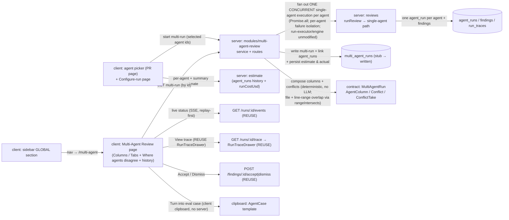

# Spec: Multi-Agent Review  |  Spec ID: SPEC-06  |  Status: approved
Supersedes: none
Date: 2026-07-08
Module: cross

## Problem & why
A real pull request is heterogeneous — a security exposure, an N+1 query, and a domain-logic slip can all
ride in the same diff. One review agent has one focus; today DevDigest lets you run **one agent or all enabled
agents**, but it presents the result as a single undifferentiated review with no way to see *which* agent found
*what*, no way to compare specialists side by side, and no live window while the runs are in flight. When three
agents each independently flag the same obvious defect, the reviewer reads three near-identical findings and
starts distrusting the tool. This feature makes the fan-out first-class: a **picker** to choose which agents to
run on a PR, a **Multi-Agent Review page** that shows one lane per agent with live status and cost, and a
**"Where agents disagree"** block that groups findings by code location and shows every agent's verdict at that
spot — *including* "did not flag". Duplicates stop being annoying (it is visibly "the same spot"), genuine
disagreements surface, and finding→agent attribution is retained in the data as the raw material for a future
Per-Agent Stats feature. Much of the surface is pre-scaffolded: a `multi_agent_runs` table stub, a dual-vendored
`observability.ts` contract family (`MultiAgentRun` / `AgentColumn` / `Conflict` / `ConflictTake`), the
multi-run-capable `POST /pulls/:id/review` route + run-executor (fan-out with per-agent failure isolation), the
SSE replay stream, `RunTraceDrawer`, and `LiveLogStream` — this feature wires them into a working page and adds
the genuinely new mechanics: **pre-run cost/time estimation** from past runs, a **concurrent multi-agent fan-out**
that groups the runs under one URL-addressable multi-run, and **calibration persistence** (the pre-run estimate
recorded next to the actual outcome).

## Goals / Non-goals
**Goals**
- Replace the PR-page **RunReviewDropdown** ("one agent or all") with a **"Pick agents to run"** multi-select
  dropdown (per-agent checkboxes with a `~Ns` estimate, a Clear link, a `Run multi-agent review (N)` primary
  button, and a `Configure agents…` footer link into the Configure-run page).
- Add a **`Multi-Agent Review → Configure run`** page: step 1 pick a PR, step 2 agent checkbox cards (each with
  the agent's one-line last-run summary and a per-agent `time · cost` estimate), a `Select all` link, a
  `Run multi-agent review (N)` button, and a **pre-run summary estimate** (e.g. `≈ 8.2s · $0.20 · parallel
  fan-out`).
- Add the new **pre-run estimate** mechanic: derive each agent's `time · cost` estimate from that agent's own
  **past `agent_runs`** (duration + `runCostUsd`), and aggregate them into the summary estimate.
- **Group** the fanned-out `agent_runs` under one **multi-run**: write and read the `multi_agent_runs` table (a
  stub today), linking each participating `agent_run` to the multi-run, via a new service + routes.
- **Fan out concurrently**: the new multi-run service launches one **independent single-agent execution per
  selected agent in parallel** (over the existing single-agent execution path), with per-agent failure isolation,
  **without** modifying `run-executor`/engine internals — so the multi-run's total duration is the **max** of the
  agents' durations (the `parallel fan-out` label is honest).
- Make the multi-run a **URL-addressable resource with history**: each launch inserts a **new** `multi_agent_runs`
  row with its own id; the results page opens by that id; the Multi-Agent Review surface lists the PR's past
  multi-runs (most-recent first); re-running the same PR creates a **new** row (history preserved), never
  overwrites.
- **Persist calibration data**: alongside each multi-run, record **both** the pre-run estimate (per-agent +
  summary `time · cost`) **and** the actual outcome (per-agent + total `duration · cost`) as raw material for
  estimate-accuracy tracking and future Per-Agent Stats.
- Serve the multi-run as the pre-shipped **`MultiAgentRun`** contract: `columns[]` (one `AgentColumn` per agent
  with status / verdict / score / duration / cost / findings) and `conflicts[]` (the "Where agents disagree"
  groups).
- Render the **Multi-Agent Review results page** with a two-mode switcher:
  - **Columns** — one column per agent (name, score badge, `duration · cost` status line, finding cards with
    `file:line`, a footer `View trace` + `N findings`); live parallel lanes during the run.
  - **Tabs + detail** — a tab per agent with a score badge; the active tab shows a summary card (score, one-line
    verdict, `View trace`, `duration · cost`) then expandable finding cards (severity icon, title, category chip,
    `file:line`, confidence %, expanded rationale + `SUGGESTED FIX`) with action buttons.
- Render the **"Where agents disagree"** block below both modes: findings grouped by code location; within each
  group one cell per participating agent showing its verdict **including "did not flag"**; a `Show only conflicts`
  toggle.
- Surface **live per-agent status** into the column/tab headers and **link to each agent's run trace** by reusing
  the existing SSE stream, the **`RunTraceDrawer`** component verbatim (no new trace viewer), and `LiveLogStream`.
- **Reuse** the existing finding **Accept / Dismiss** actions (`POST /findings/:id/accept|dismiss`) on the detail
  cards; **`Turn into eval case`** copies a ready eval-case template to the clipboard (client-only, no backend);
  **`Learn`** and **`Reply to author`** are rendered but disabled with a "coming soon" tooltip.
- Guard against a **double-click / in-flight** second launch: while a launch for a selection is in flight the run
  control is disabled so it cannot create a duplicate multi-run.
- **Retain finding→agent attribution** in the multi-run data so a later Per-Agent Stats feature can consume it.
- Add a **`Multi-Agent Review`** nav item (a `GLOBAL` sidebar section) routing to the page (the app-shell already
  recognizes the `/multi-agent` active key).
- Scope every multi-run read/write and estimate by the caller's `workspace_id`.

**Non-goals**   <!-- explicit boundaries — what we are NOT doing -->
- **Per-Agent Stats / the "Agent Performance" screen** — the `AgentStats` contract and `GET /agents/:id/stats`
  are a **future** feature; this spec only *retains* the attribution + calibration data, it does not aggregate or
  chart it, and it does not add the Agent Performance nav destination.
- **The Memory / "Learn" backend** — the cross-session memory curator (`CuratorResult`) is future; the `learn`
  finding action stays unimplemented at the backend and the button is **rendered but disabled with a "coming
  soon" tooltip** (no backend call).
- **A `Reply to author` action** — the button is **rendered but disabled with a "coming soon" tooltip**; posting
  GitHub comments / drafting replies is out of scope for this feature.
- **A server-side "add eval case" route or any write into `evals/`** — `Turn into eval case` is **client-side
  clipboard only** (see AC-24): it builds an eval-case template and copies it; it neither calls the server nor
  writes into the evals package.
- **The Compose Review drawer** — the design-system drawer that curates findings before *publishing* a review is
  a different feature and is out of scope here.
- **Editing the review engine or the run-executor internals** — `reviewer-core` stays frozen, and the
  `run-executor`/engine internals are **not modified** (the run-executor is the other worktree's boundary). The
  new multi-run service orchestrates concurrency **itself** over the existing single-agent execution path
  (`Promise.all`), so the displayed total time reflects true parallelism (max of the agents' durations).
- **Re-running a single failed agent from the results page** — deferred to a future iteration; a failed multi-run
  is re-launched as a whole new multi-run (a new row), not by re-firing one agent in place.
- **CI Runs / Memory / Agent Performance** sibling nav items shown in the mockups — only the `Multi-Agent Review`
  item (and the `GLOBAL` section it needs) are added here.
- **A built 1-vs-3 economics comparison view** — the economics claim is verified by a **manual demo** using two
  existing run traces (see `Demo`), not a new product UI.

## User stories
- As a reviewer, I want to pick which specialized agents run on a PR from the PR page, so that I fan out exactly
  the review coverage this change needs in one pass.
- As a reviewer, I want a Configure-run page that shows each agent's typical time and cost and a combined estimate
  before I commit, so that I know roughly what a multi-agent run will cost me first.
- As a reviewer, I want a column per agent that updates live while the run is in flight, so that I can see who
  finished, who is still thinking, and who failed without staring at a single spinner.
- As a reviewer, I want a "Where agents disagree" block that groups findings by code location and shows each
  agent's verdict — including "did not flag" — so that duplicate findings read as one spot and real
  disagreements become visible.
- As a reviewer, I want to expand a finding to see its confidence and suggested fix and Accept or Dismiss it, so
  that I can triage each agent's output in place.
- As a reviewer, I want a `View trace` link on every agent lane that opens the same run-trace drawer I already
  know from the PR page, so that I can answer "why did this cost this much" and "what did the grounding gate
  reject" for that specific agent without learning a new viewer.
- As a reviewer, I want every multi-run kept in history at its own URL, so that I can reopen a past run later and
  it becomes raw material for a future Per-Agent Stats view.

## Acceptance criteria (EARS)
<!-- Each criterion is ONE testable statement with a stable ID + a Verify hint. See specs/README.md#ears. -->
- **AC-1** — The PR detail page SHALL replace the "one agent or all" RunReviewDropdown with a **multi-select agent
  picker**: a checkbox per agent (each showing a `~Ns` estimate), a `Clear` link, a primary
  `Run multi-agent review (N)` button whose count reflects the checked agents, and a `Configure agents…` footer
  link that navigates to the Configure-run page.
  - Verify: client unit — the dropdown renders one checkbox per agent, the button label reflects the checked
    count, `Clear` empties the selection, and the footer link routes to the Configure-run page.
- **AC-2** — WHEN the user confirms the picker (or the Configure-run page) with a selected agent set and clicks
  `Run multi-agent review (N)`, the system SHALL start ONE **new** multi-run (a fresh `multi_agent_runs` row with
  its own id) over exactly that set and navigate to **that multi-run's** results page (addressed by its id).
  - Verify: client unit + *.it.test.ts — a POST starting the multi-run carries the selected agent ids; the UI
    lands on the results page keyed to the newly created multi-run id.
- **AC-3** — The Configure-run page SHALL present step 1 `Pull request` (a PR selector) and step 2 `Agents to run`
  (a checkbox card per agent showing the agent's one-line last-run summary and a per-agent `time · cost`
  estimate), a `Select all` control, and a `Run multi-agent review (N)` button with a **summary estimate** beside
  it (aggregated time · cost · a `parallel fan-out` label).
  - Verify: client unit — with a PR selected, the page lists agent cards with summary + estimate, `Select all`
    checks every card, and the button + summary estimate reflect the selection.
- **AC-4** — WHILE no pull request is selected on the Configure-run page, the system SHALL show the step-2
  placeholder ("Pick a pull request first …") and SHALL keep the `Run multi-agent review` button non-actionable.
  - Verify: client unit — empty state renders the placeholder and the run button is disabled/no-ops.
- **AC-5** — The per-agent estimate SHALL be derived from that agent's **own past `agent_runs`** (typical duration
  and cost via `runCostUsd`), and the summary estimate SHALL aggregate the selected agents' estimates.
  - Verify: unit — the estimate service reads prior `agent_runs` for the agent and computes time · cost; the
    summary aggregates the selected set.
- **AC-6** — IF a selected agent has **no usable past runs** (never run, or only failed runs), THEN the system
  SHALL render its per-agent estimate as **`— · no history`** and SHALL **exclude** it from the summary estimate,
  marking the summary as **partial** (e.g. a `≥ ≈…` prefix) — never a fabricated number.
  - Verify: unit + client unit — an agent with no prior successful run yields the `— · no history` placeholder, is
    dropped from the aggregate, and the summary renders its partial (`≥ ≈…`) form.
- **AC-7** — WHEN a multi-run is started, the system SHALL create one `multi_agent_runs` row (scoped to the
  caller's `workspace_id` and the PR), link each participating `agent_run` to that multi-run, and fan out **one
  single-agent execution per selected agent CONCURRENTLY** (e.g. `Promise.all` over the existing single-agent
  execution path) with **per-agent failure isolation**, **without** modifying `run-executor`/engine internals.
  - Verify: *.it.test.ts — starting a 3-agent multi-run inserts one `multi_agent_runs` row linked to three
    `agent_runs`, the three executions overlap in time (concurrent, not sequential), and forcing one agent to fail
    leaves the other two `done`.
- **AC-8** — The system SHALL expose the multi-run through the pre-shipped **`observability.ts`** contracts: a
  start route returning / a read route serving a `MultiAgentRun { id, pr_id, ran_at, agent_count,
  total_duration_ms, total_cost_usd, columns: AgentColumn[], conflicts: Conflict[] }`, workspace-scoped, whose
  `total_duration_ms` reflects the **longest** agent (max), not the sum, because the agents run concurrently.
  - Verify: *.it.test.ts — the route response validates against `MultiAgentRun`; a cross-workspace PR/multi-run id
    is not found; `total_duration_ms` equals the max of the columns' `duration_ms`.
- **AC-9** — Each `AgentColumn` SHALL carry the agent's `status` (`running | done | failed`), `verdict`, `score`,
  `summary`, `duration_ms`, `cost_usd`, and its `findings[]` (as `AgentColumnFinding`) sourced from that agent's
  run + persisted findings.
  - Verify: unit + *.it.test.ts — a column maps to its `agent_run` + findings; `cost_usd` uses `runCostUsd`; a
    running agent has a `running` status and null score.
- **AC-10** — WHILE a multi-run is executing, each agent column/tab header SHALL reflect **live status** (running →
  done/failed) by consuming the existing per-run SSE stream (`GET /runs/:id/events`, replay-first), and each
  column/tab SHALL expose a `View trace` link opening that run's trace in the **reused `RunTraceDrawer`** (AC-21).
  - Verify: client unit — mocked SSE events flip a column from running to done; `View trace` opens the
    `RunTraceDrawer` for that `run_id`.
- **AC-11** — IF an agent's run fails, THEN its column/tab SHALL render a **failed state** (no score, a failure
  indicator) while the other agents' columns proceed unaffected, and its `View trace` SHALL still open the
  persisted failure trace (with the error and the run log).
  - Verify: client unit + *.it.test.ts — a failed run yields a failed column with null score, siblings unaffected,
    and the failure trace is retrievable.
- **AC-12** — The results page SHALL provide a **Columns / Tabs** switcher. In **Columns** mode it SHALL render
  one column per agent (name, score badge, `duration · cost` line, finding cards with `file:line`, footer
  `View trace` (the reused `RunTraceDrawer`, AC-21) + `N findings`). In **Tabs** mode it SHALL render a tab per
  agent (with score badge) whose active tab shows a summary card then expandable finding cards.
  - Verify: client unit — toggling Columns↔Tabs re-renders the same agents in the two layouts; a column shows the
    finding cards and footer counts; a tab expands a finding card.
- **AC-13** — In Tabs mode, an expanded finding card SHALL show the finding's severity icon, title, category chip,
  `file:line`, **confidence %**, and its expanded **rationale + `SUGGESTED FIX`**, with the action buttons
  `Accept`, `Dismiss`, and `Turn into eval case` (enabled), and `Learn` and `Reply to author` (rendered but
  **disabled**, each with a "coming soon" tooltip).
  - Verify: client unit — an expanded card renders confidence, rationale, suggested fix, and the five action
    buttons, with `Learn` and `Reply to author` disabled.
- **AC-14** — `Accept` and `Dismiss` on a finding card SHALL call the existing `POST /findings/:id/accept` /
  `POST /findings/:id/dismiss` actions and reflect the finding's new state; `Turn into eval case` SHALL behave per
  AC-24 (client-side clipboard, no backend call); `Learn` and `Reply to author` SHALL be disabled with a "coming
  soon" tooltip and make **no** backend call.
  - Verify: client unit — Accept/Dismiss fire the corresponding finding-action call and update the card;
    `Turn into eval case` writes to the clipboard and calls no route; `Learn`/`Reply to author` are inert.
- **AC-15** — The results page SHALL render a **"Where agents disagree"** block that groups findings by code
  location; within each group it SHALL show **one cell per participating agent** with that agent's verdict,
  rendering a non-flagging agent explicitly as **"did not flag"** with its reason; and a `Show only conflicts`
  toggle SHALL filter to groups that contain at least one divergence.
  - Verify: client unit + unit — a group at a shared `file:line` shows a flag from one agent and "did not flag"
    from another; `Show only conflicts` hides fully-agreeing groups.
- **AC-16** — The `conflicts[]` grouping SHALL be **deterministic** and computed from **persisted findings** with
  **no** model call: findings SHALL be grouped by the **same `file` + overlapping line range** (reusing the
  repo's existing range-overlap primitive `rangeIntersects` / `buildLineIndex`, `reviewer-core/src/grounding.ts`),
  consistent with the shipped `Conflict` contract's file:line semantics; a `Conflict` group SHALL appear **only**
  when **≥2 selected agents have a take** at that location (≥2 flagged, or ≥1 flagged + ≥1 reviewed-but-did-not-
  flag, or divergent severities) — a single-agent-only location forms **no** group; and each `Conflict` SHALL
  retain per-agent attribution (`ConflictTake { agent_id, persona, verdict, note }`, `verdict` = a `Severity` or
  `ignored`, the non-flagging agent rendered "did not flag").
  - Verify: unit — the conflict builder groups by file + line-range overlap (via `rangeIntersects`) with no LLM
    call, emits a `ConflictTake` per participating agent, drops single-agent-only locations, and groups a
    duplicate case deterministically.
- **AC-17** — The multi-run data SHALL retain **finding→agent attribution** end-to-end (each finding and each
  conflict take carries the `agent_id` that produced it) so a future Per-Agent Stats feature can consume it.
  - Verify: unit — every `AgentColumnFinding` and `ConflictTake` resolves to a producing `agent_id`.
- **AC-18** — The sidebar SHALL add a **`Multi-Agent Review`** nav item (under a `GLOBAL` section) that routes to
  the Multi-Agent Review page and highlights on the `/multi-agent` active key.
  - Verify: client unit — the nav renders the item under GLOBAL and it is active on the `/multi-agent` route.
- **AC-19** — Any new or extended API surface SHALL reuse the **dual-vendored** `observability.ts` contracts as
  the single source of truth; if the contract is extended, **both** vendor copies
  (`server/src/vendor/shared/contracts/observability.ts` **and**
  `client/src/vendor/shared/contracts/observability.ts`) SHALL change identically.
  - Verify: unit — contract types round-trip on both server and client; a contract test asserts the two copies
    match.
- **AC-20** — All new client strings SHALL come from `next-intl` (a dedicated namespace, no hardcoded strings),
  score/severity SHALL be conveyed by a label/icon and not by color alone, and the picker, agent cards, columns,
  tabs, and conflict cells SHALL be keyboard-navigable with labeled controls (including the disabled `Learn` /
  `Reply to author` buttons, whose "coming soon" tooltip is exposed accessibly).
  - Verify: client unit — strings via `useTranslations`; severity/score has a non-color label; interactive
    elements have roles/labels and are reachable by keyboard.
- **AC-21** — `View trace` from an agent column (Columns mode) **and** from the agent summary (Tabs mode) SHALL
  open the **existing `RunTraceDrawer`** component (default export,
  `client/src/app/repos/[repoId]/pulls/[number]/_components/RunTraceDrawer/`) — the same drawer used on the PR
  page's agent runs — passing that agent's `run_id` (and its `agentName` / `prNumber` / `findings` / `running`),
  with **all** its existing sections intact (Trace tab: **Configuration, Stats, Findings, Prompt assembly, Tool
  calls, Raw output**; a **Live-log** tab streaming SSE via `useRunEvents`→`LiveLogStream`; the footer **Copy raw
  output**). **No** new trace viewer SHALL be built.
  - Verify: client unit — `View trace` in both Columns and Tabs modes mounts `RunTraceDrawer` with the agent's
    `run_id`; the drawer renders its existing sections; no alternate trace component is introduced.
- **AC-22** — WHEN a multi-run completes, the system SHALL persist — alongside the `multi_agent_runs` row and
  workspace-scoped — **both** the pre-run estimate (per-agent + summary `time · cost`) **and** the actual outcome
  (per-agent + total `duration · cost`), as calibration data for estimate-accuracy tracking and future Per-Agent
  Stats.
  - Verify: *.it.test.ts — after a multi-run, the persisted multi-run exposes both the recorded pre-run estimate
    and the actual duration/cost.
- **AC-23** — WHILE a `Run multi-agent review` launch for a given selection is in flight, the system SHALL disable
  the run control so a second concurrent click for the same selection does **not** create a duplicate
  `multi_agent_runs` row.
  - Verify: client unit — the run button is disabled after the first click until the launch resolves; a
    double-click fires the start call exactly once.
- **AC-24** — WHEN the user clicks `Turn into eval case` on a finding, the system SHALL build an eval-case
  template in the evals package `*.cases.ts` **`AgentCase`** shape
  (`{ name, kind, prompt, practices, threshold, maxTurns }`), pre-filled from that finding's data, **copy it to
  the clipboard**, and show a confirmation (toast). It SHALL make **no** server call and write **nothing** into
  `evals/`.
  - Verify: client unit — clicking builds the `AgentCase`-shaped template from the finding and writes it via
    `navigator.clipboard.writeText`, a confirmation is shown, and no network request is made.
- **AC-25** — The Multi-Agent Review surface SHALL be **URL-addressable per multi-run** (each `multi_agent_runs`
  row opens by its own id) and SHALL **list the PR's past multi-runs** (most-recent first); re-running the same PR
  SHALL create a **new** row (history preserved), never overwriting a prior one.
  - Verify: *.it.test.ts + client unit — two runs of the same PR yield two rows with distinct ids; the surface
    lists both and opens each by id; no prior row is mutated on re-run.

## Edge cases
- **No agents in the workspace** → the picker/Configure-run page shows an empty/"create an agent" state and the
  run button is non-actionable (mirrors the current RunReviewDropdown's "No agents yet" item).
- **Agent with no past runs (or only failed runs)** → per-agent estimate shows `— · no history`, the agent is
  excluded from the summary, and the summary reads as partial (`≥ ≈…`) — never a silent `$0.00` (AC-6).
- **One agent fails mid-run** → its column shows failed (no score); siblings finish; the multi-run's totals and
  the persisted failure trace remain available (AC-11).
- **All selected agents fail** → the results page renders all-failed columns and an empty/absent conflicts block,
  never a hard error.
- **A single agent selected** → the flow still produces a valid one-column multi-run (and is the "1" side of the
  1-vs-3 economics demo).
- **Re-running the same PR** → each launch inserts a **new** `multi_agent_runs` row (its own id); the results page
  opens that specific run, and the surface lists the PR's history most-recent first — prior runs are never
  overwritten (AC-25).
- **Double-click / concurrent launch of the same selection** → the run control is disabled while a launch is in
  flight, so exactly one multi-run row is created (AC-23).
- **Two agents flag the same `file:line` at different severities** → surfaced as a divergence in the conflicts
  block (AC-16), not as two duplicate cards.
- **An agent flags a spot no other agent flagged** → it does **not** form a conflict group (a group needs ≥2
  agents' takes at the location, AC-16); it appears only as that agent's own finding card.
- **Live status arrives after the page mounts / after reload** → the SSE replay buffer backfills the column
  statuses; a completed multi-run reads its columns from persisted `agent_runs` with no live stream (AC-8/AC-10).
- **PR head advances after a multi-run** → the multi-run is a snapshot of the runs it grouped; the surface keeps
  it in history and a fresh review is a new multi-run (AC-25), not an auto-recompute.
- **Cross-workspace PR / multi-run id** → not found; no row read or written (AC-8).

## Assumptions & Dependencies
**Assumptions**
- The feature is **pre-scaffolded** and this spec wires it up:
  - `multi_agent_runs` table (`server/src/db/schema/runs.ts:47`) exists as a **stub** — `id`, `workspace_id`,
    `pr_id`, `ran_at`, with **no linkage** to `agent_runs` and no estimate/actual columns. Linking the
    participating `agent_runs` and persisting the estimate+actual calibration data both require a schema addition
    (a new Drizzle migration via `pnpm db:generate` — the stub is intentionally incomplete). The exact linkage
    mechanism (a `multi_agent_run_id` FK column on `agent_runs` vs. a join table) and the calibration storage
    shape are HOW details for the plan; the WHAT is: each participating `agent_run` is resolvable to exactly one
    multi-run, and each multi-run carries both its pre-run estimate and its actual outcome (AC-22).
  - `observability.ts` contract family (dual-vendored `server/src/vendor/shared/contracts/observability.ts` and
    `client/src/vendor/shared/contracts/observability.ts`): `MultiAgentRun`, `AgentColumn`, `AgentColumnFinding`,
    `Conflict`, `ConflictTake` — **reused as the boundary types**. (`AgentStats` and `CuratorResult` in the same
    file belong to future features — Non-goals.)
  - **Fan-out orchestration**: the existing single-agent execution path (`POST /pulls/:id/review` →
    `ReviewService.runReview` → per-agent `agent_run` creation + `ReviewRunExecutor`, streaming events over the
    `runBus` with per-agent failure isolation) is reused per agent. The **new** multi-run service performs the
    fan-out **itself** — launching N independent single-agent executions **concurrently** (e.g. `Promise.all` over
    that single-agent path) — **without** modifying `run-executor`/engine internals (the run-executor is the other
    worktree's boundary). Because the executions overlap, the multi-run's `total_duration_ms` is the **max** of
    the agents' durations (not the sum), so the mockup's `≈ 8.2s total` (a max) and the `parallel fan-out` label
    are honest, and the demo claim "parallelism saves time, not money" holds. Per-agent failure isolation is
    preserved — one agent failing must not sink the multi-run (AC-7/AC-11).
  - The SSE stream (`GET /runs/:id/events`, replay-first), `useRunEvents(runIds[])` (already subscribes to
    multiple runs in parallel), `RunTraceDrawer`, and `LiveLogStream` are ready and reused for live status +
    trace.
  - **Run-trace reuse**: `RunTraceDrawer` (default export,
    `client/src/app/repos/[repoId]/pulls/[number]/_components/RunTraceDrawer/`) is reused **verbatim** for
    `View trace` — props `{ runId, agentName?, prNumber?, findings?, running?, onClose }`. Its Trace-tab sections
    are Configuration, Stats, Findings, Prompt assembly, Tool calls, Raw output, plus a Live-log tab (SSE via
    `useRunEvents`→`LiveLogStream`) and a `Copy raw output` footer. It currently lives under the PR route's
    `_components/`; reusing it from the `/multi-agent` route may require **relocating** it to a shared client
    location (a HOW detail for the plan) — but it MUST remain the **same** component, not a fork (AC-21).
  - **Conflict grouping grounding**: the shipped `Conflict` / `ConflictTake` contract (`observability.ts`) defines
    a conflict as a file:line that at least one agent flagged and at least one other (that also reviewed) did not,
    or where agents assigned divergent severities — "Computed from persisted findings; not stored", no LLM. The
    **line-range-overlap** component reuses the repo's existing range primitive `rangeIntersects` / `buildLineIndex`
    (`reviewer-core/src/grounding.ts`). **No essence-similarity/embedding match rule exists today**
    (`EMBEDDINGS_ENABLED=false` by default), so v1's match is the **deterministic same-`file` + overlapping-line-
    range** rule only; a semantic "essence" match is a future, model-backed enhancement and is out of scope
    (AC-16).
  - **Pre-run estimation** is a **new mechanic** built on existing data: `agent_runs.duration_ms` / `tokens_in` /
    `tokens_out` per agent + `runCostUsd`/`estimateCost` (`server/src/adapters/llm/pricing.ts`).
  - **`Turn into eval case`** grounding: the evals harness (`evals/`) consumes static `*.cases.ts` files typed as
    `AgentCase` (`{ name, kind, prompt, practices, threshold, maxTurns }` — see
    `evals/agents/architecture-reviewer/architecture-reviewer.cases.ts`). The button produces a template in that
    exact shape on the **client** and copies it to the clipboard; it does **not** add a server route or write into
    `evals/` (AC-24).
  - The app-shell already recognizes the `/multi-agent` active key (`client/src/components/app-shell/helpers.ts`)
    but the nav registry (`client/src/vendor/ui/nav.ts`) has **no** GLOBAL section / Multi-Agent Review item yet —
    this feature adds it.
- Agents are the workspace's `agents` rows (`enabled` flag, provider/model). The picker lists them; the demo
  personas in the mockups (Security, Performance, Junior Mentor, Customer-Facing, Architecture) are agent
  configurations, not new entities.
- `reviewer-core` and its grounding gate (`groundFindings`) are unchanged; the multi-run consumes only
  already-persisted, already-grounded findings.

**Dependencies**
- `multi_agent_runs`, `agent_runs`, `run_traces` (`server/src/db/schema/runs.ts`) — the multi-run + per-agent
  observability rows (plus the multi-run→agent_runs linkage and the estimate/actual calibration columns this
  feature adds).
- `ReviewService.runReview` / `ReviewRunExecutor` (`server/src/modules/reviews/`) — the single-agent execution
  path the new service fans out concurrently (reused, not modified).
- `container.runBus` + `GET /runs/:id/events` (SSE, replay buffer) and `GET /runs/:id/trace` — live status +
  trace.
- `RunTraceDrawer` (`client/src/app/repos/[repoId]/pulls/[number]/_components/RunTraceDrawer/`) — reused verbatim
  for `View trace` (AC-21).
- `rangeIntersects` / `buildLineIndex` (`reviewer-core/src/grounding.ts`) — the range-overlap primitive reused by
  the conflict builder (AC-16).
- `runCostUsd` / `estimateCost` (`server/src/adapters/llm/pricing.ts`) — per-run cost for estimates and columns.
- Finding actions `POST /findings/:id/accept` / `dismiss` (`server/src/modules/reviews/findings.ts`,
  `useFindingAction`) — reused; `learn`/`reply` stay unimplemented (disabled buttons, no call).
- The evals `AgentCase` shape (`evals/**/*.cases.ts`) — the client-side clipboard template format for
  `Turn into eval case` (AC-24).
- The pre-shipped `observability.ts` contracts, **dual-vendored** — extended (if needed) in both copies.
- A new **server module** (`modules/multi-agent-review` or equivalent: routes → service → repository) registered
  statically in `modules/index.ts`, plus a new **client** page + `_components` + hooks + i18n namespace + nav
  entry.
- The existing PR-page `RunReviewDropdown` (`client/src/app/repos/[repoId]/pulls/[number]/_components/
  RunReviewDropdown/`) — replaced by the new picker.

## Non-functional
- **Perf**: the conflict grouping and both read paths (columns + conflicts) are **deterministic** and make **zero
  LLM calls**; pre-run estimates read cached `agent_runs` (no model call). The fan-out runs the selected agents
  **concurrently**, so wall-clock ≈ the **slowest** agent (max) while cost ≈ the **sum** of the agents' costs
  (parallelism saves time, not money). The page consumes the existing SSE replay stream rather than polling per
  agent. This feature adds no extra model calls of its own.
- **Security**: finding titles/rationales/paths and the PR diff are untrusted third-party/model text — they are
  already neutralized inside `reviewer-core` (`INJECTION_GUARD`) at review time; the multi-run only *reads*
  persisted, grounded findings and renders them as **data** (linked, never executed). `Turn into eval case`
  serializes finding text into a client-side clipboard string (data, not executed) and reaches no server. No new
  prompt is assembled here. Apply the `security` rubric to any new route.
- **Privacy**: no secrets in the multi-run data, calibration data, or logs; estimates and actuals are derived from
  token/duration/cost aggregates, never raw prompt contents.
- **a11y**: score and severity conveyed by label/icon, not color alone (score badges, `did not flag` text); the
  picker, cards, Columns/Tabs switcher, and conflict cells keyboard-navigable with labeled controls; the disabled
  `Learn` / `Reply to author` buttons expose their "coming soon" state accessibly (AC-20).
- **i18n**: all new strings via `next-intl` in a dedicated namespace; agent-authored prose (finding titles,
  summaries) is rendered verbatim with paths/identifiers intact.
- **Tenancy**: every multi-run read/write, estimate, calibration record, and finding action first resolves the
  PR/multi-run inside the caller's `workspace_id` (AC-7/AC-8/AC-22).
- **Observability**: each agent lane links to its `View trace` (the reused `RunTraceDrawer`), from which the
  prompt-block breakdown, tokens, grounding-gate-rejected findings, and per-call cost are already answerable —
  satisfying the demo's "why did this cost this much / what did the gate reject".

## Demo (manual verification — not a feature)
The 1-vs-3 economics claim is verified **manually**, not built as product UI: run the same PR once with **1**
agent and once with **3**, read the total tokens/$ from the two **existing** traces (the multi-run header totals
and the single-run trace totals), and record the numbers out-of-band. Expected: **≈ 3× cost** and **wall-clock ≈
single-agent time** (concurrent fan-out, AC-7). No comparison view is built (Non-goal) — this requirement's
footprint is intentionally minimal.

## Inputs (provenance)
- **Selected agent set** — [reused] the workspace's `agents` rows, chosen in the picker / Configure-run page.
- **Per-agent + summary pre-run estimate** — [deterministic] aggregated from that agent's prior `agent_runs`
  (`duration_ms`, tokens → `runCostUsd`); an agent with no usable history shows `— · no history` and is excluded
  (AC-6).
- **Fanned-out agent runs + findings** — [reused] `ReviewService.runReview` → `agent_runs` + persisted `findings`
  (already grounded by `reviewer-core`), fanned out concurrently by the new service; this feature adds **no** new
  LLM call.
- **`MultiAgentRun` (columns + conflicts + totals)** — [deterministic] composed from the grouped `agent_runs`,
  their findings, `runCostUsd`, and the conflict builder (file + line-range overlap, `rangeIntersects`); no model
  call.
- **Calibration record (estimate + actual)** — [deterministic] the pre-run estimate captured at launch plus the
  measured per-agent/total duration·cost at completion (AC-22).
- **Live per-agent status** — [reused] the existing per-run SSE stream (`GET /runs/:id/events`).
- **Run traces** — [reused] `GET /runs/:id/trace` per agent, rendered by the reused `RunTraceDrawer`.
- **Eval-case template** — [derived] built client-side from a finding into the evals `AgentCase` shape; copied to
  the clipboard, never sent to the server (AC-24).

## Untrusted inputs
- **Finding titles / rationales / suggested fixes** (LLM output) and **repo file paths / `file:line`** — rendered
  as DATA in columns, tabs, and conflict cells; only linked, never executed. Serialized (not executed) into the
  clipboard string for `Turn into eval case`. Already neutralized upstream at review time (`INJECTION_GUARD` in
  `reviewer-core`); the multi-run assembles **no** new prompt from them.
- **PR diff / PR body** — never re-sent to a model by this feature; the multi-run reads only persisted findings.
- **`prId` / multi-run id / selected agent ids** — caller-influenced; every one is resolved within the caller's
  `workspace_id` before any row is read or written (AC-7/AC-8/AC-25).

## Cross-module impact

- client (picker + Configure-run + results page) → server `modules/multi-agent-review`: start a multi-run over a
  selected set; read a `MultiAgentRun` by id; list the PR's multi-run history. Grounded in: `RunReviewDropdown`,
  `useRunReview`, `useRunEvents`, `RunTraceDrawer`, `LiveLogStream`, `nav.ts`, `app-shell/helpers.ts`
  (`/multi-agent` active key).
- server `modules/multi-agent-review` → `reviews` single-agent path (`runReview`/`ReviewRunExecutor`): passes the
  selected agents and orchestrates the **concurrency itself** (`Promise.all`), reusing run creation + failure
  isolation **without** modifying the executor. Grounded in: `server/src/modules/reviews/service.ts`,
  `run-executor.ts`. Cross-module reuse goes through the container/service, not a sibling's internals (server
  CLAUDE.md boundary).
- server → `multi_agent_runs` (+ the `agent_runs` linkage + estimate/actual columns), `runCostUsd`, and the
  `rangeIntersects` conflict primitive. Grounded in: `server/src/db/schema/runs.ts`,
  `server/src/adapters/llm/pricing.ts`, `reviewer-core/src/grounding.ts`.
- shared `observability.ts` contracts are **dual-vendored**; any extension changes both copies identically.
  Grounded in: `server`/`client` `vendor/shared/contracts/observability.ts`, MEMORY
  (`shared-contracts-dual-vendor`).
- Blast radius **not computed during authoring** (the local DevDigest MCP / API is unavailable, consistent with
  SPEC-01–04). The highest-fan-in touch point is the new multi-run service composing the concurrent fan-out, the
  `multi_agent_runs` linkage + calibration, `runCostUsd`, and the conflict builder; the run-executor,
  `reviewer-core`, and `RunTraceDrawer` are read-only/verbatim reuse.

## Proposed improvements
These are **non-blocking recommendations** for the plan phase — NOT requirements, and MUST NOT be treated as
acceptance criteria. Following this resolve pass, the earlier improvements are dispositioned:
- **Persist the resolved estimate + actual** per multi-run — **ADOPTED** into scope (AC-22).
- **De-dupe an in-flight multi-run** (double-click guard) — **ADOPTED** into scope (AC-23).
- **Relabel the summary/total for parallelism** — **RESOLVED**: the multi-run fans out concurrently (AC-7), so the
  `parallel fan-out` / max-duration framing is honest; no relabel needed.
- **Re-run a single failed agent** from the results page — **DEFERRED** (Non-goal / future); not built here.
- Remaining open recommendation: none.
