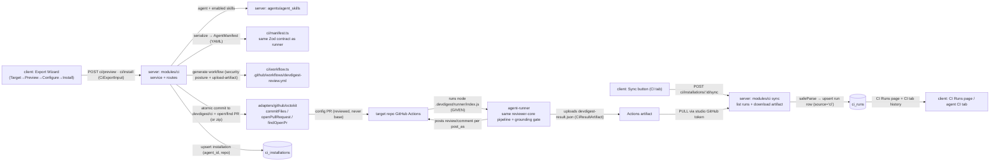

# Spec: Export to CI  |  Spec ID: SPEC-07  |  Status: approved
Supersedes: none
Date: 2026-07-08
Module: cross

## Problem & why
A tuned review agent — its model, system prompt, linked skills, and gate settings — lives only inside the
DevDigest studio, so it reviews a PR only when a user opens the studio and clicks "Run Review". Teams want the
same agent to run **automatically on every pull request in the target repository's own GitHub Actions**,
unattended, so reviews arrive without anyone opening DevDigest. This feature adds **Export to CI**: a 4-step
wizard (Target → Preview → Configure → Install) that serializes the agent to a manifest at
`.devdigest/agents/<slug>.yaml`, generates a self-contained GitHub Actions workflow that runs the **given**
agent-runner, atomically commits the bundle to a `devdigest/ci` branch, and opens a pull request. The runner
executes the **exact same** `reviewer-core` pipeline (assemble → wrap-untrusted → structured-complete → mandatory
grounding gate) so the review is byte-for-byte the same artifact in CI as in the studio — one Zod contract
(`AgentManifest`), two consumers. In CI the lethal-trifecta assembles — the agent **reads an untrusted diff** and
holds the **right to write to a public PR** — so the generated workflow's security posture (least-privilege
permissions, secrets-only key, fork PRs without secrets, no comment-triggered runs, no marketplace action) is a
load-bearing requirement, not a default. Because the studio runs on **localhost** it cannot receive a push from
Actions, so runs are ingested by a manual **Sync** that pulls the run's `devdigest-result.json`
(`CiResultArtifact`) via the studio's GitHub token; the ingested runs show up on a new **CI Runs** page and on a
new **CI tab** of the agent page. This spec is scoped to the **smallest v1 that makes the lab flow work
end-to-end**: reuse existing infra (the given contracts, the existing `ci_runs`/`ci_installations` tables, the
existing GitHub adapter), pick the simpler option wherever ambiguous, and defer richer variants to later
iterations (see Non-goals).

## Goals / Non-goals
**Goals**
- Add a `server/src/modules/ci/` module (routes → service → repository, per onion) with `manifest.ts` (agent →
  `AgentManifest` → YAML — a pure function), `workflow.ts` (string-template the workflow YAML with the security
  rules below), a `slug` helper, `service.ts`, and `repository.ts` (over `ci_installations` + `ci_runs`).
- **Serialize an agent** into an `AgentManifest`-shaped document written as YAML at `.devdigest/agents/<slug>.yaml`,
  validated by the **same** Zod contract the runner reads (`server/src/vendor/shared/contracts/eval-ci.ts:152` —
  already present on this tree).
- **Generate** `.github/workflows/devdigest-review.yml` that is **self-contained** (runs the bundled runner
  directly, not a marketplace action), enforces the security posture below, and includes an
  `actions/upload-artifact` step so the run's `devdigest-result.json` is downloadable by Sync.
- Assemble the export **bundle** — the agent manifest, one `.devdigest/skills/<slug>.md` per **enabled** linked
  skill, an empty `.devdigest/memory.jsonl`, the pre-built runner `.devdigest/runner/index.js`, and the workflow —
  and show it in the Preview step with **only** the workflow editable.
- **Install (two delivery paths):** "Open a PR" atomically commits the bundle to branch `devdigest/ci` (never the
  base branch) and opens — or reuses via `findOpenPr` — a pull request; "Copy files as a zip" returns the bundle
  without committing or opening a PR. Both reuse the existing GitHub adapter (`commitFiles`, `openPullRequest`,
  `findOpenPr`).
- Persist a `ci_installations` row on a successful GitHub-Actions export, upserted on `(agent_id, repo)` and
  scoped to the caller's workspace; one agent may be installed to N repos.
- **"Update CI config"** re-runs the export against the same `devdigest/ci` branch (force-updating the ref and
  reusing the open PR via `findOpenPr`) — it is not a separate flow.
- **Ingest by PULL:** a manual **Sync** action lists the repo's `devdigest-review.yml` workflow runs using the
  studio's GitHub token, downloads each run's `devdigest-result.json` Actions artifact, `safeParse`s it against
  `CiResultArtifact`, and **upserts a `ci_runs` row** (no new table, no migration). Two new github-adapter methods
  are added (list workflow runs; download a run artifact).
- New UI: the **Export Wizard** (modal, 4 steps) launched from **Add to CI** on the agent's CI tab; a global
  **CI Runs** page (one table over `ci_runs` joined to `ci_installations`); and the agent-page **CI tab**
  (installations per repo + run history + **Fail CI on** writing `agents.ciFailOn`).
- Enforce the generated workflow's **security invariants** as testable acceptance criteria (permissions,
  secrets-only key, `pull_request` not `pull_request_target`, no comment-triggered runs, self-contained runner,
  export via a PR to `devdigest/ci`).
- **v1 targets GitHub Actions end-to-end only.**

**Non-goals**   <!-- explicit boundaries — what we are NOT doing; every item is a deliberate v1 simplification -->
- **Building or compiling the agent-runner.** The `agent-runner/` package is **GIVEN infrastructure**, pulled
  selectively (checkout/cherry-pick the self-contained top commit, never `git merge`) from
  `upstream/lesson-7-lab/agent-runner`. Its internals — diff fetch, prompt assembly, the deterministic verdict,
  writing `devdigest-result.json`, posting to the PR — are **out of scope**; this spec treats the runner only as an
  **integration boundary** (the `AgentManifest` it reads and the `CiResultArtifact` it writes). The export ships
  the runner's **pre-built** `.devdigest/runner/index.js` verbatim; the wizard never builds/bundles it.
- **CircleCI / Jenkins / Generic CLI doing anything real.** These render as **inert Target cards** only; v1 does
  **not** generate, commit, PR, or sync them (AC-19). GitHub Actions is the only functional path.
- **Any push / webhook / inbound endpoint or background auto-polling for ingest.** The studio is localhost and
  cannot receive a push; ingest is a **manual Sync PULL** only (AC-15). No public studio endpoint is exposed.
- **Writing runs to `agent_runs` for CI.** CI runs are stored **only** in the existing `ci_runs` table; the
  observability `agent_runs` table is not written from the CI path (its columns lack `cost_usd`/`github_url` and
  its `pr_id` FKs to studio-tracked `pull_requests`, which a target-repo PR usually lacks). *Later iteration:* also
  mirror CI runs into `agent_runs` for unified observability.
- **Schema migrations for CI.** `ci_installations` and `ci_runs` (`server/src/db/schema/ci.ts`) ship as-is; v1 does
  not hand-edit migrations (do-not-touch discipline). Installation uniqueness on `(agent_id, repo)` is enforced in
  application code (upsert), not by a DB constraint. *Later iteration:* add a unique index (needs a migration).
- **Verifying / writing the target repo's Actions Secrets.** The wizard shows which secrets are expected but never
  reads, writes, or checks them — adding `OPENROUTER_API_KEY` in the repo settings is a **manual** user step (AC-11).
- **Merging the config PR automatically.** The export always goes through a **pull request** to `devdigest/ci`,
  reviewed like any code change — nothing lands on the base branch directly.
- **A GitHub App.** Blocking merges is achieved by the runner's non-zero exit + a user-configured required status
  check in branch protection — no App is installed (AC-10).
- **Serializing agent memory.** `.devdigest/memory.jsonl` is **always empty** in v1. *Later iteration:* serialize
  curated memory items (with a privacy review of committed content).
- **Coercing / rewriting model ids to OpenRouter routes.** The manifest emits `provider: 'openrouter'` (the runner
  has a single `OPENROUTER_API_KEY`, matching the contract default) and the agent's `model` string verbatim; v1
  assumes the exported agent is configured for the workspace's OpenRouter (BYO) key. *Later iteration:* map
  arbitrary provider/model ids to OpenRouter routes.
- **A live-regenerating / Monaco workflow editor.** Preview offers a plain editable text area for the workflow
  only; the other files are read-only and there is no live regeneration.
- **Re-validating the user-edited workflow against the security invariants before commit** (Proposed improvement).
- **De-duplicating a re-synced artifact / cross-agent slug disambiguation in the same repo** (Proposed improvements).
- **Touching the multi-agent-review service or the PR feed.** Neither is read or written here.

## User stories
- As an agent author, I want to export my tuned agent into a repo's GitHub Actions from a guided 4-step wizard, so
  that every PR in that repo gets an automatic review without anyone opening the studio.
- As a security-minded reviewer, I want the generated workflow to be least-privilege and self-contained — no wide
  permissions, no key in code, no secrets for fork PRs, no marketplace action — so that a malicious PR cannot
  exfiltrate the key or abuse the token, and I can explain every line before merging the config PR.
- As an agent author, I want the CI review to be the **same** artifact as the studio review (same model, prompt,
  skills, grounding gate), so that "it passed locally" and "it passed in CI" mean the same thing.
- As a maintainer, I want a `devdigest/ci` PR I can review and merge rather than a direct push to main, so that the
  CI config itself is reviewed like code.
- As an agent author, I want to click **Sync** and see the runs from CI back in the studio (CI Runs page + the
  agent's CI tab), so that I can see what the deployed agent has been doing without any inbound server.
- As a maintainer, I want to set **Fail CI on** so that a CRITICAL finding makes the check fail and — with a
  required status check — blocks the merge, without installing any GitHub App.
- As an agent author with no GitHub write access to a repo, I want to **copy the files as a zip** and add them
  manually, so that I can still install the agent when I can't open a PR.

## Acceptance criteria (EARS)
<!-- Each criterion is ONE testable statement with a stable ID + a Verify hint. -->
- **AC-1** — The system SHALL serialize an agent into an `AgentManifest`-shaped document written as YAML to
  `.devdigest/agents/<slug>.yaml` using the **same** `AgentManifest` Zod contract the runner reads
  (`server/src/vendor/shared/contracts/eval-ci.ts:152`), such that parsing the generated YAML back through
  `AgentManifest` yields a value deep-equal to the serialized input (one contract, two consumers).
  - Verify: unit (`manifest.test.ts` — serialize → YAML → `AgentManifest.parse` round-trips deep-equal)
- **AC-2** — The serialized manifest SHALL map from the agent's stored config — `name`, the assembled
  `system_prompt`, `skills` (the slugs of the agent's **enabled** linked skills only, from `agent_skills`),
  `strategy`, and `ci_fail_on` (`agents.ciFailOn`) — and SHALL emit `provider: 'openrouter'` (the single key the
  runner reads and the `AgentManifest` default) with the agent's `model` string verbatim; the manifest SHALL NOT
  contain any API key, secret, or credential.
  - Verify: unit (fields mapped from the `agents` row + enabled `agent_skills`; `provider === 'openrouter'`; assert no secret/key substring in the emitted YAML)
- **AC-3** — The `<slug>` in `.devdigest/agents/<slug>.yaml` SHALL be the agent name kebab-cased (e.g.
  "Security Reviewer" → `security-reviewer`), and each enabled linked skill SHALL be written to
  `.devdigest/skills/<skill-slug>.md`.
  - Verify: unit (`slug.test.ts` — name → kebab slug; skill files named by skill slug)
- **AC-4** — The export bundle SHALL comprise exactly `.devdigest/agents/<slug>.yaml`, one
  `.devdigest/skills/<slug>.md` per **enabled** linked skill, an empty `.devdigest/memory.jsonl`, the pre-built
  runner `.devdigest/runner/index.js` (included verbatim from the given runner infra), and
  `.github/workflows/devdigest-review.yml`; the Preview step SHALL list every file and render **only** the workflow
  as editable (the others read-only).
  - Verify: unit (bundle file set == the five kinds; `memory.jsonl` empty) + client unit (Preview lists files; workflow field editable, others not)
- **AC-5** — The Export Wizard SHALL present exactly four steps in order — **Target → Preview → Configure →
  Install** — with a labeled step indicator; the Target step SHALL show four cards (GitHub Actions, CircleCI,
  Jenkins, Generic CLI) of which only **GitHub Actions** is functional (AC-19).
  - Verify: client unit (four ordered steps render; only the GHA card advances to a functional export)
- **AC-6** — The generated `.github/workflows/devdigest-review.yml` SHALL declare `permissions:` as **exactly**
  `contents: read` and `pull-requests: write`, with no additional scopes.
  - Verify: unit (`workflow.test.ts` parses the YAML; the `permissions` map equals those two keys and nothing else)
- **AC-7** — The generated workflow SHALL trigger on `pull_request` (with the configured subset of
  `opened` / `synchronize` / `reopened`) and SHALL NOT use `pull_request_target`, so a PR opened from a fork runs
  **without** repository secrets (the runner then runs keyless or not at all — an integration-boundary behavior).
  - Verify: unit (`on.pull_request` present with configured types; `on.pull_request_target` absent)
- **AC-8** — The generated workflow SHALL NOT trigger on any PR-comment event (`issue_comment`,
  `pull_request_review_comment`), so that no run is ever initiated from untrusted comment text.
  - Verify: unit (no comment-event key appears under `on:`)
- **AC-9** — The generated workflow SHALL provide the LLM credential **only** from GitHub Actions Secrets as
  `${{ secrets.OPENROUTER_API_KEY }}`, SHALL run the review step **self-contained** via
  `node .devdigest/runner/index.js` (NOT a marketplace `uses: <owner>/<action>@…`), and no literal API key SHALL
  appear in the workflow, the manifest, or any other bundle file. (The design mockup's
  `uses: devdigest/review-action@v1` + `secrets.OPENAI_API_KEY` are **editable placeholders**; the real
  requirement is this self-contained form with `OPENROUTER_API_KEY` — a documented design-vs-spec discrepancy.)
  - Verify: unit (env wires `secrets.OPENROUTER_API_KEY`; review step runs `node .devdigest/runner/index.js`; no marketplace `uses:` on the review step; no key-shaped literal in any bundle file)
- **AC-10** — WHEN the user selects a "Post results as" option, the export SHALL carry it as `post_as`
  (`github_review` | `pr_comment` | `none`), where only `github_review` yields a deterministic verdict; and the
  Configure step SHALL state that blocking merges additionally requires **Fail CI on** plus a **required status
  check** in the repo's branch protection (no GitHub App).
  - Verify: client unit (selection maps to `CiExportInput.post_as`; the branch-protection hint renders) + unit (`post_as` flows into the generated workflow)
- **AC-11** — The Configure step's "Secrets expected" panel SHALL list `OPENROUTER_API_KEY` (shown "not set") and
  `GITHUB_TOKEN` (shown auto/"ready"), and the wizard SHALL NOT read, write, or verify the target repo's Actions
  Secrets.
  - Verify: client unit (both rows render with their states; no secrets API call is issued) — cross-ref Non-goals
- **AC-12** — The generated workflow SHALL include an `actions/upload-artifact` step that uploads the run's
  `devdigest-result.json`, so that Sync can later download it via the GitHub API.
  - Verify: unit (`workflow.test.ts` — an `actions/upload-artifact` step referencing `devdigest-result.json` is present)
- **AC-13** — WHEN the user Installs with "Open a PR" (`action: 'open_pr'`), the system SHALL atomically commit all
  bundle files to the branch `devdigest/ci` (never directly to the base branch) via `commitFiles`, then open — or
  reuse via `findOpenPr` — a pull request from that branch and return its `pr_url`.
  - Verify: `*.it.test.ts` (files committed to `devdigest/ci`; base branch untouched; PR opened or reused; `pr_url` returned)
- **AC-14** — WHERE the user chooses "Copy files as a zip" (`action: 'files'`), the system SHALL return the
  generated bundle **without** committing to any branch or opening a pull request.
  - Verify: `*.it.test.ts` (`action='files'` returns `files[]`; `commitFiles`/`openPullRequest` not called)
- **AC-15** — WHEN a GitHub-Actions export succeeds, the system SHALL persist a `ci_installations` row
  (`agent_id`, `repo`, `target_type='gha'`) scoped to the caller's workspace, upserting on `(agent_id, repo)` so
  that re-exporting the same agent to the same repo does **not** create a duplicate installation; one agent MAY be
  installed to multiple repos.
  - Verify: `*.it.test.ts` (installation row written; a second export to the same repo upserts the same row; two different repos yield two rows)
- **AC-16** — WHEN the user clicks **Sync** for an installation, the system SHALL, using the studio's GitHub token,
  list that repo's `devdigest-review.yml` workflow runs, download each run's `devdigest-result.json` Actions
  artifact, `safeParse` it against `CiResultArtifact`, and **upsert a `ci_runs` row** (`ci_installation_id`,
  `pr_number`, `ran_at`, `status`, `findings_count`←`findings_count`, `cost_usd`←`cost_usd`, `github_url`←the
  run/PR URL, `source='ci'`) — resolving the installation within the caller's workspace. There SHALL be no inbound
  ingest endpoint, webhook, or background poll.
  - Verify: `*.it.test.ts` (Sync downloads an artifact fixture → a `ci_runs` row with mapped fields and `source='ci'`, scoped by workspace; no push/webhook route exists)
- **AC-17** — IF a downloaded artifact fails `CiResultArtifact` validation, THEN Sync SHALL reject that run and
  write **no** `ci_runs` row for it (no partial write) while continuing with the other runs.
  - Verify: unit (`safeParse` failure path) + `*.it.test.ts` (malformed artifact → that run skipped; `ci_runs` unchanged for it)
- **AC-18** — The **CI Runs** page (global nav) SHALL list the CI runs from `ci_runs` joined to `ci_installations`
  — each row showing the repo, target type, status, relative run time, and a link to the GitHub run/PR — scoped to
  the caller's workspace (via `ci_installation` → agent → workspace).
  - Verify: client unit (a row renders repo/target/status/time/link) + `*.it.test.ts` (list scoped by workspace)
- **AC-19** — The agent page's **CI tab** SHALL show the agent's installations grouped by repo with per-repo status
  and run history (from `ci_runs`), an **Add to CI** action that opens the Export Wizard, an **Update CI config**
  action that re-exports to the same `devdigest/ci` branch (reusing the open PR via `findOpenPr`), and a **Fail CI
  on** control whose value SHALL persist to `agents.ciFailOn` and be serialized into the next exported manifest's
  `ci_fail_on`.
  - Verify: client unit (tab renders installations + history + the three controls) + `*.it.test.ts` (Fail-CI-on write persists to `agents.ciFailOn` and appears in a subsequent manifest; Update re-pushes to `devdigest/ci` and reuses the PR)
- **AC-20** — WHERE the selected target is not GitHub Actions (`circle` | `jenkins` | `cli`), the wizard SHALL
  render the card but SHALL NOT perform the preview/commit/PR export or the Sync round-trip in v1.
  - Verify: client unit (a non-`gha` target disables/omits the functional export + Sync path) — cross-ref Non-goals

## Edge cases
- **Agent with no enabled skills** → the bundle contains no `.devdigest/skills/*.md`; the manifest's `skills` is an
  empty array (the `AgentManifest.skills` transform already normalizes missing/`null` → `[]`).
- **`devdigest/ci` branch already exists / re-export** → `commitFiles` layers a new tree on the existing branch
  head and force-updates the ref (existing behavior, `octokit.ts:309`); an already-open PR is reused via
  `findOpenPr` rather than opening a duplicate. This is exactly what "Update CI config" does (AC-19).
- **Same agent slug written twice to the same repo** → `.devdigest/agents/<slug>.yaml` is overwritten in place
  (deterministic slug from the name; the tree write replaces the path). *Two different agents that kebab-case to
  the same slug in the same repo* is a Proposed improvement (disambiguate), not a v1 concern.
- **Fork PR** → `pull_request` (not `pull_request_target`) means repository secrets are unavailable; the runner
  runs keyless or is skipped, never leaking the key (AC-7) — the keyless behavior itself is the runner's (given).
- **Edited workflow weakens the security posture** → the user can edit the workflow in Preview (AC-4); the config
  PR is reviewed, not merged blindly (the human review is the backstop). Re-validating the edited YAML against the
  invariants before commit is a Proposed improvement, not a v1 requirement.
- **CI run on a repo/PR not tracked in the studio** → the run lands in `ci_runs` (which carries
  `pr_number`/`cost_usd`/`github_url` and links via `ci_installation_id`), independent of any studio
  `pull_requests` row — which is exactly why CI runs use `ci_runs`, not `agent_runs`.
- **Sync of the same run twice** (a manual re-refresh) → upsert keyed on the run/installation so a re-Sync does not
  duplicate the row; a stronger idempotency key on the Actions run id is a Proposed improvement.
- **Malformed / truncated `devdigest-result.json`** → rejected by `safeParse`; that run is skipped with no row
  written; other runs still ingest (AC-17).
- **`post_as: 'none'`** → exit-code-only; no verdict is posted to the PR, so only "Fail CI on" + branch protection
  can block a merge (AC-10).
- **No GitHub write access / "Copy files as a zip"** → the bundle is returned for manual installation; no
  branch/PR side effect (AC-14).
- **Non-GitHub target selected** → an inert card; no preview/commit/PR/sync in v1 (AC-20).

## Assumptions & Dependencies
**Assumptions**
- **The agent-runner is GIVEN infrastructure**, pulled selectively from `upstream/lesson-7-lab/agent-runner`. Its
  runtime contract — the boundary this spec integrates with — is: it reads `.devdigest/agents/<slug>.yaml`
  (`AgentManifest`) + `.devdigest/skills/*.md`, reads env (`OPENROUTER_API_KEY`, `GITHUB_TOKEN`,
  `GITHUB_REPOSITORY`, `PR_NUMBER`/`GITHUB_EVENT_PATH`), runs the **same** `reviewer-core` pipeline
  (`assemblePrompt`/`wrapUntrusted`/`completeStructured`/mandatory `groundFindings`), computes a **deterministic**
  verdict from grounded findings + `ci_fail_on` (never the model's self-report; see `docs/agent-prompts/README.md`),
  writes `devdigest-result.json` (`CiResultArtifact`), posts per `post_as`, and exits non-zero iff the gate
  triggered REQUEST_CHANGES. Building any of that is out of scope (Non-goals).
- **The pre-built runner bundle `.devdigest/runner/index.js` arrives with the runner pull** and is included in the
  export verbatim (a static asset). Where the studio reads those bytes at export time is a HOW detail for the plan;
  the wizard does not build/compile it.
- **The CI/manifest contracts are already on this tree** and are reused as-is (no contract authoring in v1):
  `AgentManifest`, `CiResultArtifact`, `CiExportInput`, `CiExport`, `CiInstallation`, `CiRun`, `CiTarget`,
  `CiFile`, `CiRunStatus` all live in `server/src/vendor/shared/contracts/eval-ci.ts` (dual-vendored to
  `client/src/vendor/shared/contracts/eval-ci.ts`). The **`agent-runner/` package itself is absent** on this tree
  and arrives with the pull.
- **The CI DB tables ship as starter tables** and are reused without migration: `ci_installations`
  (`agent_id`, `repo`, `target_type ∈ {gha,circle,jenkins,cli}`, `installed_at`) and `ci_runs`
  (`ci_installation_id`, `pr_number`, `ran_at`, `status`, `findings_count`, `cost_usd`, `github_url`, `source`) —
  `server/src/db/schema/ci.ts`. **`ci_runs`'s columns already fit the CI Runs surfaces**, so CI runs are stored
  there exclusively; `agent_runs` is not written from the CI path.
- **The GitHub adapter already exposes the export primitives** — `commitFiles` (tree-on-parent, creates or
  force-updates the branch ref), `openPullRequest`, `findOpenPr`, plus `postReview`/`createReviewComment`/
  `currentLogin` — in `server/src/adapters/github/octokit.ts`. Sync adds **two** new adapter methods: list a repo's
  workflow runs, and download a run's artifact (via the same Octokit client / GitHub token).
- **The manifest emits `provider: 'openrouter'`** because the runner reads a single `OPENROUTER_API_KEY`
  (matching the `AgentManifest` default). v1 assumes the exported agent is configured for the workspace's
  OpenRouter (BYO) key from the earlier lab; model-id routing for arbitrary providers is a later iteration.
- **Tenancy** flows through the agent: `agents` are `workspace_id`-scoped; `ci_installations` → `agent` →
  workspace; `ci_runs` → `ci_installation` → agent → workspace. Every export/sync/list resolves the agent (or
  installation) within the caller's workspace first (server CLAUDE.md tenancy rule).

**Dependencies**
- New server module `server/src/modules/ci/` (routes → service → repository, registered statically in
  `modules/index.ts`) with `manifest.ts`, `workflow.ts`, a `slug` helper, an export path (bundle → commit → PR or
  zip), and a Sync/ingest path (`CiResultArtifact` → `ci_runs`). Minimal route surface:
  `POST /agents/:id/ci/preview` (return the file set for a target + config), `POST /agents/:id/ci/install`
  (commit + PR OR return the zip; upsert the `ci_installation`), `POST /ci/installations/:id/sync` (pull + ingest),
  and read routes for the CI Runs page and the CI tab — validated schema-first via the `Ci*` contracts.
- `AgentManifest` + `CiResultArtifact` + the `Ci*` request/response contracts
  (`server/src/vendor/shared/contracts/eval-ci.ts`), dual-vendored to the client.
- The GitHub adapter (`server/src/adapters/github/octokit.ts`) via the container (`container.git`) — plus the two
  new Sync methods (list workflow runs; download artifact).
- `ci_installations` / `ci_runs` (`server/src/db/schema/ci.ts`), `agents` / `agent_skills` / `agent_context_docs`
  (`server/src/db/schema/agents.ts`) — read the agent + its enabled skills to serialize; `agents.ciFailOn` written
  by the CI tab's Fail-CI-on control.
- The pulled `agent-runner/` package (given infra) — a **runtime** dependency of the exported workflow (its
  pre-built `dist` becomes `.devdigest/runner/index.js`), not a build dependency of the studio module.
- Client: the Export Wizard modal + a **CI tab** as a new sibling in
  `client/src/app/agents/[id]/_components/AgentEditor/` (alongside `ConfigTab`/`SkillsTab`/`ContextTab`), a global
  **CI Runs** route, and data hooks (`client/src/lib/hooks/agents.ts` precedent), all strings via `next-intl`.

## Non-functional
- **Security** (load-bearing — the lethal trifecta): least-privilege `permissions` (AC-6); key only via Secrets as
  `OPENROUTER_API_KEY` (AC-9); `pull_request` not `pull_request_target` so fork PRs get no secrets (AC-7); no
  comment-triggered runs (AC-8); self-contained runner, no marketplace action (AC-9); export via a reviewed PR to
  `devdigest/ci`, never a direct push to the base branch (AC-13). Apply the `security` rubric to the generated
  workflow and to Sync's trust boundary. The wizard never reads/writes repo Secrets (AC-11).
- **Untrusted-input discipline**: the diff, PR title/body, and PR comments the runner sees are untrusted — the
  runner neutralizes them via the studio's own `wrapUntrusted` + injection guard (given). On the **studio** side,
  the Sync-downloaded `CiResultArtifact` and any repo string echoed from GitHub are treated as **data** —
  `safeParse`d and rendered/linked, never executed (AC-16/AC-17). Because Sync pulls the artifact with the studio's
  own authenticated token, there is no forged-push surface to authenticate.
- **Privacy / secrets**: no API key ever appears in the manifest, the workflow, the committed bundle, the DB, or
  logs (AC-2/AC-9); the key lives only in the target repo's Actions Secrets (manual step). `.devdigest/memory.jsonl`
  is empty in v1, so no memory content is committed.
- **Perf**: export is a bounded sequence of GitHub REST calls (create tree/commit/ref + open/find PR) and Sync is a
  bounded list-runs + download-artifact sequence — **no LLM call in the studio path**; the LLM cost is incurred by
  the runner in CI.
- **a11y**: the wizard is keyboard-navigable with a labeled step indicator; run status is conveyed by a label, not
  color alone; the CI Runs table rows have accessible links.
- **i18n**: all new client strings via `next-intl` namespaces (`ci`/`export`); no hardcoded UI strings. Repo names,
  paths, and identifiers stay verbatim.
- **Tenancy**: export, Sync, CI Runs, and the CI tab all resolve within the caller's `workspace_id` before touching
  a row; `ci_runs` (which has no `workspace_id` column) is scoped through its `ci_installation` → agent.

## Inputs (provenance)
- Agent config (`name`, assembled `system_prompt`, `strategy`, `ci_fail_on`) — [reused] the `agents` row
  (`db/schema/agents.ts`); `provider` forced to `openrouter`, `model` verbatim.
- Enabled linked skills (slugs + bodies → `.devdigest/skills/<slug>.md`) — [reused] `agent_skills` (enabled only) +
  `skills` bodies.
- Export options (`repo`, `target`, `action`, `post_as`, `triggers`, `base`) — [reused] wizard input, validated by
  `CiExportInput` (`eval-ci.ts:174`).
- The generated workflow YAML — [deterministic] `workflow.ts` (no model call); editable in Preview.
- The pre-built runner `.devdigest/runner/index.js` — [reused, given infra] included verbatim.
- `.devdigest/memory.jsonl` — [deterministic] always empty in v1.
- Ingested run rows — [reused] `CiResultArtifact` PULLed via the GitHub API on Sync, mapped into `ci_runs`.

## Untrusted inputs
- **The PR diff, title/body, and comments** the runner reads in CI — third-party text; neutralized by the studio's
  `wrapUntrusted` + injection guard **inside the given runner**, not in the studio module. Comment text never
  triggers a run (AC-8).
- **`devdigest-result.json` (`CiResultArtifact`)** PULLed on Sync — treated as DATA: `safeParse`d, then mapped to a
  `ci_runs` row; a malformed artifact is skipped with no write (AC-17). It is fetched with the studio's own
  authenticated token, so there is no unauthenticated push to trust.
- **Repo / PR strings echoed from GitHub** (repo name, PR number, GitHub URL) — data; rendered and linked on the CI
  surfaces, never executed.
- **`repo` and target-selection input** — caller-influenced; every export/sync resolves the agent/installation
  within the caller's workspace, never trusting the input to reach another workspace's agent.

## Cross-module impact

- client (Export Wizard / CI tab / CI Runs page) → server `modules/ci`: `POST` preview/install, `POST` Sync, and
  reads for the CI surfaces. Grounded in the mockups (Target/Preview/Configure/Install, CI tab, CI Runs) and
  `agents/[id]/_components/AgentEditor/*` (a new sibling tab), `lib/hooks/agents.ts`.
- server `modules/ci` → `agents`/`agent_skills`: read the agent + its enabled skills to serialize. Grounded in
  `db/schema/agents.ts`.
- server `modules/ci` → `adapters/github/octokit`: `commitFiles` to `devdigest/ci`, `openPullRequest`/`findOpenPr`
  for export; two new methods (list workflow runs; download artifact) for Sync. Grounded in
  `octokit.ts:245,264,332`.
- server `modules/ci` → `ci_installations` / `ci_runs`: upsert the installation and the Sync-ingested run. Grounded
  in `db/schema/ci.ts`. CI runs are stored **only** in `ci_runs` (its columns fit); `agent_runs` is untouched by
  the CI path.
- runner boundary: `modules/ci` and the given `agent-runner` share **one** `AgentManifest` + `CiResultArtifact`
  contract (`vendor/shared/contracts/eval-ci.ts`); the studio never imports the runner and the runner never imports
  the server — the YAML manifest and the JSON artifact are the entire interface.
- Blast radius **not computed during authoring** (the local DevDigest MCP/API is unavailable, consistent with
  SPEC-01..04/06). The highest-fan-in new touch point is the `ci` service composing the agent read, GitHub adapter
  calls, and the `ci_runs`/`ci_installations` writes.

## Proposed improvements
These are **non-blocking recommendations** for the plan phase — NOT requirements, and MUST NOT be treated as
acceptance criteria.
- **Validate the edited workflow against the security invariants before commit** — the Preview lets the user edit
  the YAML; a lint that re-asserts AC-6/AC-7/AC-8/AC-9 (permissions, no `pull_request_target`, no comment triggers,
  self-contained runner) before `commitFiles` would catch a hand-weakened workflow, keeping the human PR review as
  a second backstop rather than the only one. — Status: open.
- **Idempotent Sync keyed on the Actions run id** — de-dup a re-synced `devdigest-result.json` (same repo + PR +
  Actions run id) so a manual re-refresh never creates a duplicate `ci_runs` row. — Status: open.
- **Mirror CI runs into `agent_runs`** for unified cross-source observability (deferred to keep v1 to a single
  write table). — Status: open.
- **Disambiguate two agents that kebab-case to the same slug in one repo** (suffix with a short id) so their
  manifests don't collide. — Status: open.
- **Coerce arbitrary provider/model ids to OpenRouter routes** so a non-OpenRouter-configured agent still runs in
  CI under the single `OPENROUTER_API_KEY`. — Status: open.
- **Surface the deterministic verdict + blockers on the CI Runs row** (from `critical` + `ci_fail_on`), not just a
  status string, so "Fail CI on" behavior is visible in the studio. — Status: open.
