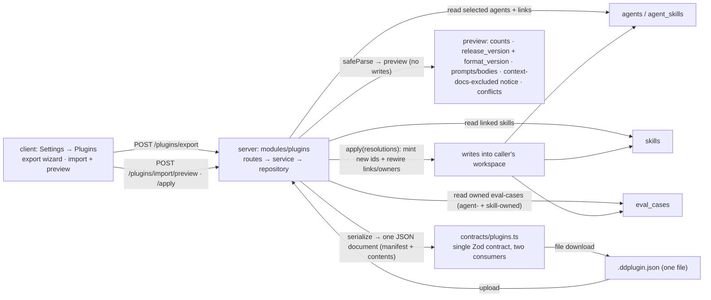

# Spec: Plugin Export/Import  |  Spec ID: SPEC-10  |  Status: approved
Supersedes: none
Date: 2026-07-11
Module: cross

## Problem & why
Everything a user tunes over the course — their review **agents** (model, system prompt, gate policy),
the **skills** those agents link, and the **eval-cases** that pin an agent's behavior — lives only inside
one person's DevDigest database on one machine. There is no way to hand a colleague "my whole reviewer
setup" so they can reproduce it. The course capstone asks for **portability**: pack the selected agents +
their linked skills + eval-cases into **one file** that a colleague
installs in a minute and runs against **their own** repo — with no help from the author and no shared
database. The plugin is a **single, human-inspectable JSON document** — extension `.ddplugin.json`, MIME
`application/json` — carrying a manifest plus all content **inline** (no container / `.zip`); the UI
downloads and accepts exactly this one file. This spec adds a server `plugins/` module (serialize → one
JSON file with a manifest; validate an uploaded file with Zod so a corrupt file yields a **clear human
error, never a 500**; preview before applying; resolve name conflicts per-item as skip / rename /
overwrite) and a **Settings → Plugins** UI
(export wizard + import with preview). The headline requirement is **self-containment**: the exported file
must carry everything the agent needs to run elsewhere, and — because keys live only in
`~/.devdigest/secrets.json` and never in the DB, git, or logs — it must carry **no secret**.

## Goals / Non-goals
**Goals**
- Add a `server/src/modules/plugins/` module (routes → service → repository, per onion, registered in
  `src/modules/index.ts`) that **serializes** SELECTED agents + their linked skills + the eval-cases those
  entities own — **including cases owned by the selected agents AND by those agents' linked skills**
  (`owner_kind ∈ {agent, skill}`) — into **one single JSON plugin file** (`.ddplugin.json`) carrying a
  manifest `{ name, format_version, release_version, exported_at, contents }`, where `format_version` is the
  schema/compatibility version and `release_version` is the user-assigned release label. (No memory slice —
  see Non-goals.)
- Define **one** Zod contract for the plugin document (a new `server/src/vendor/shared/contracts/plugins.ts`,
  added to the barrel and dual-vendored to the client) that is the **single** validator for both export
  serialization and import parsing — one contract, two consumers.
- **Import validation is `safeParse`-first**: a corrupted / malformed / oversized file yields a clear,
  human-readable `ValidationError` (HTTP 422 via the shared error handler), **never a 500**.
- **Preview before apply**: an uploaded file is parsed and summarized (manifest incl. a **visible**
  `release_version` and `format_version`, per-kind counts, full agent system prompts + skill bodies, a
  notice that repo-relative context docs are **not** included, and a per-item conflict list) **without
  persisting anything**; a second explicit "Apply" call performs the writes.
- **Name-conflict resolution per item**: when an incoming agent / skill / eval-case collides by name with an
  existing one in the caller's workspace, the user makes an explicit **skip / rename / overwrite** choice for
  that item, and Apply honors each choice.
- **Self-contained round-trip**: importing a plugin onto a **clean** workspace restores every agent, skill,
  agent→skill link, and eval-case with **fresh** workspace-scoped ids and **rewired**
  cross-references, such that the exported agent is runnable and its eval-cases executable on the importer's
  own repo — without the author's machine or database.
- **Secrets never leave**: no API key, token, or credential appears in the exported file, ever (they are read
  only through `SecretsProvider` and are not columns on any exported row).
- New UI under **Settings → Plugins**: an **export wizard** (select agents → preview → download the file)
  and an **import** flow (upload → preview with per-item conflict controls → apply).
- Reuse existing tables (`agents`, `agent_skills`, `skills`, `eval_cases`) with **no migration**
  (do-not-touch discipline; consistent with SPEC-07).

**Non-goals**   <!-- explicit boundaries — what we are NOT doing -->
- **The three final course documents** (`cost-audit.md`, `rollout-30day.md`, `final-retro.md`) are personal,
  hand-authored markdown reports — **out of scope**, not produced or packaged by this feature.
- **The Agent Performance dashboard** is a **separate spec** — out of scope here (referenced under
  Dependencies as related, not delivered).
- **A public plugin marketplace / registry / remote fetch** — v1 exports and imports a **local file** only;
  no upload to or download from any server. *Later iteration.*
- **Persisting an "installed plugins" registry** (provenance table linking imported entities back to a
  plugin) — v1 imports entities as ordinary workspace rows and adds **no new table / migration**. *Later.*
- **Agent / skill version history** — the export carries each entity's **current config snapshot** only, not
  its `agent_versions` / `skill_versions` history. Imported entities start at `version: 1`.
- **Merging / diffing an existing entity with an incoming one field-by-field** — conflict resolution is the
  three coarse branches (skip / rename / overwrite) per item, not a field-level merge.
- **Exporting secrets, provider keys, or the `~/.devdigest/secrets.json` contents** — never. The imported
  agent's `provider`/`model` are preserved verbatim, but the importer must supply their **own** key in
  Settings (a manual step) for the agent to run.
- **A memory slice** — v1 exports **only** the selected agents + their linked skills + eval-cases; **no
  memory rows** and **no embeddings** travel. This deliberately moots any `vector(1536)` / re-embedding
  concern (no vectors carried, no `EMBEDDINGS_ENABLED`/OpenAI-key dependency on the peer). *Memory-slice
  export is a future/out-of-scope extension.*
- **Repo-relative context docs** (`agent_context_docs` / `skill_context_docs`) — **excluded by design**.
  They hold repo-relative **paths** tied to the author's repo tree and would not resolve on the peer's repo,
  which would break the primary peer-test. An agent that depends on such docs **degrades gracefully**: import
  MUST NOT fail because of missing context docs, and the preview surfaces that these docs are **not** included
  (see AC-18). *Traveling context-doc content is a future/out-of-scope extension.*
- **Runs, findings, reviews, CI installations/runs, conventions, or repo state** — none of these are
  exported or imported; the plugin is agents + skills + eval-cases only.
- **Auto-enabling / auto-running the imported agent** — import restores the config; running it is the user's
  action (and requires a matching provider key).

## User stories
- As a course graduate, I want to pack my tuned agents, their skills, and eval-cases into one file, so that a
  colleague can install my whole reviewer setup in a minute.
- As the colleague, I want to import that file on **my** machine and run the exported agent against **my own**
  repo and the exported eval-cases, so that I get the author's setup working without their help.
- As an importer, I want to **preview** exactly what a file contains — including the manifest release version
  (and format version) and the full agent instructions / skill bodies — **before** anything is written, so
  that I can inspect untrusted content and decide.
- As an importer with an existing setup, I want a per-item **skip / rename / overwrite** choice when an
  incoming name collides, so that an import never silently clobbers or duplicates my own work.
- As a security-minded user, I want the exported file to contain **no key or secret**, so that sharing it can
  never leak my credentials.
- As an importer, I want a corrupted or hand-edited file to fail with a **clear message**, not a server
  crash, so that I understand what went wrong.

## Acceptance criteria (EARS)
<!-- Each criterion is ONE testable statement with a stable ID + a Verify hint. See specs/README.md#ears. -->
- **AC-1** — WHEN the user exports a selection of agents, the system SHALL serialize those agents, their
  linked skills, and the eval-cases owned by those entities — **both agent-owned and skill-owned**
  (`owner_kind ∈ {agent, skill}`) — into **one** single JSON plugin document carrying a manifest
  `{ name, format_version, release_version, exported_at, contents }`, validated by the single `Plugin`
  Zod contract; parsing the emitted document back through `Plugin` SHALL yield a value deep-equal to the
  serialized input (one contract, two consumers).
  - Verify: unit (`plugins/serialize.test.ts` — serialize → parse round-trips deep-equal; manifest has the five keys incl. `format_version` + `release_version`)
- **AC-2** — The exported document SHALL NOT contain any API key, token, secret, or credential, and SHALL
  NOT include any secret-bearing field (secrets are read only through `SecretsProvider`, never serialized).
  - Verify: unit (assert no key/secret/token substring in the emitted document; no `secrets`/`apiKey`-shaped field present)
- **AC-3** — The exported document SHALL be **self-contained**: every agent→skill link and every eval-case
  owner reference inside it SHALL resolve to an entity that is **also inside** the document (a stable
  in-file local id), with no dangling reference to a workspace-local database id.
  - Verify: unit (every `agent_skills` link + eval-case `owner` points at an in-file entity; no external UUID leaks) — this is the portability guarantee behind AC-11
- **AC-4** — IF an uploaded file fails `Plugin` validation (malformed JSON, wrong shape, or missing manifest),
  THEN the system SHALL reject it with a human-readable `ValidationError` surfaced as HTTP **422**, and SHALL
  NOT return a 500 or persist anything.
  - Verify: `*.it.test.ts` (a corrupted / truncated / wrong-shape upload → 422 with a readable message; no rows written) + unit (`safeParse` failure path)
- **AC-5** — WHEN a valid file is uploaded for preview, the system SHALL return the manifest, per-kind counts
  (agents / skills / eval-cases), the full agent `system_prompt`s and skill `body`s, and a per-item
  conflict list, **without persisting any row**.
  - Verify: `*.it.test.ts` (preview returns the summary; DB row counts unchanged before Apply) + client unit (preview renders counts + full prompts/bodies)
- **AC-6** — The import preview SHALL surface the manifest `release_version` **and** `format_version` (plus
  `name` + `exported_at`) so both the user-assigned release version and the schema version are **visible
  before applying**; the `release_version` satisfies the version-visible requirement.
  - Verify: client unit (the preview panel renders `release_version` + `format_version`) + `*.it.test.ts` (preview response carries `manifest.release_version` and `manifest.format_version`)
- **AC-7** — WHEN the preview is computed, the system SHALL mark each incoming agent / skill / eval-case whose
  `name` collides with an existing entity of the **same kind** in the caller's workspace as a **conflict**
  requiring an explicit resolution; non-colliding items require none.
  - Verify: `*.it.test.ts` (seed a same-named agent → that incoming agent flagged conflict; a fresh-named one is not)
- **AC-8** — WHEN the user Applies an item with resolution `skip`, the system SHALL NOT write that incoming
  item and SHALL leave the existing same-named entity unchanged.
  - Verify: `*.it.test.ts` (conflicting agent with `skip` → no new row; existing row byte-identical)
- **AC-9** — WHEN the user Applies an item with resolution `rename`, the system SHALL derive a new,
  non-colliding name by an **auto-suffix** scheme (append `-2`, `-3`, … until unique) — the user is NOT
  required to type a name (a user-supplied name MAY be offered but is not required) — persist the incoming
  item under that name, and leave the existing same-named entity unchanged.
  - Verify: `*.it.test.ts` (`rename` with two prior collisions → row named `<name>-3` exists; original unchanged) + unit (auto-suffix picks the first free `-n`)
- **AC-10** — WHEN the user Applies an item with resolution `overwrite`, the system SHALL replace the existing
  same-named entity's content with the incoming item's content (same workspace id, updated fields), **except
  for a shared skill**: overwriting a skill that other local agents already link to SHALL **fork a fresh copy**
  and rewire only the imported agent's link to that copy, leaving the original skill and every other agent's
  link **untouched** (no shared-state side effects).
  - Verify: `*.it.test.ts` (`overwrite` of an agent → existing row's fields equal the incoming values, no duplicate row; `overwrite` of a skill linked by another agent → a new skill row is created, the imported agent links the copy, the original skill and the other agent's link are unchanged)
- **AC-11** — WHEN a plugin is imported onto a **clean** workspace (no conflicts), the system SHALL create
  every agent, skill, agent→skill link, and eval-case with **fresh**
  workspace-scoped ids, such that the imported agent is runnable and its imported eval-cases are executable
  against the importer's own repo — restoring the author's setup without the author's machine or database.
  - Verify: `*.it.test.ts` (import onto a fresh workspace → agents/skills/links/eval-cases present and wired; a review + an eval run execute against a mock repo) — the primary round-trip / peer-portability criterion
- **AC-12** — WHEN importing, the system SHALL mint **new** ids in the caller's workspace for every created
  entity and **rewire** the `agent_skills` links and each eval-case's `owner_id` to those new ids; it SHALL
  NOT reuse the exporting workspace's ids.
  - Verify: `*.it.test.ts` (created ids differ from the file's local ids; links resolve to the new skill ids; eval-case `owner_id` points at the new agent/skill)
- **AC-13** — Export and import SHALL operate **only** within the caller's `workspace_id`: export serializes
  only entities the caller's workspace owns, and import writes only into the caller's workspace.
  - Verify: `*.it.test.ts` (export excludes another workspace's agents; imported rows all carry the caller's `workspace_id`)
- **AC-15** — IF an uploaded file exceeds the import size limit, THEN the system SHALL reject it with a clear
  `ValidationError` (422) stating the limit, and SHALL NOT attempt to parse or persist it.
  - Verify: unit (oversized upload → readable limit error; reuse the `MAX_IMPORT_BYTES` precedent from `modules/skills`)
- **AC-16** — The **Settings → Plugins** section SHALL provide (a) an **export wizard** — select agents,
  review a preview, download the file — and (b) an **import** flow —
  upload a file, review the preview with a per-item skip/rename/overwrite control on each conflict, then
  Apply — with all user-facing strings via `next-intl` and no hardcoded text.
  - Verify: client unit (export wizard renders agent selection → preview → download; import renders upload → conflict controls → Apply) + the section appears in `SETTINGS_SECTIONS`
- **AC-17** — WHEN the import preview renders, it SHALL display the full imported agent `system_prompt`s and
  skill `body`s (the imported *instructions*), so that the user can inspect this externally-authored content
  before choosing to Apply.
  - Verify: client unit (preview shows each agent's system prompt and each skill's body in full, expandable) — the human-review gate for imported instructions (see Untrusted inputs)
  <!-- AC-14 (memory slice) retired: memory export is out of scope (see Non-goals); id intentionally not reused. -->
- **AC-18** — The export SHALL exclude `agent_context_docs` / `skill_context_docs`, and WHEN an imported
  agent or skill referenced such context docs, import SHALL still succeed (MUST NOT fail on missing context
  docs) and the preview SHALL surface a notice that repo-relative context docs are **not** included.
  - Verify: unit (emitted document carries no context-doc paths) + `*.it.test.ts` (import of an agent that had context docs succeeds; preview response flags "context docs not included") + client unit (preview renders the not-included notice)
- **AC-19** — WHEN serializing an export, IF two entities of the **same kind** would carry the **same name
  within the file** (an intra-file duplicate), THEN the system SHALL reject the export with a clear
  human-readable error and SHALL NOT emit an internally-ambiguous file.
  - Verify: `*.it.test.ts`/unit (a selection producing two same-named agents → export fails with a readable message; no file emitted)
- **AC-20** — IF an uploaded file contains intra-file duplicate names for the same kind, THEN the system
  SHALL reject it with a human-readable `ValidationError` (HTTP **422**), NOT a 500, and SHALL persist
  nothing.
  - Verify: `*.it.test.ts` (a hand-edited file with two same-named skills → 422 readable message; no rows written) + unit (`safeParse`/validation flags the intra-file duplicate)
- **AC-21** — WHEN a file's manifest `format_version` differs from the importing DevDigest's expected format
  version, the system SHALL **hard-reject** an **incompatible MAJOR** mismatch with a clear human-readable
  error (422) and persist nothing, and SHALL **accept with a warning** a **compatible minor** difference;
  it SHALL NOT silently migrate or upshift an older shape.
  - Verify: `*.it.test.ts` (incompatible major `format_version` → 422 readable error, no writes; compatible minor difference → preview/apply proceeds and returns a warning) — ties to AC-4

## Edge cases
- **Agent with no linked skills** → `contents.skills` for that agent contributes nothing; the agent still
  exports and re-imports; its `agent_skills` set is empty.
- **Agent with no eval-cases** → `contents.eval_cases` may be empty; round-trip still restores the agent.
- **A skill linked by two selected agents** → the skill is serialized **once**; both agents' links point at
  the same in-file local id (dedup on export; AC-3).
- **Overwrite of a skill that other local agents already link to** → overwrite **forks a fresh copy** for the
  imported agent and rewires only the imported agent's link; the original shared skill and every other local
  agent's link stay untouched — no shared-state side effects (AC-10).
- **Rename of one item in a link pair** → when a renamed skill is written, incoming agents that linked it must
  still resolve to the newly-named row (rewire by in-file local id, not by name; AC-12).
- **Corrupted / hand-edited JSON, or a non-`.ddplugin.json` file that isn't a plugin** → `safeParse`
  failure → 422 with a readable message; nothing written (AC-4).
- **Incompatible `format_version`** → a major mismatch hard-rejects (422, clear message, no migration); a
  compatible minor difference is accepted with a warning (AC-21).
- **Empty selection on export** → the wizard SHALL require at least one agent before producing a file
  (a zero-content export is rejected in the UI).
- **Duplicate names *within the same incoming file*** (two agents both named "Security Reviewer") → an
  in-file collision independent of workspace conflicts: **rejected at export time** so a file is never
  internally ambiguous (AC-19); a hand-edited file that still contains intra-file duplicates is a
  **validation error** at import (422, readable message, not a 500 — AC-20).
- **`eval_cases.finding_id` provenance** → references the author's findings and is **dropped** on export
  (nullable; a peer has no such finding).
- **`agents.createdBy` / `agents.version`** → `createdBy` is not exported (it is the author's user id);
  imported agents start at `version: 1`.
- **Imported agent's provider key missing on the importer** → the agent imports fine but cannot run until the
  importer adds the matching provider key in Settings (secrets are never exported; AC-2).
- **Repo-relative context-doc paths** (`agent_context_docs` / `skill_context_docs`) reference the author's
  repo tree and would not resolve on the importer's repo — **excluded from the export by design**; an agent
  that depended on them still imports and runs (degrades gracefully), and the preview flags that they were not
  included (AC-18; Non-goals).
- **Memory** — out of scope for v1: no memory rows and no `vector(1536)` embeddings travel, so there is no
  re-embedding / `EMBEDDINGS_ENABLED` dependency on the peer (Non-goals).

## Assumptions & Dependencies
**Assumptions**
- **No new tables / migrations.** Export reads and import writes existing starter tables — `agents`,
  `agent_skills`, `agent_versions` (read current config only), `skills`, `eval_cases`
  (`server/src/db/schema/{agents,skills,eval}.ts`) — reusing them as-is (do-not-touch discipline). Memory
  (`knowledge.ts`) and context-doc tables are intentionally NOT read (out of scope).
- **Secrets never touch the DB or the export.** Keys live only in `~/.devdigest/secrets.json` via
  `SecretsProvider`; no agent/skill/eval row carries a credential, so serialization cannot leak one.
- **Contracts are the single source of truth.** The plugin document shape is a **new** contract
  (`server/src/vendor/shared/contracts/plugins.ts`) added to the barrel and dual-vendored to the client; it
  reuses the existing `Agent` / `Skill` / `EvalCase` shapes for the entity payloads and adds
  the manifest (`{ name, format_version, release_version, exported_at, contents }`) + in-file-local-id wiring
  on top. `format_version` is the schema/compatibility gate (AC-21); `release_version` is user-assigned. It
  drives export serialization, import `safeParse`, route request/response schemas
  (`fastify-type-provider-zod`), and the client types — edit the contract, not copies.
- **Tenancy flows through `workspace_id`.** Every route resolves `getContext()` → `{ workspaceId, userId }`
  and scopes reads/writes by `workspace_id` (server CLAUDE.md rule).
- **Import mints fresh ids and rewires by in-file local id.** The exporting workspace's UUIDs are never
  reused; the document uses stable local ids so links and eval-case owners can be rewired to the newly-minted
  workspace ids on import (AC-12).
- **Import is a two-phase flow.** Phase 1 (preview) is read-only and side-effect-free; Phase 2 (apply) takes
  the preview's items + the user's per-conflict resolutions and performs the writes — mirroring the existing
  skills `importPreview` → `create` split (`modules/skills/service.ts`).
- **Size is bounded** by the same `MAX_IMPORT_BYTES` precedent used for skill import (`modules/skills`).

**Dependencies**
- New server module `server/src/modules/plugins/` (routes → service → repository, registered statically in
  `modules/index.ts`). Minimal route surface: `POST /plugins/export` (serialize a selection → the file),
  `POST /plugins/import/preview` (upload → parse + summarize + conflicts, no writes), and
  `POST /plugins/import/apply` (items + resolutions → writes), all validated schema-first by the new contract.
- New contract `server/src/vendor/shared/contracts/plugins.ts` (barrel + client dual-vendor).
- Existing tables `agents` / `agent_skills` / `skills` / `eval_cases`; the agents & skills
  services/repositories as the write path precedent.
- Client: a **Plugins** entry in `SETTINGS_SECTIONS` (`client/src/vendor/ui/nav.ts`) + a `SettingsPlugins`
  panel colocated under `settings/[section]/_components/SettingsView/_components/`, data hooks over
  `src/lib/api.ts`, strings in `messages/<locale>/settings.json`.
- **Related (not delivered here):** the **Agent Performance dashboard** is a separate spec (**SPEC-09**); the eval-cases
  exported here are the same `eval_cases` produced by **SPEC-05 (Eval Pipeline)**; the manifest/serialize
  pattern parallels **SPEC-07 (Export to CI)**.

## Non-functional
- **Security / Privacy (load-bearing)**: no API key, token, or credential appears in the exported file, the
  DB, or logs (AC-2) — secrets are read only through `SecretsProvider`. The exported eval-case `input_diff`
  may contain the **author's own code / decisions**; the author is
  intentionally sharing these, and the export summary makes the contents inspectable, but the privacy of what
  is packed is the user's explicit choice (surface a warning listing what will be included). Apply the
  `security` rubric to the import trust boundary.
- **Untrusted-input discipline**: an uploaded plugin file is **untrusted external data** — it is
  `safeParse`d against the `Plugin` contract, never `eval`'d or executed, and its byte size is bounded before
  parsing (AC-4/AC-15). The imported agent `system_prompt`s and skill `body`s become **trusted instructions**
  once the user Applies (they are the agent's own prompt at review time), so the preview showing them in full
  (AC-17) is the **human-review gate** — the user inspects externally-authored instructions before adopting
  them. (Untrusted *diffs* the imported agent later reviews remain neutralized by the existing `INJECTION_GUARD`.)
- **Perf**: export/import are bounded DB reads/writes over a handful of agents + their skills + eval-cases —
  **no LLM call** in either path (no memory ⇒ no embedding/model call anywhere).
- **a11y**: the export wizard and import flow are keyboard-navigable with a labeled step indicator; conflict
  resolution controls have accessible labels; status is conveyed by text, not color alone.
- **i18n**: all new client strings via `next-intl` (`settings` namespace / a new `plugins` namespace); no
  hardcoded UI strings. Entity names, paths, and identifiers stay verbatim.
- **Tenancy**: export, preview, and apply resolve within the caller's `workspace_id` before reading or
  writing any row (AC-13).

## Inputs (provenance)
- Selected agents + config (`name`, `description`, `provider`, `model`, `system_prompt`, `output_schema`,
  `strategy`, `ci_fail_on`, `repo_intel`) — [reused] the `agents` rows; `createdBy` and version history excluded.
- Linked skills (`name`, `description`, `type`, `source`, `body`, `enabled`, `evidence_files`) + the
  `agent_skills` links (order + per-binding enabled) — [reused] `skills` + `agent_skills`.
- Eval-cases (`name`, `input_diff`, `input_files`, `input_meta`, `expected_output`, `notes`) owned by the
  selected agents **and** by those agents' linked skills (`owner_kind ∈ {agent, skill}`) — [reused]
  `eval_cases`; `finding_id` provenance dropped.
- Manifest `{ name, format_version, release_version, exported_at, contents }` — [deterministic] assembled by
  the module (`release_version` user-supplied; no model call).
- Uploaded plugin file (import) — [reused] user upload (`.ddplugin.json`), `safeParse`d against the `Plugin` contract.

## Untrusted inputs
- **The uploaded plugin file** — third-party data authored on another machine: `safeParse`d against `Plugin`,
  size-bounded, never executed; a failure yields a 422 (AC-4/AC-15). Treated as DATA end-to-end.
- **Imported agent `system_prompt`s and skill `body`s** — externally-authored text that becomes the agent's
  own instructions after Apply. The full-content preview (AC-17) is the user's inspection gate before adopting
  them; nothing runs at import time.
- **Imported eval-case `input_diff` / `input_files`** — third-party diff text the imported agent later reviews;
  neutralized at **review** time by the existing `INJECTION_GUARD` (reviewer-core), exactly as any diff is.
- **Incoming names** used for conflict detection — compared as data within the caller's workspace; a
  collision only triggers the skip/rename/overwrite choice, never a cross-workspace write (AC-7/AC-13).

## Cross-module impact

- client (Settings → Plugins) → server `modules/plugins`: `POST` export / import-preview / import-apply.
  Grounded in `settings/[section]/_components/SettingsView/*` (panel pattern), `vendor/ui/nav.ts`
  (`SETTINGS_SECTIONS`), `lib/api.ts` hooks.
- server `modules/plugins` → `agents` / `agent_skills` / `skills` / `eval_cases`: read to
  serialize, write to import. Grounded in `db/schema/{agents,skills,eval}.ts`.
- server `modules/plugins` ↔ the new `Plugin` contract: one Zod contract validates both the emitted document
  and the uploaded file (`vendor/shared/contracts/plugins.ts`, dual-vendored). Grounded in the existing
  contract barrel (`vendor/shared/index.ts`) and the SPEC-07 "one contract, two consumers" precedent.
- Blast radius **not computed during authoring** (the local DevDigest MCP/API is unavailable, consistent with
  SPEC-01..08). The highest-fan-in new touch point is the `plugins` service composing reads across the
  agents / agent_skills / skills / eval_cases tables on export and writes across them on import.

## Proposed improvements
These are **non-blocking recommendations** for the plan phase — NOT requirements, and MUST NOT be treated as
acceptance criteria.
- **Checksum / integrity hash in the manifest** — carry a hash of `contents` so a truncated or tampered file
  fails fast with a precise message before schema validation. — Status: open.
- **Export privacy summary** — before download, show exactly which eval diffs / agent prompts will be
  packed (a content audit), so the author never over-shares proprietary code by accident. — Status: open.
- **Auto-suffix rename** — *adopted as the rename mechanic (AC-9): `rename` auto-derives a `-2`/`-3`/… suffix,
  no per-item typing required.* A "rename all conflicts" one-click bulk action over that scheme remains a
  non-blocking nicety. — Status: partially adopted.
- **Dry-run apply report** — after Apply, return a summary (created / skipped / renamed / overwritten counts)
  so the user can confirm the outcome matched the preview. — Status: open.
- **Selective import** — let the user deselect individual entities in the preview, not just resolve conflicts,
  so they can import a subset of a large plugin. — Status: open.
- **Provenance tag** — stamp imported entities with the source plugin `name`/`release_version` (needs a
  column → migration) for later "where did this agent come from" traceability. — Status: open.
